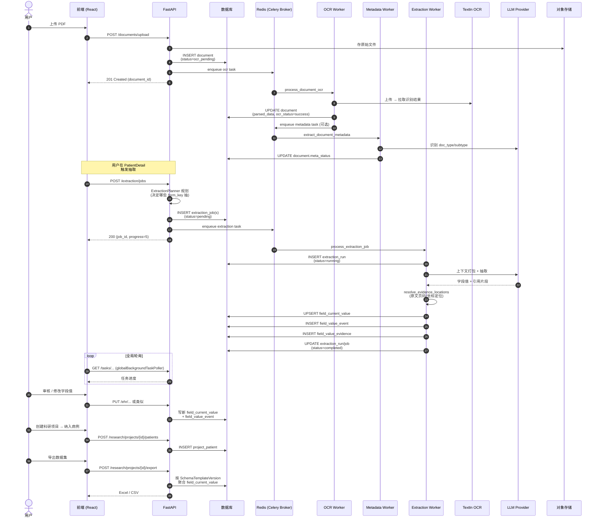

# 端到端数据流

> 一份病例从**用户上传**到**科研项目导出**的完整链路。本文是其它业务域文档的"骨架"，后续每个域都会引用本文中对应的阶段。

## 阶段总览

```text
[1] 文档上传 → [2] OCR → [3] Metadata 识别 → [4] 抽取规划 → [5] LLM 抽取 → [6] 字段落库与证据归因 → [7] 人工审核 → [8] 项目纳入 → [9] 数据集导出
```

每个阶段都是**异步可观测**的：用户操作触发 → API 投递 Celery 任务 → 后台 Worker 执行 → 写回数据库 → 前端轮询状态。

---

## 完整时序图



---

## 各阶段详解

### [1] 文档上传
- **触发**：前端 `DocumentUpload` 或 `PatientDetail/DocumentsTab` 选择文件
- **API**：`POST /api/v1/documents/upload`
- **关键代码**：[`document_service.py::upload_document`](../../backend/app/services/document_service.py)
- **存储**：原始文件→ OSS（阿里云）；元数据→ `document` 表
- **状态机**：`document.status = ocr_pending`（开启自动 OCR 时）
- **是否归档**：上传时若传 `patient_id`，文档直接归档到该病例；否则进入"未归档池"，由用户后续手动归档
- **触发副作用**：若 `DOCUMENT_OCR_AUTO_ENQUEUE=true`，自动入 OCR 队列

### [2] OCR
- **队列**：`ocr`，任务名 `eacy.ocr.process_document_ocr`
- **Worker**：[`ocr_tasks.py`](../../backend/app/workers/ocr_tasks.py)
- **外部依赖**：[[TextIn-OCR]]（待写）
- **产物**：识别文本 + 每段文本的页码与坐标，写入 `document.parsed_data`
- **状态机**：`document.ocr_status = queued → running → success | failed`
- **失败处理**：失败回写 `ocr_status=failed` + `ocr_error_message`；前端在文档列表标红

### [3] Metadata 识别（可选）
- **队列**：`metadata`，任务名 `eacy.metadata.extract_document_metadata`
- **Worker**：[`metadata_tasks.py`](../../backend/app/workers/metadata_tasks.py)
- **作用**：判断文档**类型与子类型**（如"出院记录""检验报告"），写入 `document.doc_type / doc_subtype`
- **用途**：抽取规划阶段（[4]）根据 doc_type 决定走哪条 prompt 链路

### [4] 抽取规划
- **代码**：[`extraction_planner.py`](../../backend/app/services/extraction_planner.py) + [`schema_field_planner.py`](../../backend/app/services/schema_field_planner.py)
- **作用**：根据**文档类型** + **Schema 模板版本**，决定本次抽取覆盖哪些 `form_key`（一个文档可能映射多个表单段）
- **产物**：一个或多个 `ExtractionJob`（一个 form_key 一个 job）

### [5] LLM 抽取
- **队列**：`extraction`，任务名 `eacy.extraction.process_extraction_job`
- **Worker**：[`extraction_tasks.py`](../../backend/app/workers/extraction_tasks.py)
- **核心服务**：[`extraction_service.py::process_existing_job`](../../backend/app/services/extraction_service.py)
- **执行单元**：每个 job 可有多次 `ExtractionRun`（重试 / 重抽）
- **重试策略**：HTTP 超时 / DB OperationalError 自动重试，最多 3 次（指数退避）
- **LLM 调用**：[`llm_ehr_extractor.py`](../../backend/app/services/llm_ehr_extractor.py)，使用 LangGraph 编排

### [6] 字段落库与证据归因
- **三张表协作**：
  - `field_current_value` — 当前值（一字段一行，UPSERT）
  - `field_value_event` — 完整变更历史（谁、何时、从什么改为什么、来源是抽取/人工/导入）
  - `field_value_evidence` — 每个值的原文证据：文档 ID + 页码 + 坐标 + 引用片段
- **证据定位**：[`evidence_location_resolver.py`](../../backend/app/services/evidence_location_resolver.py) 将 LLM 返回的 `quote_text` 与 OCR 的坐标对齐
- **嵌套字段**：Schema 中"用药记录"等可重复结构走 `record_instance` 表

### [7] 人工审核
- **入口**：`PatientDetail/EhrTab` 或 `SchemaEhrTab`
- **行为**：修改字段值会产生新 `field_value_event`，旧值保留可回溯
- **批量操作**：管理后台支持批量审核

### [8] 项目纳入
- **入口**：`ResearchDataset` 页面新建项目 → 纳入病例
- **数据模型**：
  - `research_project` — 项目本身
  - `project_template_binding` — 绑定使用的 Schema 模板版本（**绑定的是版本号，模板演进不破老数据**）
  - `project_patient` — 项目纳入的病例（多对多）

### [9] 数据集导出
- **入口**：`ResearchDataset/ProjectDatasetView`
- **API**：`POST /api/v1/research/projects/{id}/export`
- **逻辑**：按项目绑定的 Schema 版本，把所有纳入病例的 `field_current_value` 聚合为表格
- **格式**：Excel（`xlsx`）/ CSV（`papaparse`）

---

## 异步任务统一观测

所有 Celery 任务通过 `async_task` 表统一记录，前端 `globalBackgroundTaskPoller` 全局轮询 `/api/v1/tasks/...`，任务完成会触发：
- 通知（Antd notification）
- 相关页面的刷新事件（不强制 reload，由页面订阅）

详见 [[管理后台/异步任务进度追踪]]（待写）。

---

## 性能与容量参考

| 维度 | 典型量级 | 备注 |
|---|---|---|
| 单文档 OCR | 数秒～数十秒 | 取决于 TextIn 配额与文档页数 |
| 单次抽取 (一个 form_key) | 数秒～30 秒 | 取决于 LLM 提供商与上下文大小 |
| 批量"更新电子病历夹" | 每文档 ~1 job | 见 `update_patient_ehr_folder` |
| Celery 并发 | 各队列独立 | 详见 [[Celery任务运维]]（待写） |

具体压测数据见 [[性能验收]]（待写）。

---

## 相关文档（建立后将互链）

- [[整体架构]] — 分层视图
- [[模块全景图]] — 业务域间依赖
- [[文档与OCR/业务概述]]
- [[AI抽取/业务概述]]
- [[AI抽取/证据归因机制]]
- [[Schema模板与CRF/业务概述]]
- [[科研项目与数据集/业务概述]]
- [[管理后台/异步任务进度追踪]]
