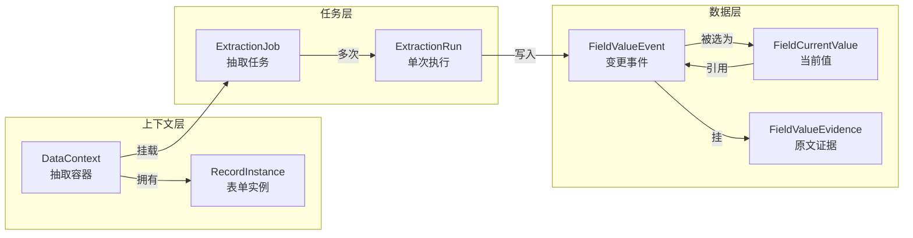

# 业务概述

> [!info] 一句话定位
> AI 抽取负责把"已 OCR 的医疗文档"按"某个 Schema 模板版本"结构化为"可审、可改、可溯源"的字段值，并支持人工接管。

## 抽取的目标

抽取的产物**不是文本摘要**，而是**结构化字段值 + 证据**，必须满足三点：

1. **可审（candidate / accepted）**：每个抽取值默认是"候选"，需人工或规则选定为"当前值"。
2. **可改（事件溯源）**：用户改了值不会覆盖历史；旧值在 `FieldValueEvent` 中永远可回溯。
3. **可溯源（证据归因）**：每个抽取值都必须有 `FieldValueEvidence` 指回原文档的页码 + 坐标 + 引用片段。

> [!warning] AI 抽取 ≠ 单纯 LLM 调用
> 完整流程包含规划（哪些 form_key 抽）、调用（LLM/规则）、归因（坐标对齐）、写库（三表协作）、进度（异步可观测）。任何一步缺失都会导致下游科研导出失去溯源能力。

## 核心数据模型角色

### 角色释义

| 角色 | 表 | 一句话 | 关键约束 |
|---|---|---|---|
| `DataContext` | [[表-data_context]] | 一个病例（或项目-病例）在某 Schema 版本下的抽取容器 | `(patient_id, schema_version_id, context_type)` 唯一 |
| `RecordInstance` | [[表-record_instance]] | 容器下某个 form 的一条实例（普通字段也是一条，可重复字段多条） | `(context_id, form_key, repeat_index)` 唯一 |
| `ExtractionJob` | [[表-extraction_job]] | 一次抽取任务，绑定 (context, document, form_key) | `target_form_key` 决定本次抽哪个 form |
| `ExtractionRun` | [[表-extraction_run]] | 一个 Job 的一次具体执行；重试会创建新 run | `(job_id, run_no)` 唯一 |
| `FieldValueEvent` | [[表-field_value_event]] | 字段值的一次变更（AI 抽取/人工编辑/导入），永久保留 | `event_type` ∈ `ai_extracted` / `manual_edit` / `import` |
| `FieldCurrentValue` | [[表-field_current_value]] | 字段的"当前选定值"，每字段一行 UPSERT | `(context_id, record_instance_id, field_path)` 唯一 |
| `FieldValueEvidence` | [[表-field_value_evidence]] | 某个 Event 的原文证据（page + bbox + quote） | `value_event_id` 必填，可多条 |

## 与 Schema 模板的关系

- 抽取**必须**绑定一个具体的 `SchemaTemplateVersion`（通过 `context.schema_version_id`）。
- `SchemaService` + `schema_field_planner.plan_schema_fields()` 把 schema_json 展平为 `SchemaField[]`，给 LLM 作为"可抽取字段清单"。
- 同一份文档在不同模板版本下抽取，结果分别落到不同 context、互不污染。详见 [[Schema模板与CRF/业务概述]]。

## 与文档 OCR 的关系

- 抽取的输入是 `document.parsed_data` / `ocr_payload_json`（OCR 文本 + 行/块/单元格坐标）。
- `ExtractionService._document_ready_for_extraction` 拒绝 `ocr_status` 非成功或无文本的文档。
- 证据归因（[[关键设计-证据归因机制]]）直接消费 OCR 的 `lines / blocks / tables.cells` 索引。
- 详见 [[文档与OCR/业务概述]]。

## 三种抽取器（可切换）

| Extractor | 触发条件 | 用途 |
|---|---|---|
| `LlmEhrExtractor` | `EACY_EXTRACTION_STRATEGY ∈ {llm, langgraph, multi_agent}` | 生产默认，LangGraph 编排 prepare → call_llm → validate → normalize → resolve_merge |
| `SimpleEhrExtractor` | 上述变量为其他值或未启用 LLM | 标签-值正则回退，用于无 OpenAI Key 的开发/演练环境 |
| `MockExtractor` | `job_type` 非 schema 抽取（如自定义 job_type） | 仅用于测试 |

实际生产仅使用前两者，详见 `ExtractionService._uses_schema_extractor` 与 `_use_llm_ehr_extractor`。

## 三种 job_type

| job_type | 上下文 | 入口 | 备注 |
|---|---|---|---|
| `patient_ehr` | `patient_ehr` context | 病例详情触发；`update-folder` 批量 | 字段落入病例本体 EHR |
| `targeted_schema` | 同上 | `update_patient_ehr_folder` 内部对单文档批量规划时使用 | 与 `patient_ehr` 共享 context，按 `target_form_key` 抽 |
| `project_crf` | `project_crf` context | 科研项目详情 → CRF 更新 | 字段落入该项目副本，与原 EHR 隔离 |

## 不在本域职责内

- **不做 OCR**：依赖 [[文档与OCR/README]] 的 `parsed_data`。
- **不做 schema 设计与发布**：依赖 [[Schema模板与CRF/README]]。
- **不做 LLM 选型决策**：模型由 `config.OPENAI_MODEL` 注入。
- **不做权限校验**：路由层在调用本服务前完成鉴权。

## 相关文档

- [[业务流程-Schema字段规划]] / [[业务流程-抽取任务生命周期]] / [[业务流程-病例EHR批量更新]]
- [[关键设计-证据归因机制]] / [[关键设计-字段值历史与变更链]] / [[关键设计-嵌套字段与RecordInstance]] / [[关键设计-异步任务进度追踪]]
- [[验收要点]]
