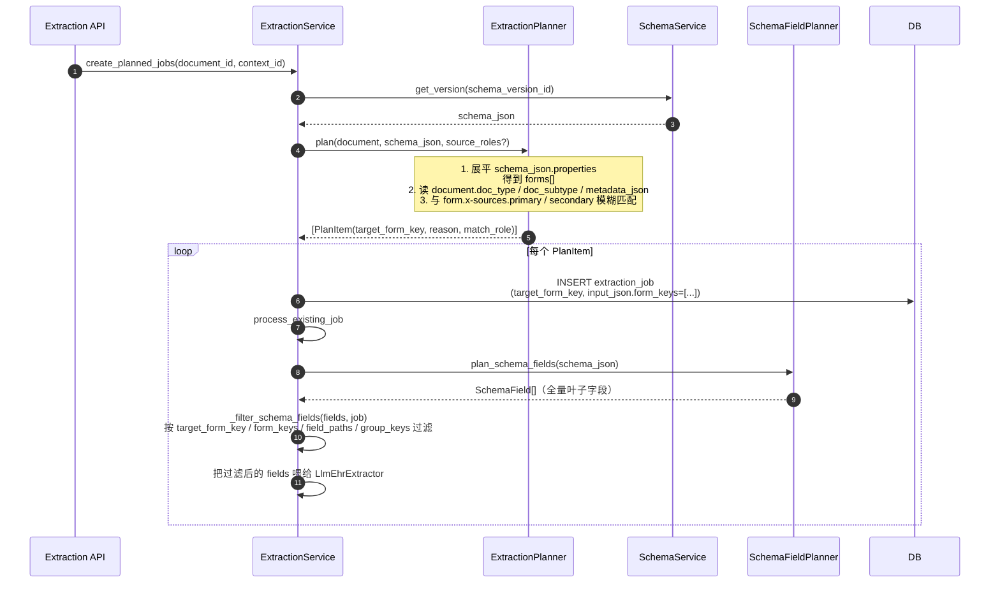

# 业务流程 - Schema 字段规划

> [!info] 一句话说明
> "规划"决定**这份文档应该抽哪些 form_key、各 form 包含哪些字段**。它由两个独立服务串联完成：`ExtractionPlanner`（文档级，doc_type → form_key）和 `SchemaFieldPlanner`（schema → 字段列表）。

## 为什么需要两层规划

> [!warning] 不规划会怎样
> 一个文档（如"出院记录"）若把 Schema 中所有 form（个人信息、检验、用药、随访……）都送给 LLM，会：
> 1. 抽出大量无关字段（噪声）
> 2. 浪费 Token / 增加幻觉风险
> 3. 失去"哪个 form 对应哪个文档"的可审计性

因此设计了两步：

| 步骤 | 输入 | 输出 | 何时调用 |
|---|---|---|---|
| **ExtractionPlanner** | `document` + `schema_json` | `ExtractionPlanItem[]`（一组 `target_form_key`） | 创建 Job 前；批量更新文件夹时 |
| **SchemaFieldPlanner** | `schema_json` | 全量 `SchemaField[]`（叶子字段） | LLM 调用前；按 `target_form_key` 过滤 |

## 触发场景

- `POST /extraction-jobs/plan` —— 显式规划接口
- `POST /patients/{id}/ehr/update-folder` —— 病例 EHR 批量更新（详见 [[业务流程-病例EHR批量更新]]）
- `POST /research/projects/{id}/patients/{ppid}/crf/update-folder` —— 项目 CRF 更新
- 上述入口都会先调 `ExtractionPlanner.plan(...)`，再为每个 PlanItem 创建一个 Job

## 主流程



## ExtractionPlanner 的匹配规则

来源：`extraction_planner.py::_match_sources` + `_document_terms`。

### 文档侧"指纹"

`_document_terms` 从下列字段抽取并归一化（去空格、转小写、去 `/ ／`）：

- `document.doc_type` / `doc_subtype`
- `document.document_type` / `document_sub_type`（兼容历史字段）
- `document.doc_title` / `original_filename`
- `metadata_json` 中 `文档类型` / `文档子类型` / `document_type` / `document_subtype` / `doc_type` / `doc_subtype` / `title`

### Schema 侧 "x-sources"

每个 form 在 schema_json 中可声明：

```json
"用药记录": {
  "type": "array",
  "x-display-name": "用药记录",
  "x-sources": {
    "primary": ["长期医嘱单", "出院带药"],
    "secondary": ["出院记录"]
  },
  "items": { "properties": { ... } }
}
```

匹配规则：

1. 遍历 `(primary, secondary)`（顺序敏感，primary 先匹）。
2. 对每个 source，做"双向包含"模糊匹配：`source ⊆ term` 或 `term ⊆ source`。
3. 第一个命中即返回 `(role, source)`，进入 PlanItem。
4. 调用方可传 `source_roles={"primary"}` 限制只匹 primary（批量更新文件夹时用，避免把次要文档拉进来）。

### 显式覆盖

若 `target_form_key` 或 `input_json.form_keys` 显式给出，**跳过文档匹配**，直接返回 schema 中存在的对应 forms（`reason="explicit target form"`，`match_role="explicit"`）。

## SchemaFieldPlanner 的展平规则

来源：`schema_field_planner.py::plan_schema_fields`。

### form_key 命名

`form_key = "{group_key}.{form_name}"`，例如：

```
病史信息.既往史
检查检验.检验报告
用药记录.出院带药
```

### 字段路径（field_path）

从顶层分组开始，沿 schema 路径用 `.` 拼接，**忽略数组下标**（数组扁平化时由 LLM 输出节点动态加 `.0 / .1`）：

```
病史信息.既往史.糖尿病
用药记录.出院带药.药品名称
检查检验.检验报告.血常规.白细胞
```

### 是否为叶子

`is_leaf` 判断：

- `allOf`（枚举引用）→ 叶子
- `type=object` 且有 `properties` → **非叶子**（递归进入）
- `type=array` 且 `items.properties` 存在 → **非叶子**（按数组元素递归）
- 其它（基础类型、enum、ref）→ 叶子

### value_type 推断

| schema 写法 | value_type |
|---|---|
| `format=date-time` | datetime |
| `format=date` 或 `x-display=date` | date |
| `type=number/integer` 或 `x-display=number` | number |
| `type=array/object`（非展开的） | json |
| 其它 | text |

### 选项与提示词

- `extraction_prompt`：取 `x-extraction-prompt` 或 `description`，会被 LLM 用作字段级提示
- `options`：从 `enum` / `allOf[0].$ref` 解出来的枚举值列表，进 `LlmEhrExtractor` 后用于值规范化

## 过滤策略（Job 级精细控制）

`ExtractionService._filter_schema_fields` 支持四种过滤维度，**满足任一不为空即生效**：

| 维度 | 取自 | 含义 |
|---|---|---|
| `target_form_keys` | `job.target_form_key` + `input_json.form_keys` | 限定 form |
| `target_field_paths` | `input_json.field_paths` | 精确到字段路径（重抽某几个字段） |
| `target_field_keys` | `input_json.field_keys` | 字段叶子名 |
| `target_group_keys` | `input_json.group_keys` | 顶层分组 |

所有维度都为空 → 全量字段；否则按 AND 取交集（每个维度内是 OR）。

## 异常分支

| 场景 | 表现 | 处理 |
|---|---|---|
| `target_form_key` 不在 schema | PlanItems 为空 | `create_planned_jobs` 抛 `ExtractionConflictError("No extraction targets matched document")` |
| 文档无 doc_type 且 x-sources 都不匹配 | PlanItems 为空 | 批量更新场景：进入 `skipped` 列表（reason="no primary source matched"）；显式接口：报 409 |
| schema_version 未找到 | — | `ExtractionNotFoundError("Schema version not found")` |
| 过滤后 fields 为空 | — | `ExtractionConflictError("No schema fields matched extraction target")`（运行期，Job 走到 `_extract` 时） |

## 涉及资源

- **API**：`POST /extraction-jobs/plan`
- **服务**：`ExtractionPlanner` / `SchemaFieldPlanner` / `ExtractionService.create_planned_jobs`
- **数据表**：[[表-extraction_job]] [[表-schema_template_version]] [[表-document]]
- **下游**：[[业务流程-抽取任务生命周期]]、[[关键设计-嵌套字段与RecordInstance]]

## 验收要点

- [ ] 显式 `target_form_key` 优先于 doc_type 匹配
- [ ] 同一文档命中多个 form 时各产生独立 Job
- [ ] `source_roles={"primary"}` 时不会把 secondary 命中的 form 拉进来
- [ ] schema 中嵌套对象/数组的所有叶子都能出现在 SchemaField[] 中
- [ ] `input_json.field_paths` 重抽时只重抽指定字段
