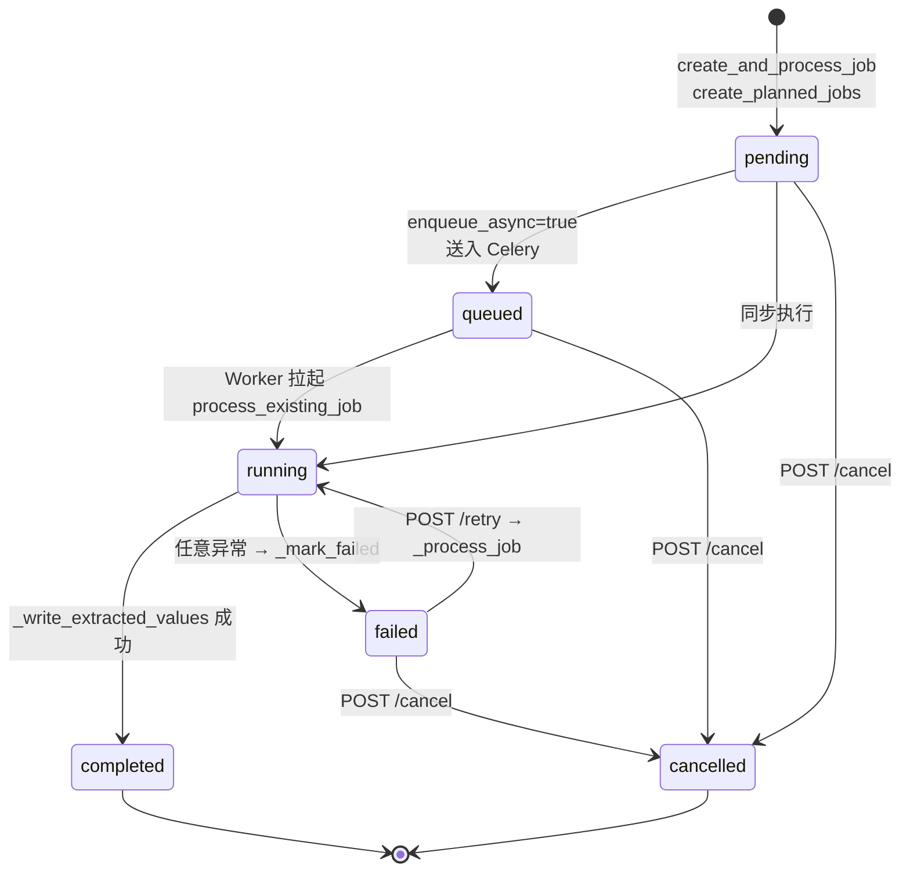
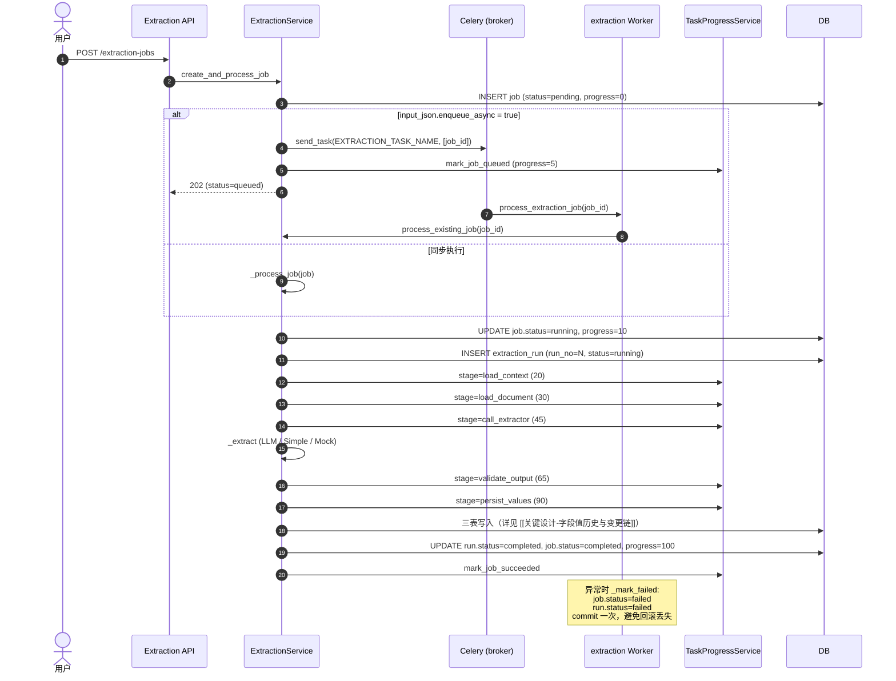

# 业务流程 - 抽取任务生命周期

> [!info] 一句话说明
> 一个 `ExtractionJob` 从创建到终态的状态机；每次执行（含重试）记为一个 `ExtractionRun`；自动重试针对瞬时错误，最多 3 次指数退避。

## Job 与 Run 的关系

- **Job**：业务层"我要抽这份文档的这个 form"的承诺，**1 个 Job = 1 个 (context, document, target_form_key) 三元组**。
- **Run**：Job 的一次具体执行（LLM/规则调用一次），同一个 Job 可有 N 个 Run（`run_no` 单调递增），由 `(job_id, run_no)` 唯一约束。
- 创建新 Run 的时机：首次执行、`POST /retry`、Worker 端 Celery 自动重试。

> [!warning] 重试 != 重抽相同提示词
> 自动重试是**对瞬时错误**（HTTP 超时、DB 断连）重试同一个 Run 的同一次调用；显式 `/retry` 才会创建新 Run。LLM 内部 LangGraph 自带 max_attempts=3 的"prompt 修复重试"，与 Job/Run 层级的重试是两层不同机制。

## 状态机



### 各状态的字段语义

| status | progress | 备注 |
|---|---|---|
| `pending` | 0 | 已创建，未入队、未执行 |
| `queued` | ≥ 5 | 已 `celery.send_task`，等待 Worker（由 `task_progress_service.mark_job_queued` 设定） |
| `running` | 10 → 90 | Worker 正在执行，分阶段写入 progress（详见下面"进度阶段"） |
| `completed` | 100 | 三表已写入；`finished_at` 已设 |
| `failed` | 末态 | `error_message` 必填；可 `/retry` 切回 running |
| `cancelled` | 末态 | 仅允许从非 completed/running 切入；`finished_at` 必填 |

## 主流程（同步与异步两种触发）



### 进度阶段表

来源：`ExtractionService._process_job` 中六次 `task_progress_service.update_job_progress`。

| current_step | progress | stage | stage_label | 说明 |
|---|---|---|---|---|
| 1 | 10 | worker_started | Worker 已启动 | run 尚未创建 |
| 2 | 20 | load_context | 读取上下文 | run 已建，model_name 已定 |
| 3 | 30 | load_document | 读取文档内容 | OCR 文本 + 证据单元就绪 |
| 4 | 45 | call_extractor | AI 抽取中 | LLM/规则正在跑 |
| 5 | 65 | validate_output | 校验抽取结果 | run.parsed_output_json 已填 |
| 6 | 90 | persist_values | 写入候选值 | 三表正在写 |
| — | 100 | completed | 已完成 | `mark_job_succeeded` |

> [!info] progress 只增不减
> `update_job_progress` 用 `max(item.progress, new)`；即使有阶段倒挂，前端进度条不会回退。

## 自动重试策略

Worker 入口 `process_extraction_job` 用 Celery 装饰器声明：

```python
@celery_app.task(
    name=EXTRACTION_TASK_NAME,
    autoretry_for=TRANSIENT_EXTRACTION_ERRORS,
    retry_backoff=True,
    retry_kwargs={"max_retries": 3},
)
```

### 哪些异常算"瞬时"

`TRANSIENT_EXTRACTION_ERRORS` 在 `extraction_service.py` 中按可用性聚合：

| 异常 | 来源 | 场景 |
|---|---|---|
| `httpx.TimeoutException` | httpx | LLM API 超时 |
| `httpx.TransportError` | httpx | 连接断开/DNS 失败 |
| `sqlalchemy.exc.OperationalError` | SQLAlchemy | DB 临时不可用 |
| `sqlalchemy.exc.DisconnectionError` | SQLAlchemy | 连接池连接失效 |

`_is_transient_error(error)` 在 `_process_job` 的 except 中决定**是否向 Worker 层抛出**——抛出才会触发 Celery 重试；同步入口 `create_and_process_job` 始终 `raise_on_failure=True`，让调用方拿到 500 后端自行决定。

### 退避节奏

- 默认 `retry_backoff=True` → 1s, 2s, 4s, 8s, … 上限由 Celery 默认 `retry_backoff_max=600` 控制
- 重试时**复用同一个 `job_id`**，不会创建新 Run；只有当前 Run 内的执行被重复

### 失败终态

3 次重试用尽 → Celery 标 task FAILED → Worker 内部 `_process_job` 的最后一次也调用 `_mark_failed`，写入：

```
extraction_job.status = failed
extraction_job.error_message = str(error)
extraction_run.status = failed
extraction_run.error_message = ...
async_task_item.status = failed (TaskProgressService.mark_job_failed)
```

之后用户必须显式 `POST /extraction-jobs/{id}/retry`（创建新 Run）才能恢复。

## 手动操作

### `POST /extraction-jobs/{id}/retry`

- 拒绝 `cancelled` / `running` 状态（`_ensure_can_retry`）
- 进入 `_process_job`，与首次执行同流程，但 `input_snapshot_extra={"retry": true}`
- 创建**新 Run**（`run_no = 已有 Run 数 + 1`）

### `POST /extraction-jobs/{id}/cancel`

- 拒绝 `completed`（`Completed extraction job cannot be cancelled`）
- 把 `status` 设为 `cancelled`，写 `finished_at`
- **不会**杀掉正在运行的 Celery 任务（仅标 DB；Worker 继续执行直到自然结束，但其结果不再被前端使用）

### `DELETE /extraction-jobs/{id}`

- 仅允许在无 Run 且无字段事件时硬删（实际上设置 `status=cancelled`）
- 已经产生过 Run 或 `field_value_event` 的 Job 抛 409，**保留审计链**

## 异常分支

| 场景 | 表现 | 处理 |
|---|---|---|
| Job 不存在 | 404 | `ExtractionNotFoundError` |
| 试图 retry 一个 running Job | 409 | `_ensure_can_retry` |
| Document 不属于 Patient | 409 | `_resolve_schema_extraction_scope` 校验 |
| Schema 未发布 | 404 | `Schema version not found` |
| Context 类型不匹配（如 patient_ehr 任务给了 project_crf context） | 409 | `_validate_job_context` |
| LLM 校验 3 次全失败 | Job=failed | LangGraph 内部已尝试 repair_prompt 3 次，最终输出 validation_status=invalid |
| `wait_for_document_ready=true` 且文档 OCR 未完成 | Job 留在 pending | `_should_wait_for_document_ready` 返回 true，不入队 |

## 涉及资源

- **API**：`POST/GET/DELETE /api/v1/extraction-jobs/...`
- **数据表**：[[表-extraction_job]] [[表-extraction_run]] [[表-async_task_item]]
- **Worker**：`backend/app/workers/extraction_tasks.py`、Celery 队列 `EXTRACTION_QUEUE`
- **进度观测**：[[关键设计-异步任务进度追踪]]

## 验收要点

- [ ] Job 从 pending → running → completed 的 progress 必须单调
- [ ] LLM 超时一次时不应将 Job 标 failed（应进入 Celery 自动重试）
- [ ] 3 次重试用尽后 Job=failed 且 `error_message` 非空
- [ ] `/retry` 必须产生新 Run（run_no+1）；`/runs` 接口可见全部历史
- [ ] cancelled 状态下不可 retry，completed 状态下不可 cancel
