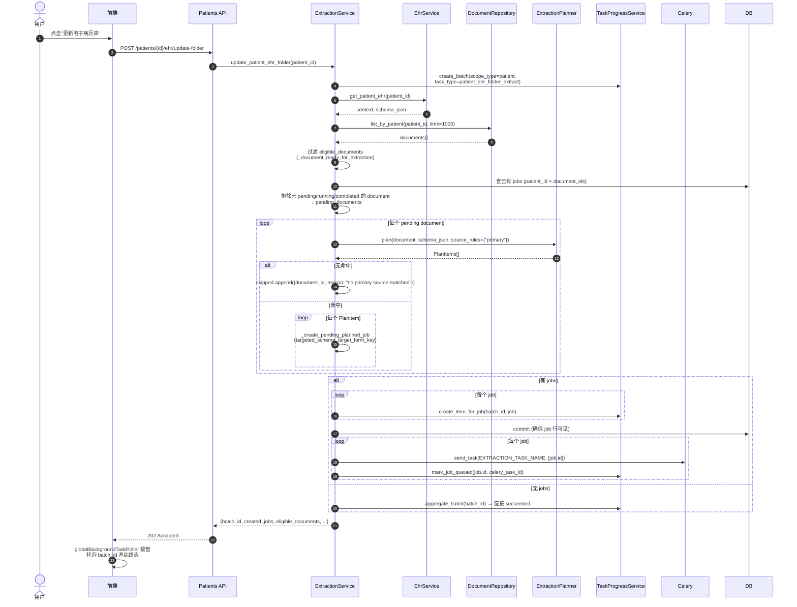

# 业务流程 - 病例 EHR 批量更新

> [!info] 一句话说明
> 用户在病例详情点"更新电子病历夹"时，后端为该病例**所有合格文档**自动规划并入队抽取任务，且把这一批任务聚合到一个 `AsyncTaskBatch` 中以便前端跟踪整体进度。同形态接口还有项目 CRF 的 `update_project_crf_folder` / `update_project_crf_folder_batch`。

## 触发场景

- `PatientDetail` → "EHR" Tab → 点击"更新电子病历夹"按钮
- 触发 `POST /api/v1/patients/{patient_id}/ehr/update-folder`
- 路由层（`patients/router.py::update_patient_ehr_folder`）直接转给 `ExtractionService.update_patient_ehr_folder`

## 前置条件

- 病例存在且未软删
- 病例已绑定 EHR Schema 版本（`get_patient_ehr` 不返回 None）
- 至少有一份文档处于 OCR 完成、归档到该病例、`status != "deleted"`

## 主流程



## 关键设计点

### 1. `targeted_schema` 而非 `patient_ehr`

批量更新里每个文档都按 `target_form_key` 抽，因此 `job_type = "targeted_schema"`（不是 `patient_ehr`）：

- 它**复用** patient 的 EHR context（同 `context_id` / `schema_version_id`）
- 但记录的 `target_form_key` 是规划阶段命中的具体 form
- 排重时把 `patient_ehr` 和 `targeted_schema` 视为同等"已抽过"（`status ∈ {pending, running, completed}`）

### 2. `source_roles={"primary"}` 的批量收紧

`ExtractionPlanner.plan(...)` 默认会同时匹 primary + secondary 的 x-sources；但**批量更新**只传 primary：

> [!warning] 为什么只用 primary
> Schema 中一个 form 可以从多个文档"次要拼凑"（secondary），但批量更新不该把"出院记录"也强行往"用药记录" form 里塞——那会产生大量低质量候选。primary 限定后，只有**主源文档**会触发其对应 form 的抽取。secondary 的拼凑由用户在单文档场景显式发起。

### 3. 排重逻辑

```text
existing_jobs = list_by_patient_documents(patient_id, [doc_ids])
extracted_document_ids = {
    job.document_id
    for job in existing_jobs
    if job.job_type in {"patient_ehr", "targeted_schema"}
       and job.status in {"pending", "running", "completed"}
}
pending_documents = eligible_documents 中不在 extracted_document_ids 的
```

- `failed` / `cancelled` 状态的 Job **不算"已抽过"**，会被重新规划
- 这样既避免重复抽取，又允许失败重试

### 4. 进度聚合（AsyncTaskBatch）

- 一次"更新文件夹"产生 1 个 `AsyncTaskBatch` + N 个 `AsyncTaskItem`（每个 Item ↔ 一个 ExtractionJob）
- `TaskProgressService.aggregate_batch` 根据 items 的状态分布算 `batch.status`：
  - 全部 succeeded → `succeeded`
  - 全部 terminal 且有 failed 但有 succeeded → `completed_with_errors`
  - 全部 terminal 且无 succeeded → `failed`
  - 有 running → `running`
  - 有 queued → `queued`
- progress 用 items 的算术平均（向下取整）
- 详见 [[关键设计-异步任务进度追踪]]

### 5. 前端体验

- 响应只返回汇总（`batch_id` + 计数），不会同步等待结果
- 前端 `globalBackgroundTaskPoller`（详见 [[管理后台/异步任务进度追踪]]）通过 `batch_id` 轮询，**所有 items 终态时弹通知**

## 返回字段释义

```jsonc
{
  "batch_id": "...",
  "patient_id": "...",
  "documents_total": 12,              // patient 名下文档总数
  "eligible_documents": 10,           // 通过 OCR 完成 + 未删 + 已归档过滤后
  "already_extracted_documents": 7,   // 已有非失败 Job 的文档
  "planned_documents": 3,             // 实际待规划的文档
  "created_jobs": 5,                  // 真正创建的 Job 数（一份文档可能对应多个 form_key）
  "submitted_jobs": 5,                // 入队成功的 Job 数（与 created_jobs 一致除非中途失败）
  "skipped": [
    {"document_id": "...", "reason": "no primary source matched"}
  ]
}
```

## 异常分支

| 场景 | 表现 | 处理 |
|---|---|---|
| Patient 不存在 | 404 | `EhrService.get_patient_ehr` 抛 HTTPException |
| 病例尚未发布过 EHR schema | 404 | `EHR schema context not found` |
| 全部文档 `not _document_ready_for_extraction` | 200 + created_jobs=0 | batch 直接 `succeeded`，提示"暂无可提交的抽取任务" |
| 全部文档无 primary 源命中 | 200 + created_jobs=0, skipped 非空 | 同上，前端可展示 skipped 列表 |
| 单个 Job 入队失败（broker 异常） | 已 commit 的 Job 留在 pending | 由后续 Worker 自身重试或人工 `/retry` |

## 项目 CRF 同形接口

`update_project_crf_folder(project_id, project_patient_id)` 几乎完全同结构，差异：

- `task_type = project_crf_folder_extract`
- `job_type = project_crf`
- `scope_type = project_patient`
- 排重维度多一层：`job.project_id == project_id and job.project_patient_id == project_patient_id`
- input_json 加 `enqueue_async=true`（与 patient_ehr 不同；patient 版直接同步 send_task）

`update_project_crf_folder_batch(project_id, [project_patient_ids])` 把上一接口对单个 project_patient 的逻辑横向铺开到整个项目，并在最外层做一个总 batch。

## 涉及资源

- **API**：`POST /api/v1/patients/{id}/ehr/update-folder`
- **服务**：`ExtractionService.update_patient_ehr_folder`
- **数据表**：[[表-extraction_job]] [[表-async_task_batch]] [[表-async_task_item]] [[表-document]]
- **前端**：`frontend_new/src/pages/PatientDetail/tabs/EhrTab/index.jsx`、`globalBackgroundTaskPoller`

## 验收要点

- [ ] 已 completed 的文档不会被二次入队
- [ ] failed 状态的 Job 对应的文档会被重新规划
- [ ] 单份文档命中多个 form 时产生多个 Job 且每个独立可追踪
- [ ] batch.progress 必须单调递增至 100
- [ ] 全部跳过时 batch 立刻进入 succeeded，前端不会卡 loading
