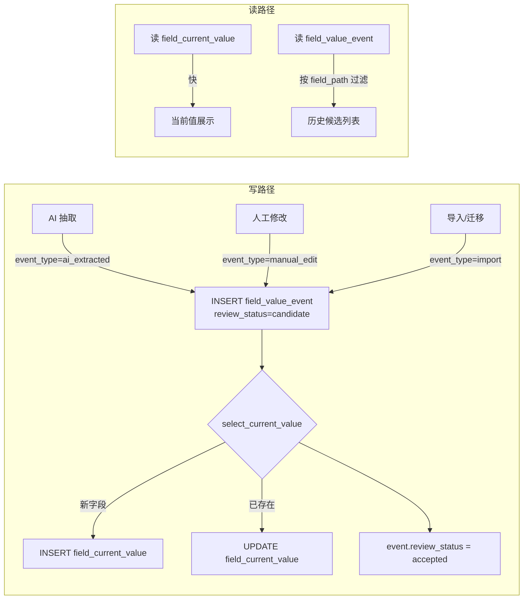

# 关键设计 - 字段值历史与变更链

> [!info] 一句话说明
> 字段值采用"当前值 + 事件流"双表设计：`FieldCurrentValue` 一字段一行 UPSERT，给读路径快查；`FieldValueEvent` 一次变更一行 INSERT，永久保留历史。所有写入（AI/人工/导入）都经过 `StructuredValueService`，保证两表一致。

## 双表协作的核心契约



### 单向不可逆

- `FieldCurrentValue` 的字段值随 `select_event` 滚动覆盖
- `FieldValueEvent` 一旦写入**只改 `review_status`**，**永不更新值字段**——即使被覆盖，旧值在 event 中永久可读

## 表职责对比

| 维度 | FieldCurrentValue | FieldValueEvent |
|---|---|---|
| 表 | [[表-field_current_value]] | [[表-field_value_event]] |
| 行数 | 一字段一行（context × record × field_path 唯一） | 一次变更一行（无唯一约束） |
| 写操作 | UPSERT | INSERT only |
| 用途 | 详情/导出读取 | 候选/历史展示、回溯、回滚 |
| 关键字段 | `selected_event_id` 指向选中的 event | `event_type` / `source_event_id`（指向被替换的前一个 event） |
| review_status 取值 | unreviewed / confirmed / rejected | candidate / accepted / superseded |

## 写入路径细节

### AI 抽取写入（`record_ai_extracted_value`）

```python
event = create_event(event_type="ai_extracted", review_status="candidate", ...)
for evidence in evidences:
    add_evidence(value_event_id=event.id, ...)
if auto_select_if_empty:
    select_current_value(event=event, selected_by=None, review_status="unreviewed")
```

> [!info] auto_select_if_empty 的含义（实现细节）
> 当前实现里 `select_current_value` 没有"仅当 current 为空才选"的分支——它**总会覆盖** current。命名是历史遗留；实际语义是 "AI 抽取出新值后，把它作为 current；如果用户随后做了 manual_edit，会产生新 event 再次覆盖"。审核冲突由前端读 `list_field_candidates` 时基于 `review_status=unreviewed` 提示。

### 人工编辑写入（`manual_edit`）

```python
event = create_event(event_type="manual_edit", review_status="accepted", created_by=edited_by, note=...)
return select_current_value(event=event, selected_by=edited_by, review_status="confirmed")
```

差异：

| 字段 | AI 抽取 | 人工编辑 |
|---|---|---|
| `event_type` | `ai_extracted` | `manual_edit` |
| `event.review_status` | candidate → accepted（select 后） | 直接 accepted |
| `current.review_status` | `unreviewed` | `confirmed` |
| `confidence` | LLM 给的 0~1 | null |
| `evidence` | 必有 | 通常无（人工填的值无原文证据） |
| `extraction_run_id` | 必有 | null |

### `select_current_value` 的语义

```
1. 查 current = field_current_values WHERE (context, record, field_path)
2. 若不存在 → INSERT，selected_event_id=event.id
3. 若存在 → 把 event 的值字段拷贝到 current，更新 selected_event_id
4. event.review_status = "accepted"
5. （前任 event 不会被显式标 superseded；通过 current.selected_event_id 反查得知）
```

## 人工修改 vs 抽取写入的区分

读路径如何**区分某个字段值是谁写的、何时写的、来自哪份文档**？

- 读 `current.selected_event_id` → 拿到选中事件
- 读该 event 的 `event_type` / `created_by` / `created_at` / `source_document_id` / `extraction_run_id`
- 同字段历史候选：`FieldValueEventRepository.list_candidates_by_context_field`（在 `EhrService.list_field_candidates`），按 `created_at` 降序展示

### `EhrService.list_field_candidates` 返回结构

```jsonc
{
  "candidates": [
    {
      "id": "<event_id>",
      "value": "阿托伐他汀钙片 20mg qn",
      "value_type": "text",
      "review_status": "candidate",
      "confidence": 0.91,
      "source_document_id": "<doc_id>",
      "source_page": 3,
      "source_text": "出院带药：阿托伐他汀钙片 20mg qn",
      "source_location": { "polygon": [...], "page_no": 3 },
      "created_at": "..."
    },
    ...
  ],
  "selected_candidate_id": "<id of currently selected event>",
  "selected_value": "...",
  "has_value_conflict": true,            // 不同候选给出了不同值
  "distinct_value_count": 2
}
```

前端在审核 UI 中用此结构展示：
- "当前值"高亮显示
- "其它候选"按时间倒序列出
- 用户选哪个 → `POST /patients/{id}/fields/{path}/select-event` → `EhrService.select_field_event` → `value_service.select_current_value(event=...)`

## 字段路径规范化（field_path）

> [!warning] 数组下标的处理
> Schema 中可重复结构（如 `用药记录.出院带药` 是 array）的字段路径有两种形态：
> - **规范路径**：`用药记录.出院带药.药品名称`（不含下标，schema_field_planner 的产物）
> - **实例路径**：`用药记录.出院带药.0.药品名称`（含下标，LlmEhrExtractor 写出的 records 形态）
>
> `EhrService._canonical_field_path` 去除所有数字段；`_field_path_aliases(path)` 返回 `[raw, canonical]` 两个候选，查询时按顺序匹配以容错。

实际表里两种路径**都存在**：
- AI 抽取写入时：用 LLM 的扁平化路径（带下标，由 `_flatten_record_node` 产出）
- 人工编辑时：用规范化路径（无下标）
- 读取时：`_resolve_existing_field_path` 自动适配

这是该模块当前的 TBD：长期可能统一为规范化路径 + `repeat_index`，详见 [[关键设计-嵌套字段与RecordInstance]] 末尾。

## 删除与回滚

### 删除字段值（`EhrService.delete_field_value`）

- 删除该 (context, field_path) 下的所有 evidence、event、current
- 不可回滚（事件流也清除）
- 慎用：仅在用户显式"清空字段"时调用

### 回滚到历史候选

无单独 API，等价操作：再次 `select_field_event` 选老 event → 写一个新 `selected_event_id` 指回旧 event。旧 event 仍是 accepted，其值字段不变。

## 异常分支

| 场景 | 表现 | 处理 |
|---|---|---|
| 同字段并发写入（同时 AI + 人工） | 可能竞态 | `_write_extracted_values` 用 `pg_advisory_xact_lock(hashtext(context_id))` 在 context 级互斥 |
| 写入 value_text 与 value_number 同时填 | 多 slot 冲突 | LangGraph `_validate_value_payload` 拦截 LLM 输出；service 层不校验（信任 LLM 输出） |
| 字段不在 schema | event 仍写入 | `LlmEhrExtractor._normalize_field_item` 会拒；只有人工 API 直接传非法 field_path 才会落库 |
| evidence 重复 | event 一对多 evidence | 无去重，前端按 quote_text 自行去重 |

## 涉及资源

- **服务**：`StructuredValueService`（核心）/ `EhrService`（HTTP 适配 + 读组装）
- **数据表**：[[表-field_current_value]] [[表-field_value_event]] [[表-field_value_evidence]]
- **API**：`EhrService.manual_update_field` / `select_field_event` / `list_field_candidates` / `list_field_events`
- **下游**：[[科研项目与数据集/README]] 导出读 `field_current_value`

## 验收要点

- [ ] 同一字段被 AI 抽取 → 人工编辑 → 再次 AI 抽取，event 表保留 3 行；current 显示最后一次
- [ ] 删除字段后历史也无（语义匹配"清空字段"）
- [ ] `has_value_conflict=true` 时前端必须提示用户审核
- [ ] manual_edit 的 event 没有 evidence 也能正常显示
- [ ] 通过 `select_field_event` 选老 event，current 值切回历史，旧 event 仍 accepted
