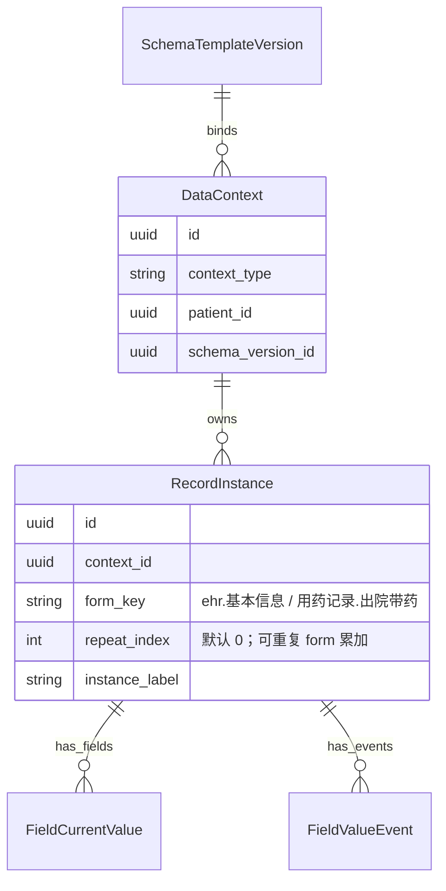

# 关键设计 - 嵌套字段与 RecordInstance

> [!info] 一句话说明
> Schema 中"用药记录""检验报告"等**可重复结构**（type=array）由 `RecordInstance` 表承载多条实例；LLM 输出的嵌套对象在落库时被**扁平化**为带下标的 field_path，而上下文容器 `DataContext` 只为每个 form 默认建一条 `repeat_index=0` 的实例。

## 为什么不直接拍平到 FieldCurrentValue

字段值表（`field_current_value`）的唯一键是 `(context_id, record_instance_id, field_path)`。如果不引入 `record_instance_id`：

- "用药记录.出院带药.药品名称" 只能有 1 个值（覆盖）
- 无法表达"3 条用药记录、每条 5 个字段"的合理结构
- 删除某条记录会导致整组字段路径无差别清空

引入 `RecordInstance` 后：

- 一个 form_key（如 `用药记录.出院带药`）可以有多条 RecordInstance（`repeat_index = 0,1,2,...`）
- 每条 instance 单独挂自己的 field_current_value 行
- 删除某条 → 仅删该 record_instance_id 下的字段值

## 数据模型关系



`UniqueConstraint(context_id, form_key, repeat_index)` 保证一个 form 下 repeat_index 不重复。

## 容器初始化

来源：`EhrService.initialize_default_record_instances`。

新建一个 `DataContext` 时（或首次访问 `get_patient_ehr` 时），系统会：

1. 调 `schema_top_level_forms(schema_json)` 列出所有 form_key
2. 对每个 form_key，建一条 `repeat_index=0` 的 RecordInstance（`instance_label = form_title`）
3. 普通（非数组）form 永远只有这一条；可重复 form 后续按需 `create_record_instance` 新增

> [!info] 为什么默认建 0 号实例
> 抽取写入时需要把字段值挂在某个 `record_instance_id` 上。若 0 号实例不存在，每次抽取都要 lazy create → 多次往返 DB；预建 0 号简化写路径。

## LLM 如何表达嵌套

`LlmEhrExtractor` 推荐 **records 格式**（system prompt 第一段）：

```jsonc
{
  "records": [
    {
      "form_path": "用药记录.出院带药",
      "record": [
        {
          "药品名称": "阿托伐他汀钙片",
          "剂量": "20mg",
          "频次": "qn"
        },
        {
          "药品名称": "拜阿司匹林",
          "剂量": "100mg",
          "频次": "qd"
        }
      ],
      "evidences": [{"source_id": "p3-l27", ...}]
    }
  ]
}
```

兼容 fields 格式（带数组下标的扁平路径）：

```jsonc
{
  "fields": [
    {"field_path": "用药记录.出院带药.0.药品名称", "value_type": "text", "value_text": "..."},
    {"field_path": "用药记录.出院带药.0.剂量",     "value_type": "text", "value_text": "..."},
    {"field_path": "用药记录.出院带药.1.药品名称", "value_type": "text", "value_text": "..."}
  ]
}
```

## 扁平化逻辑

`LlmEhrExtractor._flatten_record_node`：

```text
prefix = "用药记录.出院带药"
node   = [ {药品名称: A, 剂量: 20mg}, {药品名称: B, 剂量: 100mg} ]

→ list 时：对每个 index 拼 "{prefix}.{index}" 继续递归
→ dict 时：对每个 key 拼 "{prefix}.{key}" 继续递归
→ scalar 时：作为叶子，按 SchemaField spec 找 by_path（含 _spec_for_indexed_path 去下标查找）→ 产出 fields 输出
```

最终输出全部是**带下标的 field_path 字符串**，与 SchemaField 的"规范路径"通过 `_spec_for_indexed_path` 对齐：

```python
def _spec_for_indexed_path(self, field_path, by_path):
    without_indexes = ".".join(part for part in parts if not part.isdigit())
    return by_path.get(without_indexes)
```

## ExtractionService 落库时如何映射到 RecordInstance

来源：`ExtractionService._resolve_output_record` + `_write_extracted_values`。

```text
1. 加载 context 下所有 RecordInstance → records_by_form: {form_key: record}
2. 取 default_record = records[0]（通常是 ehr.基本信息）
3. 对每个 LLM 输出 field：
   a. 优先用 field.record_form_key（LLM 输出时回填的）
   b. 否则用 field_path 前两段 "{group}.{form}" 反查 records_by_form
   c. 找不到 → 用 default_record（兜底，避免丢字段）
4. 用该 record.id 作为 record_instance_id 写入 FieldCurrentValue / FieldValueEvent
```

> [!warning] 当前实现：可重复字段并不会"为每条数据建一个 RecordInstance"
> 即使 LLM 输出了 2 条出院带药，落库时它们都会挂在同一个 `用药记录.出院带药.repeat_index=0` 的实例上，区分靠 `field_path` 末端的下标（如 `.0.药品名称` / `.1.药品名称`）。
>
> 这是当前实现的折中：避免抽取过程中并发 INSERT RecordInstance；副作用是**用户手动新增 record_instance（repeat_index>0）后，再做 AI 抽取，新增的 instance 不会被自动填充**。详见末尾 TBD。

## 字段路径在两表中的不一致

| 写入方 | 写入到 `field_path` 的形态 |
|---|---|
| LlmEhrExtractor → record_ai_extracted_value | 带下标，如 `用药记录.出院带药.0.药品名称` |
| EhrService.manual_update_field | 规范化（无下标），如 `用药记录.出院带药.药品名称` |

读取适配（`EhrService._resolve_existing_field_path`）：

1. 列 context 下所有 current values 的 field_path 集合
2. 把 `[raw_path, canonical_path]` 两种形态依次去匹
3. 命中即返回；都没命中返回 canonical_path（避免读到空时报错）

> [!info] 前端展示路径
> `EhrService._current_values_by_display_path` + `_schema_display_path` 用 schema 结构把任意 field_path 翻译成"用户能看懂的展示路径"，去除中间下标但保留必要的"0"作为默认序号。

## 删除单条 RecordInstance

`EhrService.delete_record_instance`：

```text
1. 查该 record 的所有 events
2. 删 evidence（按 event_ids）
3. 删 current_values（按 record_instance_id）
4. 删 events（按 record_instance_id）
5. 删 record_instance 本体
```

**事件流也会被删**——这是个**破坏性操作**，删除前需用户确认。

## 创建额外 RecordInstance（人工新增）

`EhrService.create_record_instance` 给前端用，典型场景：

- 用户在 `用药记录.出院带药` 之外新增一条"自填记录"
- `repeat_index = next_repeat_index(context, form_key)`（max + 1）
- `instance_label` 默认 `"{form_title} #{repeat_index+1}"`

随后用户在 UI 填字段时，`manual_update_field` 会以**规范化 field_path + 显式 record_instance_id** 写入，与 LLM 写入路径完全不冲突。

## TBD / 已知问题

> [!todo] 实现一致性待澄清
> 1. AI 抽取写入用带下标 path + 同一个 record_instance，而人工编辑用无下标 path + 显式 record_instance_id。这种"双轨"在审计与导出时会增加适配成本。长期方案候选：
>    - **(a) 拍平归一**：抽取也一律不写下标，按需 INSERT RecordInstance.repeat_index=N
>    - **(b) 显式标注**：在 field_path 旁加 `repeat_index` 列，永远不在 path 里写下标
>
>    目前尚未决策；详见 `eacy/EHR-CRF 数据库与抽取落库设计.md`。

## 涉及资源

- **服务**：`LlmEhrExtractor._flatten_record_node` / `_spec_for_indexed_path`
- **服务**：`ExtractionService._resolve_output_record` / `_write_extracted_values`
- **服务**：`EhrService.initialize_default_record_instances` / `create_record_instance` / `delete_record_instance`
- **数据表**：[[表-record_instance]] [[表-field_current_value]] [[表-field_value_event]]

## 验收要点

- [ ] 新建 context 后所有顶层 form 都有 repeat_index=0 的 RecordInstance
- [ ] LLM 输出 2 条用药记录时，前端能看到 `.0.` / `.1.` 两组字段
- [ ] 删除 RecordInstance 后，其字段值与历史 event 也消失
- [ ] 同一字段路径在 AI 写入（带下标）与人工编辑（无下标）后能被读侧统一显示
