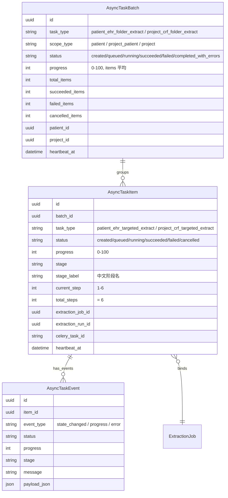

# 关键设计 - 异步任务进度追踪

> [!info] 一句话说明
> 所有抽取任务（单个或批量）都映射到三张通用表：`async_task_batch`（批）/`async_task_item`（项）/`async_task_event`（事件流）；前端用 `globalBackgroundTaskPoller` 全局轮询批次状态。本文档是 [[管理后台/异步任务进度追踪]] 的"以抽取为视角"的展开版。

## 为什么不直接读 extraction_job.progress

`extraction_job` 是**业务实体**，记录任务的最终态；`async_task_*` 是**观测体系**，记录"何时入队、当前在哪一步、心跳、事件流"：

| 关注点 | extraction_job | async_task_item |
|---|---|---|
| 任务的业务结果 | ✓ status, error_message | × |
| 阶段进度（worker_started / load_document / ...） | × | ✓ stage, stage_label, current_step |
| 心跳（用于判断"卡死"） | × | ✓ heartbeat_at |
| Celery task_id | × | ✓ celery_task_id |
| 批次维度聚合 | × | ✓ batch_id |
| 事件流（每次变更都记录） | × | ✓ async_task_event |

> [!warning] 不要在前端读 extraction_job 来做进度条
> 它的 `progress` 字段只是写入次数的截图；批量场景需要"5/10 已完成、3/10 失败"的聚合，必须读 batch 表。

## 三层模型



> [!info] 单个抽取与批量抽取都共用这套
> 单个抽取（`POST /extraction-jobs`）也会创建 1 个 item，但 `batch_id` 可为 null（仅创建 item 不创建 batch）。批量入口（`update-folder`）必然创建 batch。

## 写入路径（TaskProgressService）

### `create_batch(...)`

`update_patient_ehr_folder` 入口先建 batch：

```python
batch = await tps.create_batch(
    task_type="patient_ehr_folder_extract",
    title="更新电子病历夹",
    scope_type="patient",
    patient_id=patient_id,
    requested_by=...,
)
```

`status=created, progress=0, heartbeat_at=now`。

### `create_item_for_job(batch_id, task_type, job)`

每个 ExtractionJob 创建后立刻建一个 item，绑定 `extraction_job_id`、`document_id`、`target_form_key` 等业务键。`total_steps=6`、`progress=job.progress`。

随后 `_create_event(state_changed, "等待抽取 ...")` 写入事件流。

`aggregate_batch(batch_id)` 立刻重算 batch 字段。

### `mark_job_queued(job_id, celery_task_id, commit=True)`

入队后调用，把 item `status=queued, progress=5, stage=queued, celery_task_id=<celery uuid>`。

### `update_job_progress(...)`

Worker 在每个阶段调一次（共 6 次，见 [[业务流程-抽取任务生命周期]]）：

```python
await tps.update_job_progress(
    job,
    status="running",
    progress=20,
    stage="load_context",
    stage_label="读取上下文",
    message="正在读取患者、项目和模板上下文",
    extraction_run_id=run.id,
    current_step=2,
    commit=True,
)
```

每次都：

1. UPDATE item（progress 取 max；stage 替换；heartbeat 刷新）
2. INSERT event（event_type 默认 `progress`；失败时 `error`）
3. 重算 batch
4. （可选）commit

### `mark_job_succeeded(job)` / `mark_job_failed(job, error_message)`

终态切换 + 写最后一条 event；失败时 `event_type=error` 并把 `error_message` 放进 `payload_json`。

## 批次聚合规则

`aggregate_batch(batch_id)`：

```text
items = list_by_batch(batch_id)
total = len(items)
succeeded / failed / cancelled / running / queued = 各状态计数
progress = round(sum(item.progress) / total)

batch.total_items / succeeded_items / failed_items / cancelled_items / progress 全部写回

terminal = succeeded + failed + cancelled
若 total == 0     → status=succeeded, progress=100
else terminal==total:
    若 failed 且 succeeded → completed_with_errors
    若 failed 且无 succeeded → failed
    否则 succeeded
else running → status=running, started_at=started_at or now
else queued  → status=queued
else         → status=created

batch.message 用 "已完成 X/Y，进行中 Z，失败 W" 的中文文案
```

## 读取路径（前端）

### 全局轮询器

`frontend_new/src/utils/globalBackgroundTaskPoller.js`（详见 [[管理后台/异步任务进度追踪]]）：

```text
- 维护活跃 batch/item id 列表
- 每隔 N 秒（默认 2-3s）调 /api/v1/tasks/* 获取最新状态
- batch.status 切到终态时弹 Antd notification
- 触发订阅组件刷新（如 EhrTab 重新拉 current_values）
```

### Batch payload 返回

`TaskProgressService.get_batch_payload`：

```jsonc
{
  "batch_id": "...",
  "task_type": "patient_ehr_folder_extract",
  "title": "更新电子病历夹",
  "status": "running",
  "progress": 47,
  "total_items": 10,
  "running_items": 2,
  "queued_items": 3,
  "succeeded_items": 5,
  "failed_items": 0,
  "cancelled_items": 0,
  "message": "已完成 5/10，进行中 2，失败 0",
  "items": [
    {
      "task_id": "<item_id>",
      "status": "running",
      "progress": 45,
      "stage": "call_extractor",
      "stage_label": "AI 抽取中",
      "extraction_job_id": "...",
      "extraction_run_id": "...",
      "document_id": "...",
      "target_form_key": "用药记录.出院带药",
      ...
    }
  ]
}
```

### 事件流增量

`list_batch_events(batch_id, after_id, limit)`：游标式拉取，用于"实时日志"型 UI（当前主要用于管理后台调试视图）。

## commit 时机的设计

> [!warning] Worker 内必须 commit
> Worker 的 `_process_job` 在每个阶段都用 `commit=True`，**确保前端在阶段切换时立即可见**——如果只是 flush，前端轮询拿到的还是上一阶段的状态。代价是数据库写入次数变多（6 次 commit / 任务），但抽取本身耗时数秒~数十秒，commit 开销可忽略。

`_mark_failed` 也强制 commit，避免事务回滚把"我已经失败了"这条状态也吞掉。

## 心跳与卡死检测

- 每次 `update_job_progress` 都刷新 `item.heartbeat_at` / `batch.heartbeat_at`
- 运维侧可写一个监控任务：扫所有 `status=running` 且 `heartbeat_at < now - threshold` 的 item → 报警
- 当前未实装该监控，详见 TBD

## TBD

> [!todo]
> 1. **超时 / 卡死告警**：心跳字段已经在写，但没有定时任务消费它来报警。
> 2. **批次取消**：当前 `cancel_job` 只能针对单 Job，无 "取消整个 batch" 入口。如需，需在 batch 接口加 `POST /tasks/batch/{id}/cancel`，循环调 `cancel_job` 并杀对应 Celery task_id（Celery `revoke`）。
> 3. **事件流 retention**：`async_task_event` 表会一直增长，目前没有 TTL/归档策略。

## 异常分支

| 场景 | 表现 | 处理 |
|---|---|---|
| update_job_progress 但 item 不存在（旧 job） | 静默 return | 不抛错，避免污染 worker |
| aggregate_batch 收到 None batch_id | 直接 return None | 单任务模式（无 batch）的兼容 |
| Worker 崩溃，item 永远停在 running | heartbeat_at 不再更新 | 待 TBD 1 解决 |
| 任务全部 skipped（无 jobs） | total_items=0 → 立即 succeeded | message 写"暂无可提交的抽取任务" |

## 涉及资源

- **服务**：`TaskProgressService`（核心）
- **数据表**：[[表-async_task_batch]] [[表-async_task_item]] [[表-async_task_event]]
- **前端**：`frontend_new/src/utils/globalBackgroundTaskPoller.js`、`pages/Admin/index.jsx`
- **相关文档**：[[管理后台/README]]、[[管理后台/异步任务进度追踪]]、[[业务流程-抽取任务生命周期]]

## 验收要点

- [ ] 批量更新文件夹时，前端只用 `batch_id` 轮询即可拿到所有 item 状态
- [ ] Worker 每个阶段的 stage_label 都能在前端看到（不仅 status）
- [ ] 失败的 item 会在事件流里留下一条 `event_type=error` 包含 `error_message`
- [ ] 整批完成时 `batch.status` 在 1 个轮询周期内变更（依赖 commit=True 生效）
