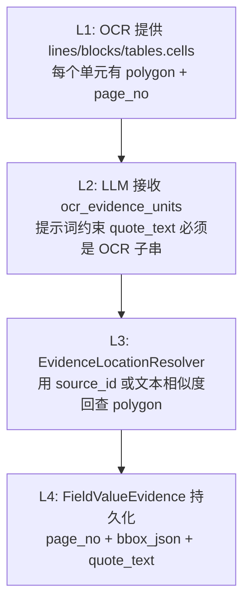

# 关键设计 - 证据归因机制

> [!info] 一句话说明
> 每个 AI 抽取出来的字段值都必须能"指回"原文档的某段文字（quote_text）+ 页码 + 坐标（bbox）；这条溯源链由 `LlmEhrExtractor` 提示词 + OCR 证据单元 + `EvidenceLocationResolver` 三段配合实现。

## 为什么这套设计能保证可溯源

可溯源的三个层级，由下往上必须**层层不丢**：



每层都有**兜底**：

- L2 模型偏离 → L3 用 `_match_location_by_quote` 模糊查
- L3 模糊查不到 → 兜底使用兄弟字段位置（`_apply_sibling_evidence_fallback`，[[关键设计-嵌套字段与RecordInstance]] 详述）
- L4 写入时把 `match_strategy` 记到 `bbox_json` 里供审计

## quote_text 与 OCR 坐标对齐的三种路径

`evidence_location_resolver.py::resolve_evidence_locations` 按优先级尝试：

### 路径 1：`source_id` 直查（最准）

LLM 输出 `evidences[].source_id`（OCR 证据单元的 line_id / block_id / cell_key），resolver 用 `(source_type, source_id)` 直接到索引表里查 polygon。

> [!info] 提示词如何引导
> `LlmEhrExtractor._build_user_prompt` 把 `build_ocr_evidence_units(document)` 算出的所有 line/block 列表（限 260 条）作为 "OCR 证据单元" 写入 prompt，明确要求 LLM 在 evidence 里回填 `source_type` / `source_id`。

### 路径 2：source_type 缺失时的同 ID 试探

只给了 `source_id` 没给 `source_type` → 依次尝试 `line / block / table_cell`，第一个命中即用。

### 路径 3：`quote_text` 模糊匹配（兜底）

`_match_location_by_quote`：

1. 收集候选 query（`quote_text`、`fallback_text`，对 dict/list 递归展平）
2. 对索引中每个 location.text 计算 `_text_match_score`：
   - 完全相等 → 1.0
   - 通配符 `*` 跨段匹配（处理姓名 `张*`、身份证 `4***1234X`）
   - 子串包含 → 0.65 ~ 0.95
   - `SequenceMatcher.ratio()` 兜底
3. 按 query 长度选阈值：≤2 字符 0.98、≤4 字符 0.72、其它 0.50
4. 取最高分；记 `match_strategy="ocr_value_fuzzy"`、`match_score`、`match_query`

> [!warning] 阈值的取舍
> 短 query（如性别"男"）必须几乎完全匹配，否则会把任何含"男"的句子都拉出来；长 query 容忍 OCR 错字/标点。

## 提示词如何强制 LLM 使用原文

LLM 输出格式规则（来自 `_build_system_prompt`）：

```text
4. evidence.quote_text 必须来自原文，不要改写；
   如 OCR 证据单元中有对应内容，必须填写 source_type/source_id。
```

校验阶段 `_validate_evidence`：

```python
return [f"... quote_text must be an OCR substring: {quote}"
        for quote in quotes if quote and quote not in text]
```

不达标 → 进入 LangGraph 的 retry 分支，构造 `repair_prompt` 再调一次（最多 3 次）。这是 LLM 内部的"prompt 修复重试"，独立于 Celery 层重试。

## ExtractionService 的兜底（兄弟字段位置）

来源：`_apply_sibling_evidence_fallback`。

### 场景

LLM 在同一个表单（如"用药记录.出院带药.0"）里抽出了 5 个字段，其中 4 个挂上了 quote_text + bbox，1 个（`剂量`）只有 quote_text 没找到 bbox。

### 兜底逻辑

```text
1. 把字段按 (record_instance_id, parent_path) 分组
2. 同组中如已有定位成功的兄弟 → 把它的 page_no / bbox_json 复制给未定位字段
3. 在兜底 evidence 的 bbox_json 标注:
     fallback_strategy = "sibling_field_location"
     fallback_from_quote_text = 兄弟的 quote_text
```

> [!info] 兜底比无位置更好
> 用户审核时可以看到这个值"大致在哪一段"——准确度退化但可用性保留；UI 上靠 `fallback_strategy` 标识"位置为推测"。

## FieldValueEvidence 如何记录

写入由 `StructuredValueService.record_ai_extracted_value` → `add_evidence`（一个 event 可挂多条 evidence）：

```text
value_event_id   → 所属 event
document_id      → 必填（每条 evidence 必定指向某文档）
evidence_type    → "document_text" / "llm_extract" / "table_cell" 等
quote_text       → 原文片段（resolver 优先用 location.text，回退用 LLM quote_text，再回退用 field value）
page_no          → 整数页码
bbox_json        → polygon + page_no + coord_space + source_type/source_id + match_strategy
row_key/cell_key → 表格类证据（暂未广泛使用）
start_offset/end_offset → 字符级偏移（暂未广泛使用）
evidence_score   → LLM confidence
```

`bbox_json` 字段是一个**包含丰富元数据的 dict**，不只是坐标：

```jsonc
{
  "page_no": 3,
  "polygon": [x1, y1, x2, y1, x2, y2, x1, y2],
  "coord_space": "pixel",
  "page_width": 1240,
  "page_height": 1754,
  "source_type": "line",
  "source_id": "p3-l27",
  "textin_position": [...],
  "source_text": "出院带药：阿托伐他汀钙片 20mg qn",
  "match_strategy": "ocr_value_fuzzy",   // 仅模糊匹配路径有
  "match_score": 0.83,                   // 同上
  "match_query": "阿托伐他汀钙片20mgqn",     // 同上
  "fallback_strategy": "sibling_field_location",  // 仅兜底有
  "fallback_from_quote_text": "..."
}
```

## 读取侧：从 evidence 算前端 source_location

来源：`EhrService._source_location_from_evidence`：

- 把 `evidence.bbox_json` 拷贝出来
- 强制 `page` 与 `page_no` 都存在（兼容前端不同字段名）
- 若有 `polygon` 但无 `position`，把 `polygon` 复制到 `position`（前端历史字段）
- 该结构最终通过 `/patients/{id}/fields/{path}/events` 等接口返回给前端 PDF 高亮组件

## 关联到字段的判断

`EhrService._evidence_matches_field` 决定 evidence "属于" 哪个字段：

1. quote_text 紧凑化（去空白）
2. 若 quote 包含字段当前值 → 命中
3. 若 quote 包含字段 key / title / field_path 叶子名 → 命中
4. 否则不展示（避免把"姓名：张三"的句子作为"身份证"字段证据）

LLM 侧也有同样思路的 `_evidence_matches_field`（在 `LlmEhrExtractor._select_evidences_for_field`），在 LLM 输出过滤阶段就剔除无关 evidence。

## 异常分支

| 场景 | 表现 | 处理 |
|---|---|---|
| document 无 `parsed_data` 与 `ocr_payload_json` | resolver 直接返回 evidences 原样 | 字段值写入但 page_no/bbox_json=null |
| LLM 没回 quote_text | `_build_field_evidences` 用字段显示值兜底查询 | 仍可能模糊命中；否则 evidence 只有 quote_text 无定位 |
| `quote_text` 不在 OCR 文本中 | LangGraph repair 重试；3 次失败标 invalid | 最终 Job 失败、不写库 |
| polygon 数组长度 <8 | `_add_location` 拒绝索引 | 该 OCR 单元失去可定位性，但不影响其它单元 |

## 涉及资源

- **服务**：`evidence_location_resolver.resolve_evidence_locations` / `build_ocr_evidence_units`
- **服务**：`LlmEhrExtractor._build_user_prompt` / `_validate_evidence` / `_select_evidences_for_field`
- **服务**：`ExtractionService._build_field_evidences` / `_apply_sibling_evidence_fallback`
- **数据表**：[[表-field_value_evidence]] [[表-field_value_event]] [[表-document]]
- **前端**：PDF 高亮、字段证据弹窗组件

## 验收要点

- [ ] 抽取出的每个字段值都有至少 1 条 evidence（quote_text 非空）
- [ ] 至少 80% 的 evidence 能解析出 page_no 与 bbox（剩余兜底也应有 fallback_strategy）
- [ ] LLM 改写过的 quote_text（非 OCR 子串）会被 validate 拦截并触发重试
- [ ] 同组兄弟字段定位成功时，未定位字段会复用其 page_no
