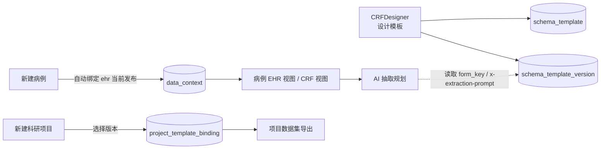

# 业务概述

> Schema 模板把"一份完整病例档案应该长什么样"沉淀为可版本化的 JSON Schema，再以"同一份结构"驱动**录入表单（EHR/CRF）**、**AI 抽取规划**与**数据集导出**。

## 一句话定位

> Schema 模板 = **字段字典 + 表单结构 + 抽取提示词** 的统一载体。

## 解决什么问题

| 问题 | 解决方式 |
|---|---|
| 不同医生 / 项目对"该填什么字段"理解不一致 | 模板把字段定义固化在 JSON Schema 中，全院共用 |
| 字段含义会随业务演进 | 模板支持多版本，新版发布不破坏旧数据（见 [[关键设计-模板版本化]]） |
| AI 抽取 prompt 与字段定义在两处维护，易漂移 | 每个字段的 `x-extraction-prompt` 内嵌在 schema 里，抽取规划直接读取 |
| 录入表单要随字段变化更新前端代码 | 前端用 [`SchemaForm`](../../../frontend_new/src/components/SchemaForm/SchemaForm.jsx) 通用渲染器，**零 schema 硬编码** |
| 不同项目要导出不同结构 | 每个科研项目绑定特定模板版本，按该版本结构聚合 |

## 核心概念

### SchemaTemplate（模板）
长生命周期对象，由 `template_code`（唯一）+ `template_name` + `template_type` 描述。`template_type` 决定模板用途：
- `ehr` — 病例档案模板（每个病例自动绑定当前发布的 ehr 版本）
- `crf` — 科研专用 CRF 模板（按项目按需绑定）
- 其他类型按业务扩展

详见 [[表-schema_template]]。

### SchemaTemplateVersion（模板版本）
模板的一次"快照"。`schema_json` 字段存放完整 JSON Schema 文本，状态从 `draft` → `published` → `deprecated` 单向流转。**真正被业务对象引用的是版本，而非模板本身**——这是版本化的关键设计，详见 [[关键设计-模板版本化]]。

详见 [[表-schema_template_version]]。

### EHR 与 CRF 的关系

> [!info] EHR 与 CRF 在 EACY 中是"同一套机制 + 不同模板"
>
> - **EHR 视图**：用 `template_type='ehr'` 的当前发布版本渲染，每个病例自动绑定，作为"病人的完整档案"。
> - **CRF 视图**：用 `template_type='crf'`（或科研项目专属的某个 ehr 版本）渲染，每个**科研项目**自行绑定，作为"项目的研究数据"。
>
> 两套视图共用同一个 `SchemaForm` 运行时、同一个抽取流水线、同一个证据归因机制。差别只在"绑定了哪个版本的 schema"。

## 关键设计

| 主题 | 文档 |
|---|---|
| 模板与版本分离、版本不变性 | [[关键设计-模板版本化]] |
| Schema 结构（字段/分组/嵌套/枚举）与 `form_key` 映射 | [[关键设计-Schema结构]] |

## 与其他域的协作

- 病例与版本的绑定：写入 `data_context.schema_version_id`（见 [[表-data_context]]）。
- 项目与版本的绑定：写入 `project_template_binding.schema_version_id`（见 [[表-project_template_binding]]）。
- 一旦绑定，业务对象只看版本里的 schema 快照，不会随模板的新版本发布而变更。

## 涉及代码

- **后端**
  - 路由：`backend/app/api/v1/templates/router.py`
  - 服务：`backend/app/services/schema_service.py`
  - 字段规划：`backend/app/services/schema_field_planner.py`（把 schema 拆解为可被抽取流水线消费的 `SchemaField` 列表）
- **前端**
  - 设计器：`frontend_new/src/pages/CRFDesigner/index.jsx` + `frontend_new/src/components/FormDesigner/...`
  - 运行时渲染：`frontend_new/src/components/SchemaForm/SchemaForm.jsx` + `CategoryTree.jsx`
- **参考样例**：项目根 `ehr_schema.json` 是当前 ehr 模板的一份导出快照。

## 涉及的表

- [[表-schema_template]]
- [[表-schema_template_version]]
- [[表-data_context]]（病例与 schema 版本的绑定）
- [[表-project_template_binding]]（项目与 schema 版本的绑定）
