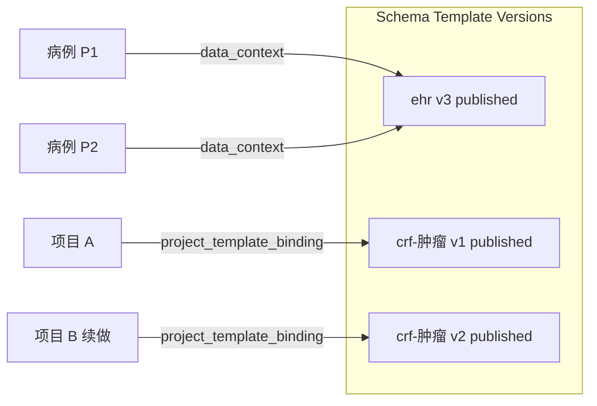
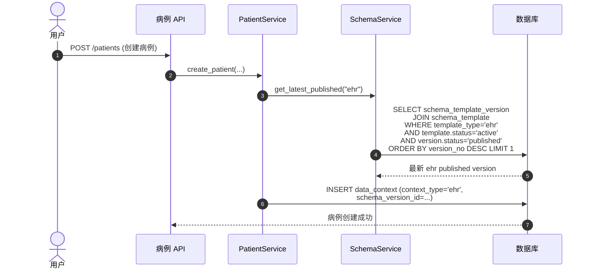
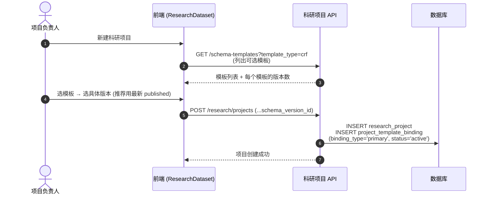

# 业务流程：模板使用（绑定到项目）

> [!info] 一句话
> 设计好的模板版本，通过两种路径"上岗"：**新建病例自动绑定 ehr 当前发布版本**、**新立项的科研项目主动选择某个版本**。

本文聚焦"模板侧"的绑定语义，项目侧详细流程见 [[科研项目与数据集/业务流程-创建科研项目]]（TBD）。

## 两类绑定

| 绑定关系 | 载体表 | 触发时机 | 谁选 |
|---|---|---|---|
| 病例 ↔ ehr 版本 | `data_context` | 新建病例时 | 系统自动取 `template_type='ehr'` 的最新 published |
| 项目 ↔ 模板版本 | `project_template_binding` | 新建科研项目时（也可后续追加 binding） | 用户在项目设置里主动选择 |

详见 [[表-data_context]] [[表-project_template_binding]]。

## 病例绑定：自动选最新 ehr published

关键点：

- 选版本的 SQL 在 [`SchemaTemplateVersionRepository.get_latest_published`](../../../backend/app/repositories/schema_template_repository.py)。
- 一旦写入 `data_context.schema_version_id`，**该病例就锁在那个版本**——后续 ehr 模板再发布新版，老病例不变。
- 病例侧详细创建流程见 [[病例管理/业务流程-新建病例]]（TBD）。

## 项目绑定：用户主动选版本

要点：

- 一个项目可能有多条 `project_template_binding`（不同 `binding_type`），唯一约束是 `(project_id, schema_version_id, binding_type)`。
- 推荐写入 `locked_at` 锁定，避免后续被替换（业务规则，由调用方维护）。
- 项目导出时按绑定的版本读 `schema_json`，按其结构聚合 `field_current_value` → Excel/CSV，详见 [[科研项目与数据集/业务流程-数据集导出]]（TBD）。

## 模板侧需要支持的查询

为上述绑定流程，本模块对外提供：

| 调用方需求 | 调用 | 出处 |
|---|---|---|
| 列出某类型可绑定的模板 | `GET /schema-templates?template_type=crf&status=active` | `list_schema_templates` |
| 拿到模板的全部版本（选哪个） | `GET /schema-templates/{id}` 返回 `versions` | `get_schema_template` |
| 系统自动选 ehr 最新 published | `SchemaService.get_latest_published("ehr")` | 服务方法，非 HTTP 接口 |

## 版本被引用后的保护

- 一个版本只要被 `data_context` 或 `project_template_binding` 引用，删除 draft 会被拒；删 published 转 deprecated 保留数据（详见 [[关键设计-模板版本化]]）。
- `SchemaTemplateVersionRepository.has_references` 是引用检测的真相源。

## 异常分支

| 场景 | 表现 | 处理 |
|---|---|---|
| ehr 类型下没有任何 published 版本 | `get_latest_published` 返回 None | 病例创建应被阻断，提示运维先发布 ehr 模板 |
| 用户选了 `draft` 状态版本绑给项目 | 业务上允许但不推荐 | 前端最好只展示 published，draft 仅供 preview |
| 模板被归档（`archived`） | `get_latest_published` 过滤掉了 | 老项目仍可引用其历史 published 版本 |

## 涉及资源

- **后端服务**：`SchemaService.get_latest_published`、`SchemaService.list_templates`
- **数据表**：[[表-schema_template]] [[表-schema_template_version]] [[表-data_context]] [[表-project_template_binding]]
- **下游业务流程**：[[病例管理/业务流程-新建病例]]、[[科研项目与数据集/业务流程-创建科研项目]]、[[科研项目与数据集/业务流程-数据集导出]]（均为 TBD）

## 验收要点

- [ ] 新建病例后，`data_context` 出现一条 `context_type='ehr'` 的记录，`schema_version_id` 指向当前 ehr 最新 published
- [ ] 发布 ehr 新版后，再新建病例 → 新病例绑新版；旧病例的 `schema_version_id` 不变
- [ ] 项目绑定 crf 版本后，将其状态人为改为 `deprecated`（运维操作），项目侧仍能读取该版本的 schema_json
- [ ] 列出 `template_type=crf` 模板接口，归档（archived）模板被过滤
