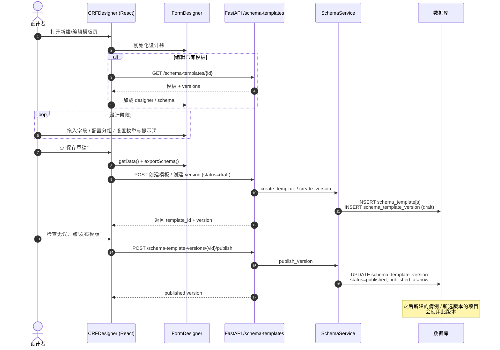

# 业务流程：模板设计与发布

> [!info] 一句话
> 在 `CRFDesigner` 里**可视化拖拽**搭出 schema，保存为 draft 版本；确认无误后发布，让新建的病例 / 新立项的科研项目可以选择使用。

## 触发场景

- 业务方提出新的字段需求 / 调整字段定义
- 上线新科研项目，需要独立的 CRF 结构
- 修复现有版本中的字段定义错误（实际是**新建版本**，老版本仍保留）

## 前置条件

- 用户已登录，具备模板管理权限
- 进入 `frontend_new/src/pages/CRFDesigner` 页面（路径：`/research/templates/new` 或 `/research/templates/:id/edit`）

## 主流程

## 关键步骤说明

### 1. 进入设计器与回填

- URL 含 `templateId` → 调 `GET /schema-templates/{id}` 拉模板元信息 + 版本列表（`SchemaTemplateDetailResponse`），把 `designer` 与 `schema_json` 灌进 `FormDesigner`。
- 无 `templateId` → 视为新建，弹出 `TemplateMetaModal` 让用户填模板名 / 分类 / 描述。

### 2. 设计阶段

设计器内部用一份"designer 数据 + 字段组 fieldGroups"作为可视化中间表示，最终在保存前调用 `exportSchema()` 输出 JSON Schema。CSV 导入 / 导出能力用于离线编辑字段清单。

详细的 designer 数据结构与 schema 互转见 `frontend_new/src/components/FormDesigner/utils/designerBridge.js`（TBD 单独成文）。

### 3. 保存草稿

前端封装了 `saveCrfTemplateDesigner` / `createCrfTemplateDesigner`（见 `frontend_new/src/api/crfTemplate.js`），最终落到后端：

- 新建模板：调 `POST /schema-templates`（`SchemaService.create_template`），后端会按模板名自动生成全局唯一的 `template_code`（无需用户提供）。
- 创建版本：调 `POST /schema-templates/{id}/versions`（`SchemaService.create_version`），传入 `schema_json` + `version_no` + `status=draft`。

> [!warning] template_code 不由用户输入
> 后端使用 `SchemaService._slug_template_code` 把模板名转成 slug 并保证唯一。前端不要再让用户填 `template_code`，避免命名冲突。

### 4. 发布

- 调 `POST /schema-template-versions/{vid}/publish`。
- 后端把版本状态置 `published`，记录 `published_at`。
- 一旦发布，**该版本的 `schema_json` 不再变更**（详见 [[关键设计-模板版本化]]）。需要再调整 → 新建一个 `version_no+1` 的 draft。

## 异常分支

| 场景 | 表现 | 处理 |
|---|---|---|
| 提供的 `template_code` 已存在 | 409 Conflict | 前端兜底自动改用基于模板名的 slug；管理后台手动改名 |
| 发布一个 `deprecated` 版本 | 409 Conflict | 不允许"复活"已废弃版本，新建版本替代 |
| 删除一个被引用的 draft 版本 | 409 Conflict | 先解绑（实操中通常用不到，因为 draft 不应被引用） |
| `exportSchema()` 失败 | 前端 message.error | 检查 FormDesigner 控制台日志；常见为字段定义不完整 |
| 网络中断 | message.error 兜底 | 草稿在前端 designer ref 里仍在，可重试保存 |

## 涉及资源

- **前端页面**：`frontend_new/src/pages/CRFDesigner/index.jsx`
- **核心组件**：`frontend_new/src/components/FormDesigner/`
- **API 客户端**：`frontend_new/src/api/crfTemplate.js`
- **后端路由**：`backend/app/api/v1/templates/router.py`
- **后端服务**：`backend/app/services/schema_service.py`
- **数据表**：[[表-schema_template]] [[表-schema_template_version]]

## 验收要点

- [ ] 新建模板 → 保存草稿 → 可在模板列表看到，状态 draft
- [ ] 发布草稿 → 状态变 published，`published_at` 有值
- [ ] 已发布版本无法被原地修改 schema（接口未提供此能力）
- [ ] 重名模板自动改 slug 后缀（`_2`、`_3` 等）
- [ ] CSV 导入 / 导出来回一次，schema 关键字段无丢失（精确字段范围以 designer 实现为准）
