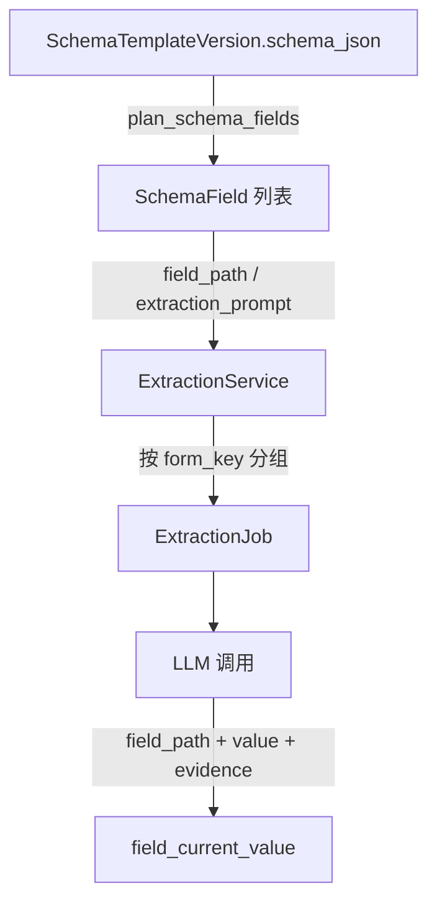

# 关键设计：Schema 结构

> EACY 的 Schema 是**带扩展的 JSON Schema 2020-12**：在标准结构之上加 `x-*` 扩展字段表达 EACY 自有语义（字段唯一标识、显示控件、抽取 prompt、敏感性、行约束等）。本文说明：层级划分、嵌套结构、枚举处理、与 `form_key` 的映射关系。

> [!info] 参考样例
> 项目根 `ehr_schema.json` 是当前 ehr 模板的一份导出快照，对照阅读最直观。

## 整体层级

```text
schema (object)
├── 文件夹1 (object)        ← 一级分组，对应 CategoryTree 的"文件夹"
│   ├── 表单1 (object)      ← 二级分组，对应 CategoryTree 的"表单/form_key"
│   │   ├── 字段组A (object)
│   │   │   ├── 叶子字段a (string/number/...)
│   │   │   └── 叶子字段b
│   │   └── 可重复表格 (array<object>)   ← 多行记录（用药、手术等）
│   └── 表单2 ...
└── 文件夹2 ...
```

- 最外层 `properties` 的每个键是一个**文件夹**（一级目录）。
- 文件夹下的每个键是一个**表单**（form），其 `<folder>.<form>` 拼接即 `form_key`，是抽取流水线的最小调度单元。
- 表单内可以继续嵌套 `object` / `array` 表达字段组与可重复结构。

## 一级 / 二级目录 → `form_key`

`form_key` 的生成规则在 [`schema_field_planner.schema_top_level_forms`](../../../backend/app/services/schema_field_planner.py)：

| schema 结构 | 产生的 `form_key` |
|---|---|
| `properties.基本信息.properties.人口学情况` | `基本信息.人口学情况` |
| `properties.基本信息` 下无 properties | `基本信息`（兜底，整个文件夹当成一个表单） |
| 整个 schema 为空 | `ehr`（最终兜底） |

`form_key` 用于：

- **抽取规划**：每个 `form_key` 对应一个 `ExtractionJob`，一次抽取一个表单（详见 [[AI抽取/业务概述]]）。
- **前端 CategoryTree**：左侧目录树按 `form_key` 展开（见 `CategoryTree.jsx`）。
- **靶向抽取触发**：前端用户点某个表单 → 传递 `target_form_key` → 后端只规划该表单（见 `SchemaForm.jsx` 的 `targetFormKey` 计算）。

## 叶子字段

每个叶子字段是 JSON Schema 的标量类型（`string` / `number` / `boolean` / `date` 等），辅以 `x-*` 扩展声明 EACY 语义。常见扩展字段：

| 扩展字段 | 含义 |
|---|---|
| `x-field-uid` | 字段全局唯一 ID（`f_xxxxxxxx` 形式），跨版本可对齐"逻辑上同一个字段" |
| `x-display` | 前端控件类型：`radio` / `date` / `table` / ... |
| `x-extraction-prompt` | 该字段的抽取 prompt，AI 抽取直接读取 |
| `x-sensitive` | 是否敏感字段（前端会脱敏显示） |
| `x-primary` | 是否主字段（影响病例摘要展示等） |
| `x-options-id` | 引用的枚举字典 ID（详见下文） |
| `x-unit` | 数值单位（如"岁"、"mmol/L"） |
| `x-sources` | 该字段优先来自哪种文档类型（`primary` / `secondary` 数组，给文档溯源做匹配） |

不要从本文 copy 字段列表去抄到代码里——以 `schema_field_planner.py` 与 `SchemaForm` 的实际读取为准。

## 分组与字段组（object 嵌套）

文件夹下不止两层，还可以继续嵌套 `object`。例如 `基本信息.人口学情况.身份信息.患者姓名` 是一个 4 段路径的叶子字段。

`schema_field_planner.plan_schema_fields` 会递归遍历到所有叶子，产出一组 `SchemaField`，其中 `field_path` 是**去除数组下标**的规范化点分路径，与 `FieldCurrentValue.field_path` 直接对齐。

## 可重复结构（用药记录类）

> [!info] 用药记录、手术记录、检验项目这类"一份病例可以有多条"的结构，用 JSON Schema 的 `array<object>` 表达。

样例片段（`基本信息.人口学情况.身份信息.身份ID`）：

```json
{
  "type": "array",
  "items": {
    "type": "object",
    "properties": {
      "证件类型": { "type": "...", "x-display": "radio" },
      "证件号码": { "type": "string" }
    }
  },
  "x-display": "table",
  "x-row-constraint": "multi_row",
  "x-merge-binding": "group_key=证件类型"
}
```

要点：

- `x-display: "table"` 让前端渲染为表格。
- `x-row-constraint: "multi_row"` 允许多行。
- `x-merge-binding`（如 `group_key=证件类型`）用于合并去重——同 `证件类型` 的多次抽取结果会归并为同一行。
- 数据落库时每行有自己的 `_row_uid`，前端字段路径形如 `xxx.<rowIndex>.<subField>`，但 `field_current_value` 中的 `field_path` 仍保留无下标形态，行身份由 `record_instance` 表承载。

详见 [[AI抽取/关键设计-嵌套字段与record_instance]]（TBD）。

## 枚举

枚举通过 JSON Schema 的 `$defs` + `$ref` 复用：

```json
"性别": {
  "allOf": [{ "$ref": "#/$defs/8853747a-..." }],
  "x-options-id": "8853747a-...",
  "x-display": "radio"
}
```

- 真正的可选值列表写在 `$defs.<uuid>.enum`。
- `x-options-id` 直接暴露 ID，便于前端 / 字段规划读取，避免逐层解析 `allOf`。
- `schema_field_planner.options_for` 同时支持 `enum`、`allOf+$ref`、`items.enum` 三种写法。

## 字段 → AI 抽取的映射



- 抽取 prompt 不集中存放，**就近写在字段定义里**（`x-extraction-prompt`），随版本一起冻结。这样某字段的 prompt 演进与 schema 本身共版本，不会出现"prompt 改了但老版本数据怎么解释"的歧义。
- `form_key` 是抽取调度的边界，一个表单一个 job，独立重试、独立计费、独立证据归因。

## 前端运行时如何消费 Schema

- `SchemaForm` 接收 `schema` + `patientData`，**不写任何字段层硬编码**。
- `CategoryTree` 按 schema 的 `properties` 递归生成左侧目录，只到"文件夹 → 表单"两层（不暴露字段层级），见 `CategoryTree.jsx` 头注释。
- 字段级渲染（`FormPanel`）按字段类型 + `x-display` 选控件。
- 修改 / 候选值固化 / 证据展示 全部按 `field_path` 与后端对齐。

## 引用本设计的其他文档

- [[关键设计-模板版本化]]
- [[业务流程-模板设计与发布]]
- [[AI抽取/业务概述]]（form_key 调度、x-extraction-prompt 读取）
- [[AI抽取/证据归因机制]]（TBD，field_path 与证据落库）
