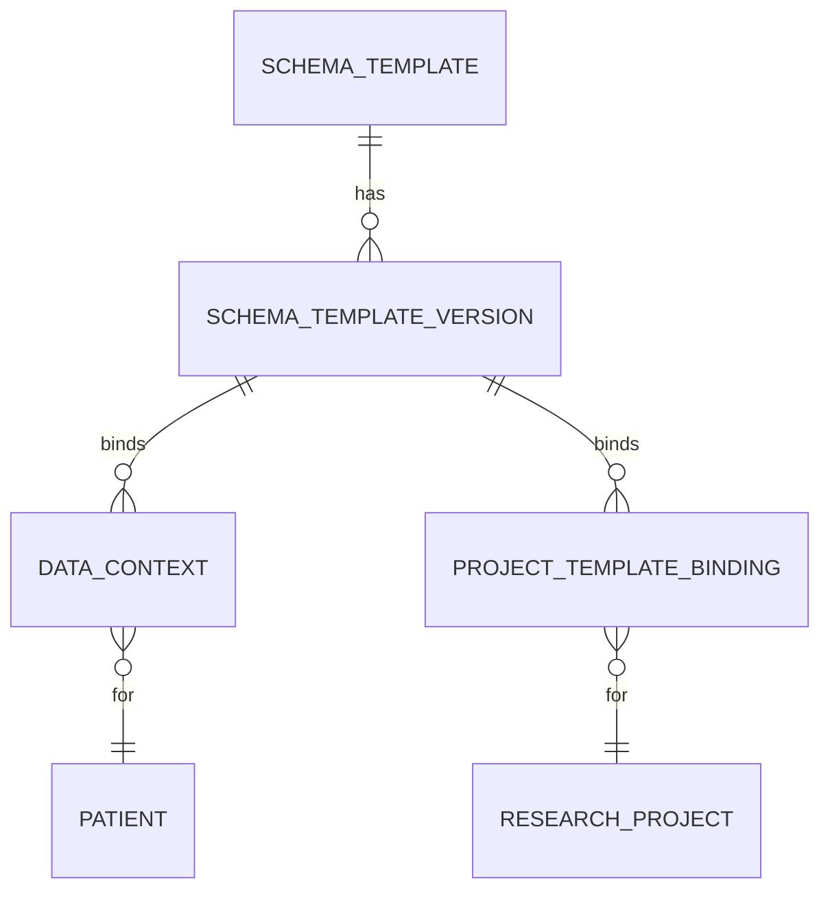
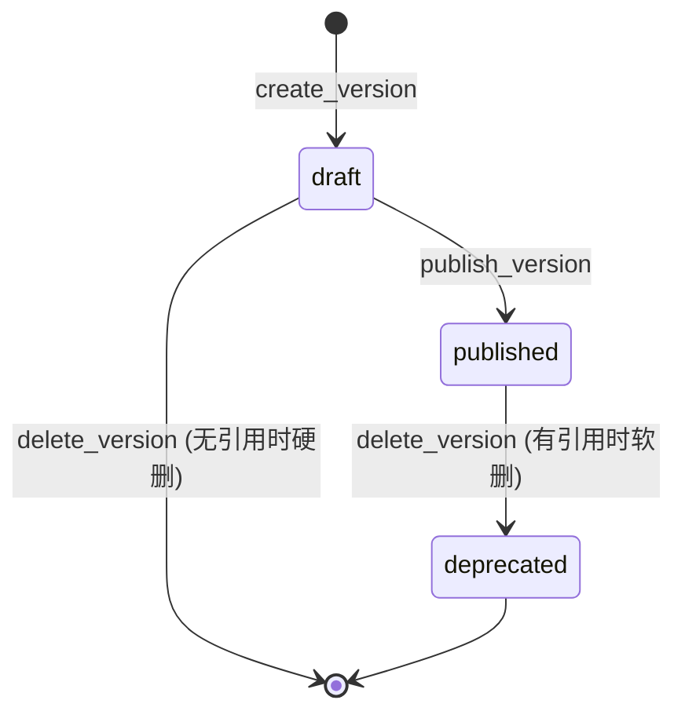
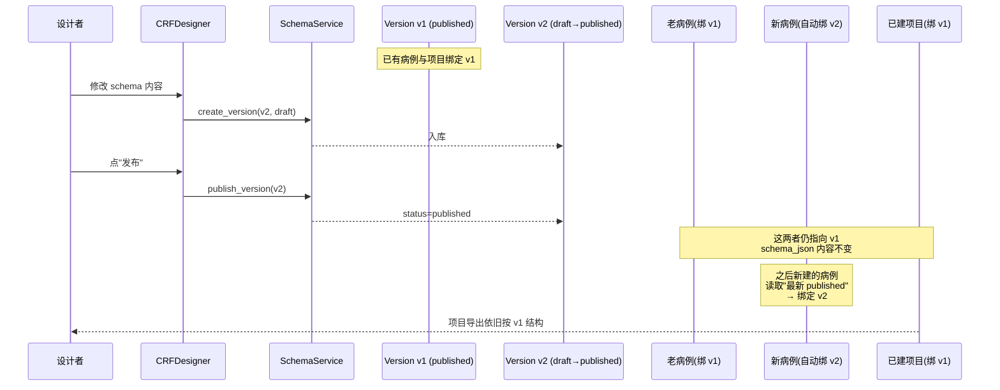

# 关键设计：模板版本化

> Schema 模板的核心是"**模板（长生命周期）+ 版本（不可变快照）**"二元结构。理解这套结构才能理解：为什么新版发布不会破坏老数据、为什么科研项目能保证多年后导出的数据集与项目立项时完全一致。

## 模板 vs 版本

| 对象 | 角色 | 可变性 |
|---|---|---|
| `SchemaTemplate` | "这套字段定义的名字"——逻辑标识 | 可改名、可归档 |
| `SchemaTemplateVersion` | "这套字段在 X 时刻的具体长什么样"——内容快照 | **发布后不可改** |

> [!info] 类比
> `SchemaTemplate` 像一本书的"书名"，`SchemaTemplateVersion` 像一次"印刷版次"。新版印出来不会让你手里的旧版字消失。

详见 [[表-schema_template]] [[表-schema_template_version]]。

## 为什么业务对象绑定的是版本而非模板

业务对象（病例、科研项目）持有的是 `schema_version_id`，不是 `template_id`：

| 业务对象 | 绑定字段 | 来源 |
|---|---|---|
| 病例（EHR 上下文） | `data_context.schema_version_id` | 新建病例时写入当时的 ehr 当前发布版本 |
| 科研项目 | `project_template_binding.schema_version_id` | 用户在项目设置里**主动选择**的版本 |

如果绑的是模板（template_id），那"模板"的内容随时间漂移，老病例 / 老项目某天打开就会变成另一套字段——这在医疗数据场景是不可接受的。

## 版本状态机

关键规则（在 `SchemaService` 中实现）：

- **draft → published**：调用 `publish_version`，记录 `published_at`。已 deprecated 的版本不能再发布回 published。
- **删除 draft**：若该 draft 已被 `data_context` 或 `project_template_binding` 引用，禁止删除（保护引用完整性）；无引用则硬删。
- **删除 published**：永远转为 `deprecated`（软删），保留快照内容供已绑定的对象继续读取。

> [!warning] 不允许"原地改 schema"
> `SchemaTemplateVersion.schema_json` 一旦版本进入 `published`，不再提供更新接口。要变更字段，必须**新建一个版本**。这是版本不变性的物理保证。

## 新版发布不破老数据：完整链路

实际代码路径：

- 病例创建时拉取 ehr 类型最新 published：[`SchemaTemplateVersionRepository.get_latest_published`](../../../backend/app/repositories/schema_template_repository.py)
- 项目立项时由用户选择版本，写入 `project_template_binding`（详见 [[科研项目与数据集/业务流程-创建科研项目]]，TBD）

## 多类型并存：ehr / crf / ...

`SchemaTemplate.template_type` 把模板按用途分桶，`get_latest_published(template_type)` 在每个桶内独立挑选当前发布版本。所以可以同时存在：

- 一个 `template_type='ehr'` 的"全院通用病历模板"，每个病例自动绑定。
- 多个 `template_type='crf'` 的"科研专用模板"，按项目按需绑定。

## 版本删除与引用保护

`SchemaService.delete_version` 的实现要点：

1. 查询 `data_context` 与 `project_template_binding` 是否引用该版本（`has_references`）。
2. `draft` + 有引用 → 拒绝（409 Conflict）。
3. `draft` + 无引用 → 硬删。
4. `published` → 转 `deprecated`，记录变更，物理快照保留。

> [!warning] 不要为了"清理"硬删 published 版本
> 即便上线后发现某版本有错，正确做法是发布修正版 + 把错误版标 deprecated，而非删数据。任何已经引用该版本的字段历史都依赖那份 `schema_json` 才能正确反序列化。

## 引用本设计的其他文档

- [[业务流程-模板设计与发布]]
- [[业务流程-模板使用（绑定到项目）]]
- [[AI抽取/业务概述]]（抽取读取版本里的 `x-extraction-prompt`）
- [[科研项目与数据集/业务概述]]（项目-版本绑定）
