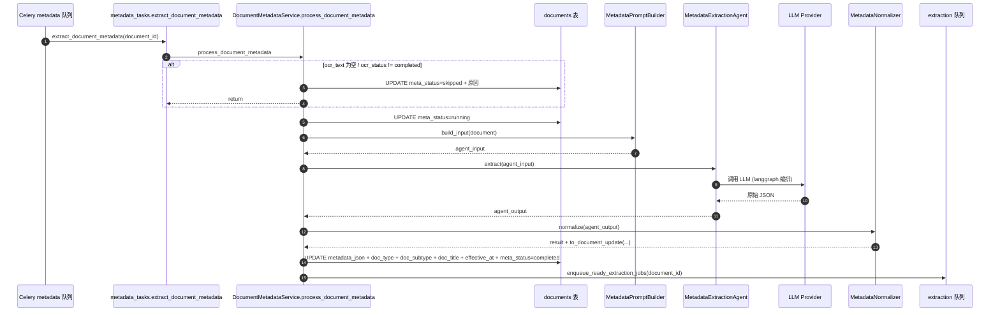

# 业务流程-Metadata识别

> [!info] 一句话说明
> OCR 完成后，再让 LLM 看一遍文档文本，**识别"这是张什么单据 + 涉及谁 + 唯一标识符是什么"**，把结果落到 `documents.metadata_json` / `doc_type` / `doc_subtype` / `doc_title` / `effective_at`。这是 [[端到端数据流]] `[3] Metadata 识别` 阶段的详细版。

## 为什么需要这一步

Metadata 不是终端用户能直接看的产物，而是为后续两件事服务：
1. **未归档分组**：`ArchiveGroupingService` 用 `metadata_json` 里的"唯一标识符 / 患者姓名 / 出生日期 / 机构…"做并查集与候选病例匹配（见 [[关键设计-未归档池与归档]]）。**没跑过 Metadata 的文档进不了正常分组**，会停在"待 OCR / 元数据提取"组。
2. **抽取规划**：`doc_type` / `doc_subtype` 决定 [[AI抽取/README]] 走哪条 prompt 链路；不同类型文档抽取的 form_key 集合不同。

## 触发场景

- **自动级联**：`DocumentService.process_document_ocr` 成功后 `_enqueue_metadata_task` 入队（OCR → Metadata 串联）。
- **手动重跑**：`POST /api/v1/documents/{document_id}/metadata` → `DocumentMetadataService.queue_document_metadata` 入队（如调整了 prompt 或 schema 后批量补跑）。

## 前置条件

- `document.ocr_status = "completed"` 且 `ocr_text` 非空；否则 `_has_extractable_text` 返回 False，任务直接置 `meta_status=skipped` 并写入原因。
- LLM 提供方可达（依赖 `MetadataExtractionAgent` 内部的 langgraph + LLM 客户端，详见 [[AI抽取/README]]）。

## 状态机

```text
queued ──► running ──┬─► completed
                     ├─► failed (LLM 异常 / 解析失败)
                     └─► skipped (OCR 文本为空)
```

字段 `document.meta_status`：

| 值 | 含义 |
|---|---|
| `queued` | 已入队，Worker 未拾取 |
| `running` | Agent 正在调 LLM |
| `completed` | 写入 `metadata_json`、`doc_type/doc_subtype/doc_title/effective_at` |
| `skipped` | OCR 未完成或文本为空，本次不跑 |
| `failed` | LLM 抛错；旧的 `result` 保留 + 新增 `error` 段 |

## 主流程



## 产物结构

`metadata_json` 形如：
```json
{
  "schema_version": "<METADATA_SCHEMA_VERSION>",
  "result": {
    "患者姓名": "...", "患者性别": "...", "患者年龄": "...",
    "出生日期": "...", "联系电话": "...", "诊断": "...",
    "机构名称": "...", "科室信息": "...",
    "文档类型": "...", "文档子类型": "...", "文档标题": "...",
    "文档生效日期": "...",
    "唯一标识符": [{ "value": "..." }, ...]
  }
}
```

`router.py::build_document_metadata_summary` 把它扁平化为 `document_metadata_summary` 给前端用，避免每个页面都各自挑字段。

## 异常分支

| 场景 | 表现 | 处理 |
|---|---|---|
| OCR 文本为空 | `meta_status=skipped`，`metadata_json.error.message="OCR text is empty or not completed"` | 用户先补完 OCR 再重跑 |
| LLM 调用抛异常 | `meta_status=failed`，`metadata_json` 保留旧 `result` + 新 `error` 段 | 重跑 `/metadata` 即可重置 |
| 已在 running 时再次入队 | `queue_document_metadata` 抛 409 | 前端按钮置灰 |
| Normalizer 解析失败 | 走 `_mark_failed` 同上 | 排查 prompt 或 LLM 返回格式 |

## 涉及资源

- **API**：`POST /api/v1/documents/{document_id}/metadata`（202 Accepted）
- **Celery 任务**：`eacy.metadata.extract_document_metadata`（队列名 `metadata`）
- **服务**：`DocumentMetadataService` + `MetadataPromptBuilder` + `MetadataExtractionAgent` + `MetadataNormalizer`
- **数据表**：[[表-document]]

## 验收要点
- [ ] OCR 完成后自动触发 Metadata，30s 内 `meta_status=completed`。
- [ ] OCR 失败的文档触发 Metadata：返回 `skipped`，不会进入 `running`。
- [ ] LLM 调用失败时 `metadata_json.error.type` 与 `message` 可定位问题，且原有 `result` 保留。
- [ ] Metadata 完成后 `doc_type`/`doc_subtype` 进入 `idx_documents_doc_type` 索引，FileList 按类型过滤可见。
- 详尽用例见 [[验收要点]]。
