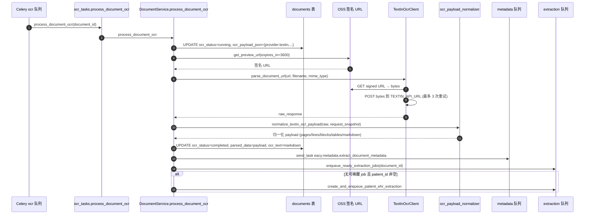

# 业务流程-OCR处理

> [!info] 一句话说明
> 后台 Worker 从 `ocr` 队列拉一个 `document_id`，调用 TextIn OCR，把识别结果归一化后写回 `documents.parsed_data` / `ocr_payload_json`，并尝试触发下游 Metadata 与抽取任务。这是 [[端到端数据流]] `[2] OCR` 阶段的详细版。

## 触发场景

1. **自动触发**：上传时 `DOCUMENT_OCR_AUTO_ENQUEUE=true`（见 [[业务流程-文档上传与存储]]）。
2. **手动重抽**：用户在 FileList / DocumentDetailModal 点"重新 OCR"，前端调 `POST /api/v1/documents/{document_id}/ocr`，由 `DocumentService.queue_document_ocr` 入队。
3. **未来扩展**：批量重抽脚本可直接 `celery_app.send_task("eacy.ocr.process_document_ocr", [...])`，本流程是幂等的。

## 前置条件

- 文档行存在且未软删（`get_visible_by_id`）。
- 文档已成功上传到 OSS（`storage_path` 非空，能签出预览 URL）。
- 手动重抽时：当前 `ocr_status != "running"`（否则 `queue_document_ocr` 直接 409）。
- TextIn 凭据齐全：`TEXTIN_APP_ID / TEXTIN_SECRET_CODE / TEXTIN_API_URL`，否则在第一次调用时 `TextInOcrError`。

## 状态机

```text
queued ──► running ──┬─► completed
                     │
                     └─► failed
```

字段 `document.ocr_status` 取值：

| 值 | 何时进入 |
|---|---|
| `pending` | 上传时关闭自动入队 |
| `queued` | 入 Celery 队列后、Worker 尚未拾取 |
| `running` | `process_document_ocr` 已开始 |
| `completed` | TextIn 返回成功 + 归一化落库完成 |
| `failed` | TextIn 调用或归一化抛异常；详情写入 `ocr_payload_json.errors` |

`document.status` 与 `ocr_status` 联动：未归档文档 OCR 成功 → `status=ocr_completed`；已归档文档保持 `archived`（`keep_archived` 分支）。

## 主流程



> [!info] 为什么用签名 URL 而不是直接传 bytes
> `DocumentService` 拿到的 OSS 签名 URL（默认 1 小时）直接交给 `TextInOcrClient.parse_document_url`；该方法内部仍是把文件 GET 下来再 POST 给 TextIn，并不让 TextIn 直接拉 OSS。这样做的好处是：① 单一鉴权链路（OSS 仍只信任后端）；② Worker 重启后无需保存原始 bytes。

## 归一化产物

`normalize_textin_ocr_payload` 把 TextIn 的 `pages / detail` 数组重排为统一结构，写入 `parsed_data` 与 `ocr_payload_json`（同源）。结构与字段语义见 [[关键设计-OCR坐标归一化]]。`ocr_text` 字段额外保存 `markdown`，方便全文检索与 Metadata Agent 喂入。

## 重试与失败语义

- **TextIn HTTP 层重试**：`TextInOcrClient._post_document_bytes` 对连接 / 读写 / 超时类异常做 3 次指数退避（`attempt * 1.5` 秒）。
- **业务层重试**：本流程**不在 Worker 层 retry**。失败直接写 `ocr_status=failed`，业务侧靠"手动重抽"按钮兜底（每点一次重抽就是一次 `queue_document_ocr`）。
- **TextIn 业务错误**：`code != 200` 时抛 `TextInOcrError`，错误信息进 `ocr_payload_json.errors[].message`。
- **下游触发失败被吞掉**：`_enqueue_metadata_task` / `enqueue_ready_extraction_jobs` 包在 `try/except: pass` 里——OCR 成功本身不应因为下游入队失败而回滚。

## 异常分支

| 场景 | 表现 | 处理 |
|---|---|---|
| OSS 签名 URL 失效（超时） | TextIn 下载失败 → `TextInOcrError` | 文档置 `failed`；用户重抽生成新 URL |
| TextIn 凭据缺失 | 第一次调用 `TextInOcrError("Missing TextIn credentials")` | 运维补 env，重启后用户重抽 |
| TextIn 业务码非 200（如 401 / 文件过大） | `TextInOcrError(f"code=..., message=...")` | 同上，错误明细前端可显示 |
| Worker 进程崩溃 | 任务卡在 `running` | 由 [[管理后台/异步任务进度追踪]] 兜底，运维手动重抽 |

## 涉及资源

- **API**：`POST /api/v1/documents/{document_id}/ocr`（202 Accepted，幂等入队）
- **Celery 任务**：`eacy.ocr.process_document_ocr`（队列名 `ocr`）
- **数据表**：[[表-document]]
- **外部依赖**：[[TextIn-OCR]]

## 验收要点
- [ ] 上传后 30s 内 `ocr_status` 从 `queued` 变 `completed`，`parsed_data.pages.length > 0`。
- [ ] 重抽接口幂等：连续 POST 两次，`ocr_status` 不会同时进两次 `running`（第二次 409）。
- [ ] TextIn 故意失败（断网）后 `ocr_status=failed` 且 `ocr_payload_json.errors[0].message` 非空。
- 详尽用例见 [[验收要点]]。
