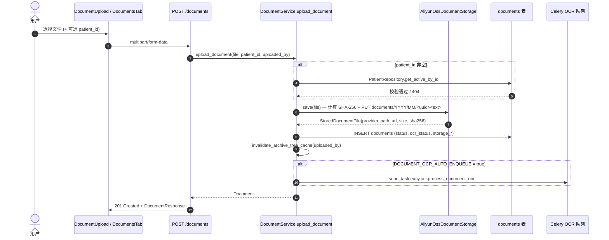

# 业务流程-文档上传与存储

> [!info] 一句话说明
> 用户在前端选择 PDF/图片 → 后端把文件落到对象存储 → 写入 `documents` 表 → 视配置自动入 OCR 队列。这是 [[端到端数据流]] `[1] 文档上传` 阶段的详细版。

## 触发场景

- DocumentUpload 页（`frontend_new/src/pages/DocumentUpload/index.jsx`）的拖拽 / 多文件上传。
- PatientDetail 的 DocumentsTab 直接为某病例上传（带 `patient_id`）。
- 第三方对接：直接 `POST multipart/form-data` 到 `/api/v1/documents`。

## 前置条件

- 当前用户已登录（`get_current_user`）。
- 若带 `patient_id`：该病例属于当前用户 `owner_id` 且未软删（`PatientRepository.get_active_by_id`）。
- OSS 凭据齐全：`OSS_ACCESS_KEY_ID / OSS_ACCESS_KEY_SECRET / OSS_BUCKET_NAME / OSS_ENDPOINT`。任何缺失会在服务启动时 `build_document_storage` 直接抛错。

## 主流程

## 关键决策点

### 初始 status / ocr_status 取值
来自 `DocumentService.upload_document` 一段三元表达式：

| 入参 / 配置 | status | ocr_status |
|---|---|---|
| `auto_enqueue=true` | `ocr_pending` | `queued` |
| `auto_enqueue=false`，`patient_id=null` | `uploaded` | `pending` |
| `auto_enqueue=false`，`patient_id` 非空 | `archived` | `pending` |

> [!info] 自动入队由全局开关控制
> `DOCUMENT_OCR_AUTO_ENQUEUE` 在 `core.config` 中读取；关闭后所有上传都不会自动 OCR，运维场景（如 TextIn 配额告警时）可临时关闭。

### 文件命名与对象 Key
`_object_key` 使用 `documents/YYYY/MM/<uuid><ext>` 三段式：按月分桶便于成本核算与生命周期管理，UUID 防冲突。**原始文件名不参与对象 Key**，只保留在 `original_filename` 字段中。

### SHA-256 摘要
`AliyunOssDocumentStorage.save` 在内存里完整读取文件后算 SHA-256，写入 `documents.file_hash`。**大文件慎用**：当前实现没有流式分片上传，超大 PDF 会一次性占用等量内存。TBD。

## 异常分支

| 场景 | 表现 | 处理 |
|---|---|---|
| `patient_id` 不存在 / 属于他人 | HTTPException 404 | 前端展示"病例不存在或无权限" |
| OSS PUT 失败 | `_put_object` 抛 RuntimeError | session.rollback；文档行不插入；前端拿到 5xx |
| OSS 凭据缺失（启动期） | `build_document_storage` RuntimeError | 服务起不来，对接方在部署侧补 env |
| Celery broker 不可达 | `send_task` 抛错 → 上抛 | 文档已落库 `ocr_pending`，但消息没投递；需手动调 `POST /documents/{id}/ocr` 补单 |

## 涉及资源

- **API**：`POST /api/v1/documents`（多 part 上传）；`POST /api/v1/documents/{id}/archive`、`POST /api/v1/documents/{id}/unarchive`、`POST /api/v1/documents/batch-archive` 等归档相关接口见 [[关键设计-未归档池与归档]]。
- **数据表**：[[表-document]]
- **存储**：[[TextIn-OCR]] 之外的对象存储 = 阿里云 OSS，配置见 `core.config`。
- **前端页面**：`DocumentUpload`、`FileList`、`PatientDetail/DocumentsTab`。

## 验收要点
- [ ] 未带 `patient_id` 上传：文档进入未归档池，`status=ocr_pending` 且 OCR 任务可见。
- [ ] 带 `patient_id` 上传：`status=archived`、`archived_at` 非空、`patient_id` 命中。
- [ ] 上传后 archive_tree 缓存失效：再次 `GET /documents/v2/tree` 看到新增。
- [ ] OSS 凭据缺失场景：服务启动直接报错，不会生成"半个文档"。
- 详尽用例见 [[验收要点]]。
