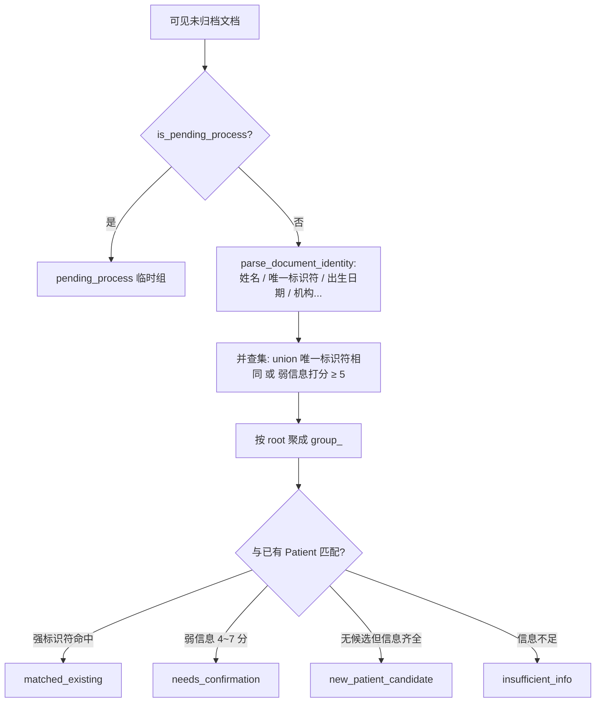

# 关键设计-未归档池与归档

> [!info] 一句话说明
> 未归档文档（`patient_id IS NULL`）会被 `ArchiveGroupingService` 按"唯一标识符 + 弱信息匹配"聚成虚拟分组，再与现有病例做候选匹配，呈现到 FileList 的左侧目录：**待解析 / 待归档 / 已归档** 三档。

## 为什么需要"未归档池"

EACY 支持"先批量上传一堆 PDF、回头再决定归档到哪个病人"的工作流。但医生上传时通常不会先建好病例；如果系统每次都强制 `patient_id`，体验很差。所以：
- 上传时 `patient_id` 可空 → 进未归档池。
- 后台 OCR + Metadata 跑完后，系统自动**用 Metadata 抽出的姓名/身份证/住院号等**做并查集聚类，再与已有病例做候选匹配，给用户一个"系统建议归档到 X 病例"的待办。

## 三档徽标的互斥定义

`DocumentService.get_archive_tree` 返回的 `counts`：

| Key | 定义 | 判断 |
|---|---|---|
| `parse_total` | OCR 或 Metadata 未完成 | `is_pending_process_document(document)` |
| `todo_total` | 已解析但仍待人工归档 | 进入 `todo_groups`（已剔除 `pending_process` 组） |
| `archived_total` | 已归档 | `document.status == "archived"` |

> [!info] 三者互斥求和
> 同一份文档**不会同时**计入两档，三档之和等于可见文档总数。这是历史 bug 修复（`parse_total + todo_total` 重复计数）的根本设计：`todo_groups` 在生成时显式跳过 `pending_process` 状态的组（见 `document_service.py` 中 `if group.get("status") == "pending_process": continue`）。

### `is_pending_process_document` 的判定
```
status != archived 且 (
  meta_status != completed
  OR ocr_status != completed
  OR metadata_json.result 为空
)
```
任一不满足，就停留在"待解析"。

## 分组算法

`ArchiveGroupingService.build_groups` 的核心步骤（细节见源码，本节只讲设计意图）：



- **唯一标识符**：身份证号、住院号、门诊号等强 ID，命中即直接 union。
- **弱信息打分**：姓名(3) + 出生日期(3) + 年龄(2) + 性别(1) + 医院(1) + 科室(1)，门槛 5。
- **候选匹配**：每个文档组与每个病例两两比对，强标识符命中 → `matched_existing`；否则按弱信息累加。
- **groupId** 取组内最小 doc_id 的前 8 位，保证幂等可寻。

## UI 表现

FileList 左侧目录：

```
├── 待解析 (parse_total)
├── 待归档
│   ├── auto_archived          ← matched_existing
│   ├── pending_confirm_review ← needs_confirmation
│   ├── pending_confirm_new    ← new_patient_candidate
│   └── pending_confirm_uncertain ← insufficient_info
└── 已归档 (archived_total)
    └── 各病例
```

- 点开一个组 → `GET /documents/v2/groups/{group_id}/documents` 拉详情。
- 点"确认归档" → `POST /documents/v2/groups/{group_id}/confirm-archive?patient_id=...`。

后端通过 `redis_client` 缓存 `documents:archive_tree:<uploaded_by>`（TTL 300s），任何归档 / 取消归档 / 上传 / 更新都会 `invalidate_archive_tree_cache` 让下次重算。

## 归档操作矩阵

| 接口 | 用途 | 副作用 |
|---|---|---|
| `POST /documents/{id}/archive` | 单文档归档 | 写 `patient_id` + `status=archived`；可选创建 `patient_ehr` 抽取 job |
| `POST /documents/batch-archive` | 批量归档（手动选） | 同上，每份文档分别处理 |
| `POST /documents/v2/groups/{group_id}/confirm-archive` | 整组归档（从待办分组里点） | 内部走 `archive_group_to_patient` → `batch_archive_to_patient` |
| `POST /documents/{id}/unarchive` | 取消归档 | 清掉 `patient_id` 与 `archived_at`，文档回到未归档池 |

所有归档接口都会：
1. 校验目标病例属于当前 owner_id（防越权）。
2. 失效 archive_tree 缓存。
3. 如 `create_extraction_job=true`：拉当前发布的 ehr Schema，确保 `data_context` 存在，并入 `extraction` 队列做病例级抽取（与 [[业务流程-OCR处理]] 末尾的 `enqueue_ready_extraction_jobs` 互补）。

## 易踩坑

> [!warning] 已归档文档不进入分组
> `archived_by_patient` 单独按 `patient_id` 聚合，绕开并查集；`groups` 只服务于 `patient_id IS NULL` 的待归档文档。

> [!warning] 待解析组的 groupId 是常量
> 所有未完成 OCR / Metadata 的文档共享同一个 `group_pending_process`，前端不要把它当作正常组对待（不可"确认归档"）。

> [!warning] 弱信息门槛是经验值
> 5 分门槛是当前经验值；如果业务里出现"同名同性别但其实是两个人"的误并组，需要调整或引入更强的标识符（如手机号 + 出生日期组合）。

## 相关文档

- [[业务概述]]
- [[业务流程-Metadata识别]]（分组依赖它的产出）
- [[病例管理/业务概述]]
- [[表-document]]、[[表-patient]]
