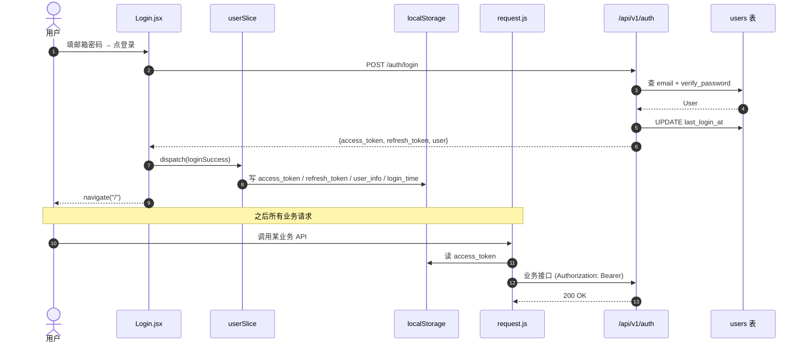
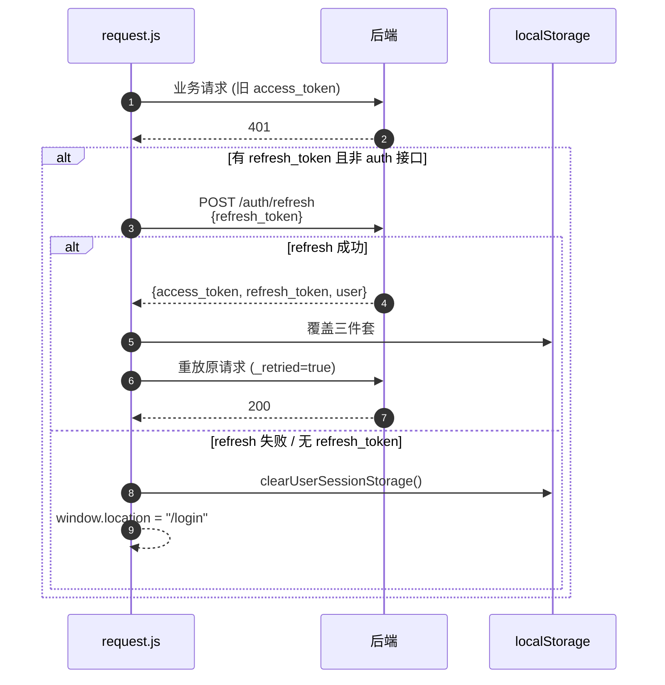
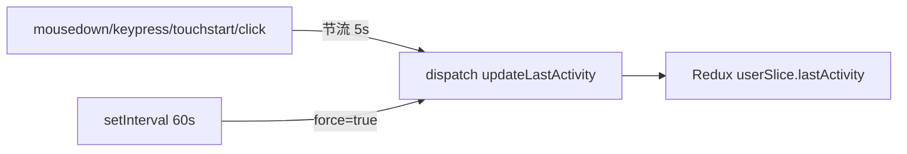

# 业务流程 - 登录与会话

> [!info] 一句话
> 用户邮箱密码登录后，前端把 access/refresh token 放进 `localStorage`，Redux 同步 `isAuthenticated=true`。后续请求由 `request.js` 自动带 Bearer；401 时**先静默 refresh 一次再重试**，再失败才退到登录页。

## 两种登录概念

| 概念 | 触发 | 做什么 |
|---|---|---|
| **硬登录 (loginByEmail)** | `Login.jsx` 提交邮箱密码 | 调 `POST /auth/login` → 写 `access_token / refresh_token / user_info / login_time` 到 `localStorage` → `dispatch(loginSuccess)` |
| **软登录 (softLogin)** | `App.jsx` 启动时，已 `isAuthenticated` 才执行；每次刷新只跑一次（`softLoginExecuted` ref） | 当前 `api/auth.js::softLogin` 是 `emptySuccess(null)` 桩，**后端无对应接口**。语义保留为"应用启动时的身份续约 hook"，目前空操作 |

## 主流程

## Token 过期与静默刷新

关键点（`frontend_new/src/api/request.js`）：

- **去重**：`refreshPromise` 单例锁，并发的 401 共享同一个 refresh 调用。
- **白名单**：URL 命中 `/auth/login` / `/auth/register` / `/auth/refresh` 不触发重试，避免死循环。
- **重试标记**：`_retried=true` 防二次重试。
- **`/auth/refresh` 自身返回非 2xx** 视同退出登录，直接跳转 `/login`。

## 用户活动心跳

- 来源：`frontend_new/src/App.jsx` 的第二个 `useEffect`。
- **目的**：在 Redux 维护"最近活动时间"，可供未来"会话超时自动登出"等策略消费。**当前仅写不读**，没有基于这个时间触发登出的逻辑。
- **节流**：5 秒一次（事件触发）+ 每 60 秒强制刷一次。

## 异常分支

| 场景 | 表现 | 处理 |
|---|---|---|
| 密码错误 / 用户不存在 / `is_active=false` | 后端统一 401 `"Invalid email or password"` | 前端 `request.js` 抛 `ApiRequestError`，UI 提示 |
| Email / username 已注册 | `/auth/register` 返回 409 | 注册表单提示 |
| 业务请求带过期 access_token | 第一次 401 → 静默 refresh → 重放 | 用户无感知 |
| Refresh token 也过期 | refresh 401 → `clearUserSessionStorage` + 跳 `/login` | 用户被强退 |
| `ENABLE_AUTH=false`（开发期） | 无 token 也返回 `dev_admin` | 见 [[关键设计-鉴权与作用域]] |
| `/auth/logout` | 当前是 no-op | 前端不依赖响应，自行清 token |

## 涉及资源

- **API**：`POST /api/v1/auth/login` / `/auth/refresh` / `/auth/logout` / `GET /auth/me`
- **数据表**：[[表-user]]
- **前端页面**：`pages/UserSystem/Login.jsx`
- **前端拦截器**：`api/request.js::request` + `ensureFreshAccessToken`
- **Redux**：`store/slices/userSlice.js::loginSuccess / updateLastActivity`
- **会话清理**：`utils/authCleanup.js::clearUserSessionStorage`

## 验收要点

- [ ] 错误密码登录返回 401，且 UI 显示错误（不暴露"用户存在但密码错"）。
- [ ] 登录成功后刷新浏览器，仍处于登录态（`localStorage` 恢复）。
- [ ] access_token 手工删除后调一个业务接口，应自动 refresh 并成功返回。
- [ ] refresh_token 也手工删除后调业务接口，应被跳转到 `/login`。
- [ ] 并发 5 个业务请求都遇到 401，refresh 只调用 1 次（共享 promise）。
