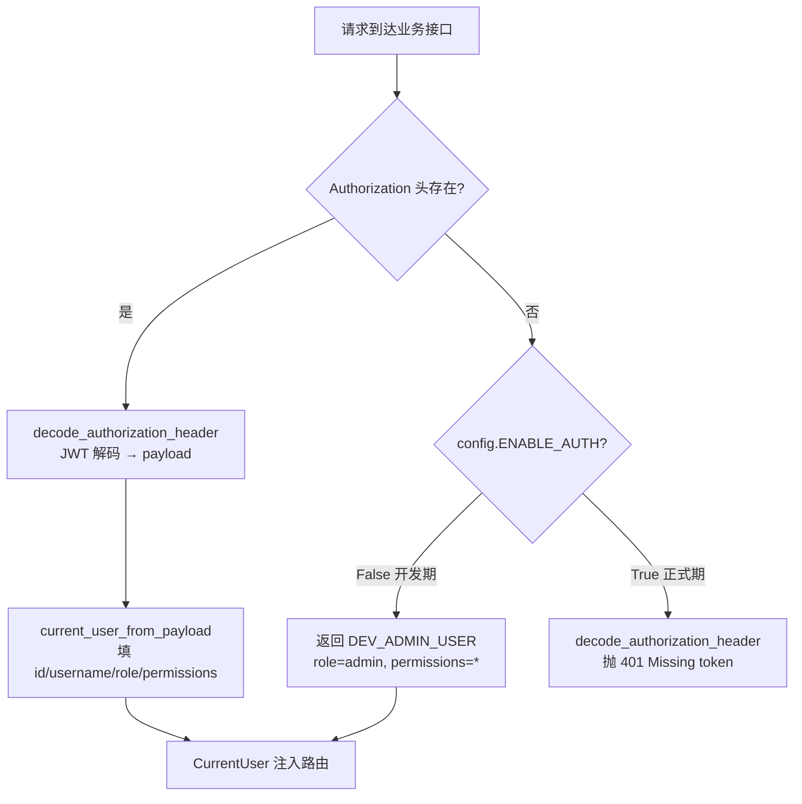
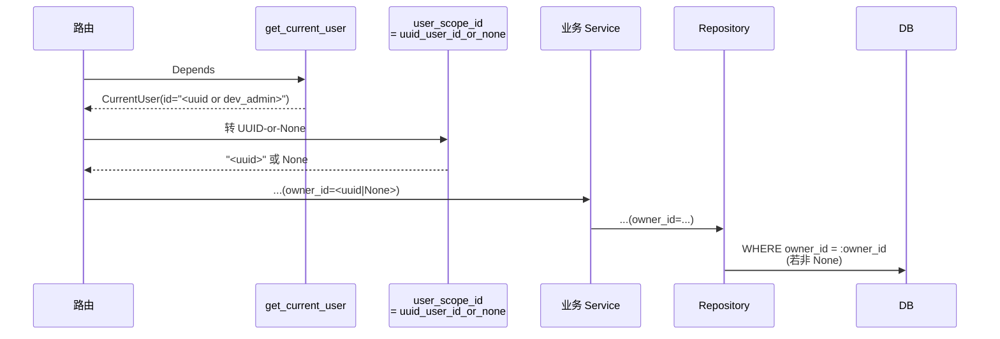

# 关键设计 - 鉴权与作用域

> [!info] 一句话
> EACY 的"权限"目前不是 RBAC，而是**两条平行约束**：(1) `ENABLE_AUTH` 控制是否强制 JWT；(2) 仓储层用 `owner_id` / `uploaded_by` 做"用户作用域"过滤，由路由层手工传 `user_scope_id(current_user)`。

## 一、统一入口：`get_current_user`

所有业务路由都通过 `app.core.auth.get_current_user` 注入 `CurrentUser`：



代码定位：`backend/app/core/auth.py::get_current_user`。

## 二、`ENABLE_AUTH` 开发期宽松鉴权

来源：`backend/core/config.py`，默认 `ENABLE_AUTH = False`。

| 模式 | 行为 |
|---|---|
| `ENABLE_AUTH=false`（**默认**） | 任意接口**无 token 也通**，注入 `DEV_ADMIN_USER`：`id="dev_admin", role="admin", permissions=["*"]` |
| `ENABLE_AUTH=true` | 必须带 `Authorization: Bearer <jwt>`；无 / 非法 → 401 |

> [!warning] 生产部署必须 `ENABLE_AUTH=true`
> 默认值是开发期友好型，**不是上线值**。同时必须覆盖默认 `JWT_SECRET_KEY="fastapi"`。

设计意图（参考 `eacy/EACY开发计划 1.3 开发期宽松鉴权实施路径.md`）：让业务接口**提前**全部接入 `Depends(get_current_user)`，正式启用鉴权只是切个开关，无需逐处改。

## 三、`is_admin_user`：唯一的"角色守门"

```python
# backend/app/core/auth.py
def is_admin_user(current_user: CurrentUser) -> bool:
    return current_user.role == "admin" or "*" in current_user.permissions
```

使用点：`/admin/*` 路由的 `require_admin_user` 依赖。

> [!info] `require_permissions(...)` 工厂存在但未被调用
> `backend/app/core/auth.py::require_permissions` 实现了 "permissions 包含才放行"，但**全代码没有调用方**。所以**细粒度权限点位目前没有任何接口在校验** —— TBD。

## 四、数据作用域：`owner_id` / `uploaded_by`

这是当前**实际生效**的"我只能看到我自己的数据"机制，但**不在中间件层**，而是**业务路由 → service → repository** 一层一层手工传：



### `uuid_user_id_or_none` 的语义

```python
def uuid_user_id_or_none(current_user: CurrentUser) -> str | None:
    try:
        return str(UUID(str(current_user.id)))
    except (TypeError, ValueError):
        return None
```

- 真实登录用户：`id` 是 UUID 字符串 → 返回 UUID → 仓储层附加 `WHERE owner_id = ...`，**实际隔离**。
- 开发期 `dev_admin`：`id = "dev_admin"` 不是合法 UUID → 返回 `None` → 仓储层**不附加过滤**，等价于"看全部"，方便开发联调。

### 实测应用面

| 表 / 列 | 仓储方法过滤参数 | 路由调用位置示例 |
|---|---|---|
| `patient.owner_id` | `PatientRepository.list_all_active / get_active_by_id / count / paginate` 等都接受 `owner_id` | `patients/router.py` 多处 `owner_id=user_scope_id(current_user)` |
| `document.uploaded_by` | `DocumentRepository.list_by_patient / list_unarchived / list_visible_documents / list_by_ids_light` 等 | `documents/router.py` |
| `research_project.owner_id` | `ResearchProjectRepository.get_by_code / list_projects / count_projects` | `research/router.py` |

写入时类似：`created_by` / `selected_by` / `edited_by` / `requested_by` 等审计列接收 `uuid_user_id_or_none(current_user)`，开发期写 NULL。

> [!warning] 这是"手工纪律"型隔离
> 任何新加的查询接口若**忘记**传 `owner_id` 参数，就会**直接漏权**——读到所有用户的数据。Repository 层默认参数是 `None=不过滤`。验收时必须逐接口确认。

## 五、starter template 残留：`core/fastapi/...`

| 文件 | 当前角色 |
|---|---|
| `core/fastapi/middlewares/authentication.py::AuthBackend` | Starlette middleware；只把 `payload["user_id"]` 写到 `request.user.id`，**不抛错**，与业务路由的 `get_current_user` **职责重叠**且口径不同（这里 `id` 是 `int`，业务层是 UUID 字符串） |
| `core/fastapi/dependencies/permission.py` | `IsAuthenticated / IsAdmin / AllowAll / PermissionDependency`，业务路由**未使用**，可视为骨架样例 |

> [!todo] 清理项
> 这两块在功能上被 `app/core/auth.py` 一套吃掉了。若未来收敛，可考虑下线 `core/fastapi/middlewares/authentication.py` 与 `core/fastapi/dependencies/permission.py`，或把它们改为唯一鉴权入口——任一种走向，目前都是 TBD。

## 六、典型校验失败码

| 场景 | 码 | 来源 |
|---|---|---|
| 缺 token（`ENABLE_AUTH=true`） | 401 `Missing authorization token` | `decode_authorization_header` |
| token 格式错（scheme 非 bearer / 空） | 401 `Invalid authorization header` | 同上 |
| JWT 签名 / 过期错 | 401 `Invalid authorization token` | `decode_access_token` |
| token 无 `user_id` / `sub` | 401 `Authorization token missing user identity` | `current_user_from_payload` |
| 非 admin 访 `/admin/*` | 403 `Admin permission required` | `require_admin_user` |
| `require_permissions` 不满足 | 403 `Permission denied` | 目前**没有路由实际触发** |
