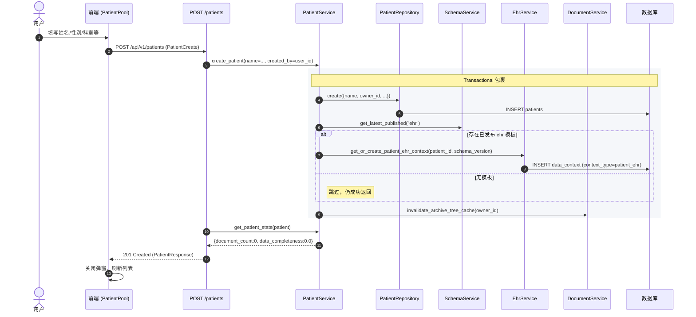

# 业务流程 - 新建病例

> [!info] 一句话说明
> 用户在病例池点击"新增"提交基本信息 → 后端创建 `Patient` 行 → 自动为该病例初始化一条 `patient_ehr` 数据上下文（绑定最新已发布的 ehr Schema 版本）→ 失效归档树缓存 → 返回带聚合统计的病例对象。

## 触发场景

- 病例池页面（`PatientPool`）顶部"新增病例"按钮
- 病例池"批量导入"流程中，每一行数据走同一接口（逐条创建）

## 前置条件

- 当前用户已登录（JWT 通过 `get_current_user` 解析）
- 至少提交 `name` 字段；`name` 非空且 ≤ 100 字
- **不需要**预先存在 ehr Schema 模板：若没有已发布版本，跳过 EHR 上下文初始化，病例本身仍能创建

## 主流程



## 异常分支

| 场景 | 表现 | 处理 |
|---|---|---|
| `name` 缺失或超长 | FastAPI 422 校验失败 | 前端按 `Form.Item rules` 拦截；后端 Pydantic 兜底 |
| 当前无已发布 ehr Schema | 病例创建成功，但暂无 EHR 上下文 | 后续首次访问 EHR Tab 时由 `get_patient_ehr` 触发懒创建（见 EhrService） |
| 数据库写入失败 | `Transactional` 回滚，整体失败；归档缓存未失效 | 返回 5xx；前端 toast 报错；用户重试 |
| `owner_id` 为 `None`（无登录态） | 病例 `owner_id` 落库为空，**仅在开发态可能发生** | 生产应被鉴权拦截；详见 [[用户系统与权限/业务概述]] |

## 关键副作用

> [!warning] 创建成功即产生四类副作用
> 1. `patients` 表新增一行（`deleted_at = NULL`）
> 2. `data_context` 可能新增一行（`context_type=patient_ehr`，`schema_version_id` 指向当前 ehr 最新发布版本）
> 3. 当前用户的"病例-文档归档树"缓存被失效，前端下次访问会重拉
> 4. 全部包裹在 `@Transactional()` 中：任一步失败则全部回滚（注意：归档缓存失效是事务后调用，不参与回滚）

> [!example] PatientCreate 请求体最小样例
> ```json
> { "name": "张三", "gender": "male", "age": 56, "department": "心内科" }
> ```

## 涉及资源

- **API**：`POST /api/v1/patients` —— 参数与响应见 OpenAPI `/docs`
- **数据表**：[[表-patient]]、[[表-data_context]]
- **前端页面**：`PatientPool/index.jsx` 的 `addPatientVisible` Modal

## 下游延伸

创建完成后，用户通常立即进入下一步：
- 进入 [[业务流程-病例查询与档案查看]] 的"档案查看"
- 在 [[文档与OCR/README]] 上传文档并归档到该病例
- 通过 [[AI抽取/README]] 的 `update_patient_ehr_folder` 一键抽取

## 验收要点

- [ ] 仅传 `name` 即可成功创建，返回 201
- [ ] 创建后立即 `GET /patients/{id}` 能取回（受 `owner_id` 过滤）
- [ ] 若存在已发布 ehr Schema，`data_context` 中应有一条新行
- [ ] 同一用户连续创建两条同名病例不应失败（无唯一约束）
- [ ] 见 [[验收要点]]
