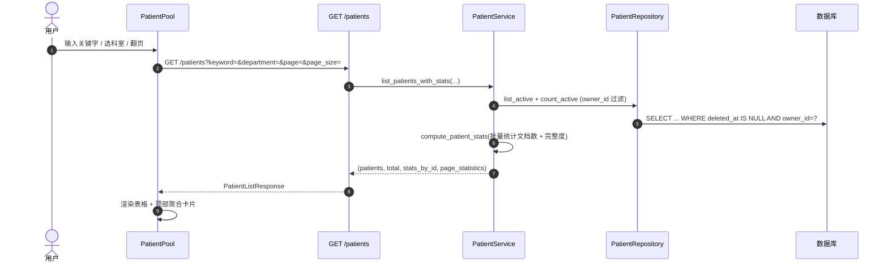

# 业务流程 - 病例查询与档案查看

> [!info] 一句话说明
> 用户在 **PatientPool** 按关键字/科室筛选病例，进入 **PatientDetail** 后通过多个 Tab 分别查看：原始文档、AI 摘要、按 Schema 渲染的电子病历、时间线。本流程覆盖"查询 → 详情 → Tab 内联视图"的链路。

## 触发场景

- 主导航"病例池" → 列表/卡片视图浏览
- 列表行点击"查看" → 进入 `/patient/:patientId`
- 从 [[文档与OCR/README]] 文档列表点击关联的患者
- 科研项目"病例清单"中点击患者跳转

## 前置条件

- 用户已登录，`owner_id` 等于待查询病例的归属用户
- 别人创建的病例**直接 404**（`get_active_by_id` 带 `owner_id` 过滤）

## 病例池查询主流程



### 关键筛选语义

| 参数 | 行为 |
|---|---|
| `keyword` | 对 `name / main_diagnosis / doctor_name` 三列做 `ILIKE %kw%` 联合匹配 |
| `department` | 等值匹配 `Patient.department` |
| 分页 | `page` ≥ 1，`page_size` 1~100，按 `created_at DESC` |
| `owner_id` | 由 JWT 注入，前端不可控；他人病例**不可见** |

> [!info] 顶部聚合卡片只针对当前页
> `page_statistics.total_documents / average_completeness` 是当前页的累计/均值；`total` 是全集大小。这是设计上的取舍：避免每次翻页都重扫全表。

## PatientDetail 多 Tab 概览

进入详情页后，前端先并行触发：
- `GET /patients/{id}` → 基本信息 + 关联项目
- `GET /patients/{id}/ehr` → EHR 上下文 + Schema + 记录 + 当前值（含字段证据）
- 拉取该病例文档列表（走 `/documents` 接口的 `patient_id` 过滤）

详细见 `usePatientData.js`（钩子层做并行+缓存）。

### Tab 职责

| Tab | 组件位置 | 核心职责 |
|---|---|---|
| 时间线 | `tabs/TimelineTab` | 按时间维度展示就诊/上传/抽取/审核事件，提供"病例叙事"视图 |
| 文档 | `tabs/DocumentsTab` | 列出归档到该病例的所有 `document`；支持上传、下载、删除、PDF 预览、跳转到证据片段 |
| AI 摘要 | `tabs/AiSummaryTab` | 展示 / 编辑 / 重新生成病例级 AI 摘要（保存于 `Patient.extra_json`，详情待与团队确认） |
| 电子病历 (Schema 版) | `tabs/SchemaEhrTab` | **当前默认 Tab**，按绑定的 ehr SchemaVersion 渲染表单；支持字段编辑、查看候选值、查看证据、切换历史事件 |
| 电子病历 (旧版静态) | `tabs/EhrTab` | 早期硬编码字段视图，与 `data/ehrFieldsConfig` 联动；新功能不再加入，逐步被 SchemaEhrTab 取代（待与团队确认是否下线） |

> [!info] SchemaEhrTab 与 EhrTab 的关系
> `SchemaEhrTab` 是数据驱动的（Schema → 字段路径 → 当前值 + 证据），是后续演进方向；`EhrTab` 走静态配置 `data/ehrFieldsConfig`，主要用于兼容早期布局。两者目前并存。

### 字段值的交互闭环

PatientDetail 上字段值的所有交互都对应 `/patients/{id}/ehr/fields/{field_path}/...` 系列接口（见 `router.py`）：

```mermaid
flowchart LR
    A[查看字段] -->|GET .../events| H[历史事件]
    A -->|GET .../candidates| C[候选值列表]
    A -->|GET .../evidence| E[原文证据]
    A -->|PATCH .../fields/{path}| U[人工修改]
    C -->|POST .../select-candidate| S[选定候选]
    H -->|POST .../select-event| S2[回滚到历史]
    U & S & S2 --> V[当前值更新]
```

字段值底层三表协作（`field_current_value / field_value_event / field_value_evidence`）见 [[AI抽取/业务概述]] 与 [[端到端数据流]] 阶段[6]。

### "病例夹更新中"提示

左侧病例列表（rail）会显示某些病例的"抽取中"徽标：
- 前端定期 `POST /patients/ehr-extraction-status` 携带可见病例 id 列表
- 后端返回每个 id 的活跃 (`pending/running`) 抽取任务统计
- 见 `list_active_ehr_status_by_patients`

## 异常分支

| 场景 | 表现 | 处理 |
|---|---|---|
| 病例不存在或被软删 | `GET /patients/{id}` → 404 | 前端跳回列表并 toast |
| 当前用户非 owner | 同上 404（不区分 403 vs 404） | 前端按 404 处理 |
| EHR Schema 未发布且病例尚未懒创建上下文 | `GET /patients/{id}/ehr` 行为待 EhrService 文档（TBD） | 前端兜底为空表单 |
| 病例下文档很多 | 列表分页由 `/documents` 接口承担，本接口仅提供 `document_count` | 详见 [[文档与OCR/README]] |

## 涉及资源

- **API**：参见各 Tab 标注的端点，全部见 OpenAPI `/docs`
- **数据表**：[[表-patient]]、[[表-document]]、[[表-data_context]]、[[表-field_current_value]]、[[表-project_patient]]
- **前端页面**：
  - `PatientPool/index.jsx` —— 病例池
  - `PatientDetail/index.jsx` + `tabs/*` —— 病例详情
  - `PatientDetail/hooks/usePatientData.js` —— 数据装配钩子

## 验收要点

- [ ] 关键字"心"应同时匹配姓名含"心"和诊断含"心"
- [ ] 切换页码不丢失 keyword / department 过滤
- [ ] 病例池顶部卡片随当前页变化（非全集）
- [ ] PatientDetail 默认 Tab 为 `ehr-schema`
- [ ] 病例 rail 上活跃抽取的徽标在任务结束后自动消失（依赖轮询）
- [ ] 见 [[验收要点]]
