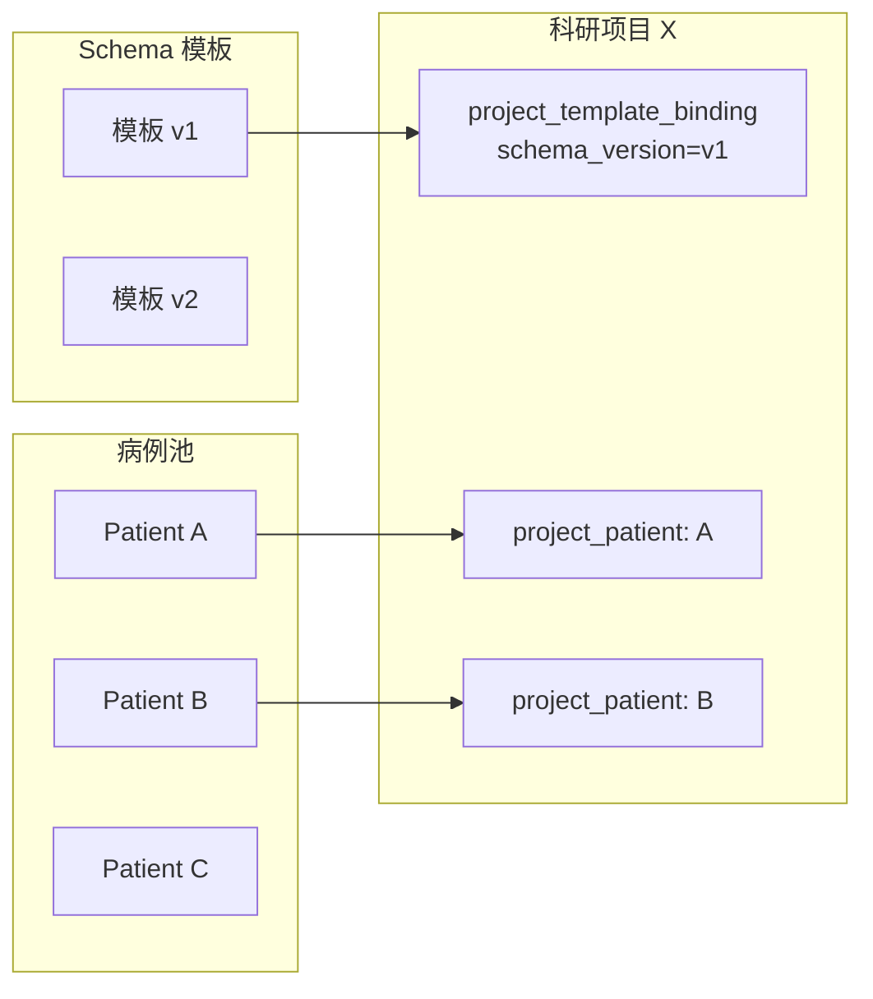

# 业务概述

> [!info] 一句话定位
> 科研项目（Research Project）是把"病例池里若干病例"按"某个 Schema 模板版本"组装成"可导出数据集"的容器。

## 它是什么

一个科研项目对应一个**真实研究课题**（例如："2025 年 XXX 单中心回顾性研究"）。在 EACY 中，它把三件事绑在一起：

1. **课题元信息**——项目编号、名称、负责人、起止日期（见 [[表-research_project]]）。
2. **纳入的病例集合**——通过 [[表-project_patient]] 与病例池形成**多对多**关系，每个入组关系有自己的 `enroll_no`（入组编号）、`status`（enrolled / withdrawn）。
3. **CRF 模板版本绑定**——通过 [[表-project_template_binding]] 指向 `schema_version_id`，决定本项目的字段集合（即"CRF 长什么样"）。

## 与上游域的关系

- **病例池**是主数据，项目只是"引用"。一个病例可以同时进多个项目，撤回（withdrawn）后历史关系保留。
- **Schema 模板**定义字段，**项目绑定的是版本（version）不是模板（template）**。这是核心设计点。

## 模板版本绑定的语义

> [!warning] 绑定的是 schema_version_id，不是 template_id
> 见 `bind_crf_template`（`research_project_service.py`）：参数同时收 `template_id` 与 `schema_version_id`，但实际上服务会校验 `version.template_id == template_id`，真正写入 `project_template_binding` 的是 `schema_version_id`。后续所有"项目 CRF 上下文"、"完整度计算"、"导出表头"都按这个版本 ID 来。

### 为什么这样设计

1. **演进不破坏老数据**：模板团队上新版本（v2 新增 5 个字段），已经在跑的项目仍按 v1 工作；老数据的字段口径不变。
2. **同一模板可被不同项目按不同版本绑定**：项目 A 用 v1、项目 B 用 v2 并存。
3. **一个项目可以有多类绑定**：`binding_type` 区分 `primary_crf`（主 CRF，唯一）与其它扩展用途；本期前后端只用 `primary_crf`，且 `get_active_primary_crf` 仅取 `status=active` 的那条。

### 绑定的状态机

| status | 含义 |
|---|---|
| active | 当前生效，前端创建/读取 CRF 上下文都按它走 |
| disabled | 已停用（DELETE 接口将 status 改为 disabled，不真删） |

## 项目下的"数据是什么"

项目本身不直接存字段值。每个入组的 `project_patient` 会**按项目绑定的 schema_version 创建一个 `data_context`**（`context_type=project_crf`），字段值写入这个上下文下的 `field_current_value`。同一个病例在不同项目下有不同的 project_crf 上下文，互不干扰。

- 上下文创建：`ResearchProjectService.get_or_create_project_crf_context`
- 初始化：按 schema 顶层 form 自动建一份 `record_instance`（见 `initialize_default_record_instances`）

## 关键能力一览

| 能力 | 实现位置 | 备注 |
|---|---|---|
| 项目 CRUD + 软删除（status=deleted） | `research_project_service.py` | DELETE 走"归档"语义 |
| 入组人数 / 平均完整度 / PI 名（聚合统计） | `compute_project_stats` | 平均完整度 = 已填叶子字段数 / Schema 叶子字段数，按 project_patient 取平均 |
| 病例纳入与撤回 | `enroll_patient` / `withdraw_project_patient` | 撤回不删记录，置 status=withdrawn |
| 项目 CRF 字段值 增/改/选证据/删除 | `manual_update_crf_field` / `select_crf_field_event` / `delete_crf_field_value` | 复用 `StructuredValueService` 与 [[AI抽取]] 同一套事件/证据/当前值机制 |
| 触发本项目下的批量抽取（"更新电子病历夹"） | `ExtractionService.update_project_crf_folder(_batch)` | 详见 [[AI抽取/业务概述]] |
| 数据集导出（xlsx 多 Sheet） | `research_project_export_service.py` | 详见 [[业务流程-数据导出]] |

## owner 范围与权限

- 项目带 `owner_id`，列表/读取/更新接口都接受 `owner_id` 参数；当请求者非匿名时按 `uuid_user_id_or_none(current_user)` 过滤，**非属主访问视同未找到**（404）。
- 匿名/系统访问（`owner_id is None`）跳过该过滤，便于运维与导出脚本。

## 相关文档

- [[端到端数据流]] 第 [8][9] 阶段
- [[业务流程-创建项目与绑定模板]]
- [[业务流程-病例纳入]]
- [[业务流程-数据集查看与编辑]]
- [[业务流程-数据导出]]
- [[Schema模板与CRF/业务概述]]
