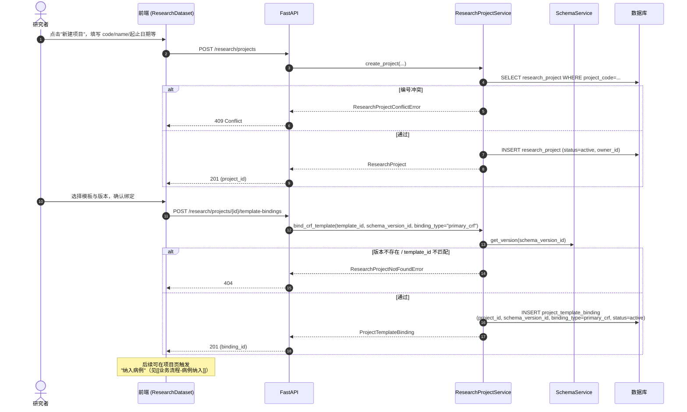

# 业务流程：创建项目与绑定模板

> [!info] 一句话说明
> 用户在「研究数据集」页新建项目 → 选择一份 **Schema 模板**及其**版本**绑定为本项目的 primary_crf → 项目进入"可纳入病例"状态。

## 触发场景

- 新课题立项；
- 已有项目需要切换/补绑模板（先 disable 老 binding，再 POST 新 binding）。

## 前置条件

- 已有可用 Schema 模板（参见 [[Schema模板与CRF/业务概述]]）；至少有一个已发布的 `schema_template_version`。
- 当前用户已登录（匿名用户允许创建，但 `owner_id` 为空，后续不能按属主过滤回查）。

## 主流程

## 关键设计点

> [!info] 绑定的"两个 ID"
> 入参同时收 `template_id` 与 `schema_version_id`，服务会校验 `version.template_id == template_id`，落库主键则是 `schema_version_id`。前端的"模板/版本"两级选择必须一致。

> [!info] 一个项目可有多条 binding，但 active 的 primary_crf 仅取一条
> `binding_repository.get_active_primary_crf` 用 `status=active` + `binding_type=primary_crf` + `LIMIT 1`。换模板的标准做法：DELETE 老 binding（实际是改 status=disabled）→ POST 新 binding。

> [!warning] 唯一约束在 (project_id, schema_version_id, binding_type)
> 同一个 (项目, 版本, 类型) 不允许重复 active 多条；想"恢复 disabled"需要新建一条而不是更新。

## 异常分支

| 场景 | 表现 | 处理 |
|---|---|---|
| project_code 冲突 | 创建失败 | 409 Conflict（`ResearchProjectConflictError`） |
| 非属主访问 | 视同未找到 | 404 Not Found |
| schema_version 不存在或 template_id 不匹配 | 绑定失败 | 404 Not Found |
| 项目已归档（status=archived） | 不允许绑定 | 404 Not Found |

## 涉及资源

- **API**：见 frontmatter `api_endpoints`
- **数据表**：[[表-research_project]] [[表-project_template_binding]]
- **前端**：[[页面-ResearchDataset]] / `ProjectTemplateDesigner.jsx`（项目内编辑器）

## 验收要点

- [ ] 创建同名 `project_code` 返回 409
- [ ] 绑定的 schema_version 不属于传入 template_id 时返回 404
- [ ] DELETE binding 后再 GET，list 中该条 status 应为 disabled（非物理删除）
- [ ] 切换 binding 后新纳入的病例的 project_crf 上下文挂的是**新版本**
