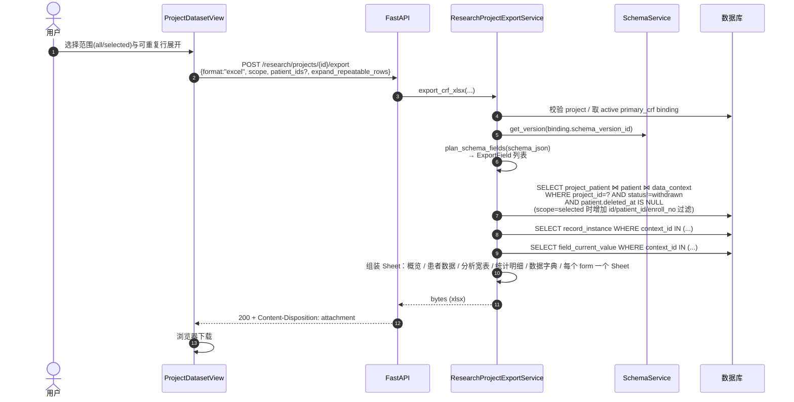

# 业务流程：数据导出

> [!info] 一句话说明
> 按项目**当前绑定的 Schema 模板版本**，把所有"非撤回入组病例"的字段值聚合为多 Sheet 的 Excel（xlsx）文件回传给前端下载。

## 触发场景

- 数据集视图（`ProjectDatasetView`）顶部"导出"按钮；
- 支持两种范围：`scope=all`（全部入组病例）与 `scope=selected`（仅前端勾选的若干 `patient_ids` / `project_patient_ids` / `enroll_no`）。

## 前置条件

- 项目存在、未删除（`status != deleted`）且为属主（非匿名时）；
- 项目有 active 的 `primary_crf` binding；
- 对应 `schema_version` 存在。

## 主流程

## 导出范围与口径

> [!info] 范围严格限定在"项目 + 模板版本 + 未撤回病例"
> - **病例集合**：`project_patient.status != 'withdrawn'` 且 `patient.deleted_at IS NULL`；
> - **字段集合**：由项目绑定的 schema_version 决定（`plan_schema_fields(schema_json)`），与全局其它项目无关；
> - **字段值来源**：`data_context.context_type='project_crf'` 且 `schema_version_id` 匹配 binding；
> - **可重复表单**：`expand_repeatable_rows=true` 时每个 record_instance 一行；否则同一病例的多记录折叠。

> [!warning] selected 模式参数三选一
> `patient_ids` 列表会同时与 `project_patient.id` / `project_patient.patient_id` / `project_patient.enroll_no` 比对，三者命中其一即收入。前端只要传"用户在表格中勾选时拿到的标识"即可。

## 输出结构（多 Sheet）

| Sheet | 内容 | 备注 |
|---|---|---|
| 概览 | 项目名/编号/状态/模板版本/人数/记录数/非空值数/导出时间 | 一列两值 |
| 患者数据 | 一行一病例，字段值折叠 | 多记录字段取代表值 |
| 分析宽表(全展开) | 每个 form 的 record 一行 | 受 `expand_repeatable_rows` 影响 |
| 统计明细(长表) | 一行一字段值（长格式） | 含字段路径、记录序号、溯源等级、来源 event_id |
| 数据字典 | 字段列名映射 | 用于二次分析对照 |
| `<form_title>` | 每个顶层 form 一个 Sheet | 字段列+实例行 |

> [!info] 列裁剪
> 宽表/患者表/单 form 表会调用 `_drop_empty_and_duplicate_columns`，导出前删除整列为空/或与前列重复的列，保留前 N 个"基础列"（编号/姓名等）。

## 异常分支

| 场景 | 表现 | 处理 |
|---|---|---|
| `format` 非 `excel`/`xlsx` | 400 | "Only xlsx export is supported" |
| `scope=selected` 但缺 `patient_ids` | 400 | "patient_ids is required when scope is selected" |
| 项目不存在 / 已删除 / 非属主 | 404 | "Research project not found" |
| 项目无 active primary_crf binding | 404 | "Project CRF template not found" |
| binding 指向的 schema_version 缺失 | 404 | "Project CRF schema version not found" |

## 涉及资源

- **API**：`POST /research/projects/{project_id}/export`
- **数据表**：[[表-research_project]] [[表-project_patient]] [[表-project_template_binding]] [[表-data_context]] [[表-record_instance]] [[表-field_current_value]]
- **前端**：`ProjectDatasetView.jsx` 的"导出"对话框与 `exportProjectCrfFile` API 调用
- **服务**：`research_project_export_service.py`（含内置的 `SimpleXlsxWriter`，无第三方 xlsx 依赖）

## 验收要点

- [ ] 撤回的入组不出现在导出；二次入组的病例只出现一次
- [ ] 切换 binding 后导出按**新版本**字段集
- [ ] `expand_repeatable_rows=false` 时"用药记录"等可重复 form 不会拆行
- [ ] selected 模式可分别用 patient_id / project_patient_id / enroll_no 命中
- [ ] 大量列时空列已被自动剔除，前 N 个基础列保留
- [ ] 中文文件名通过 `filename*=UTF-8''...` 传递，浏览器正确显示
