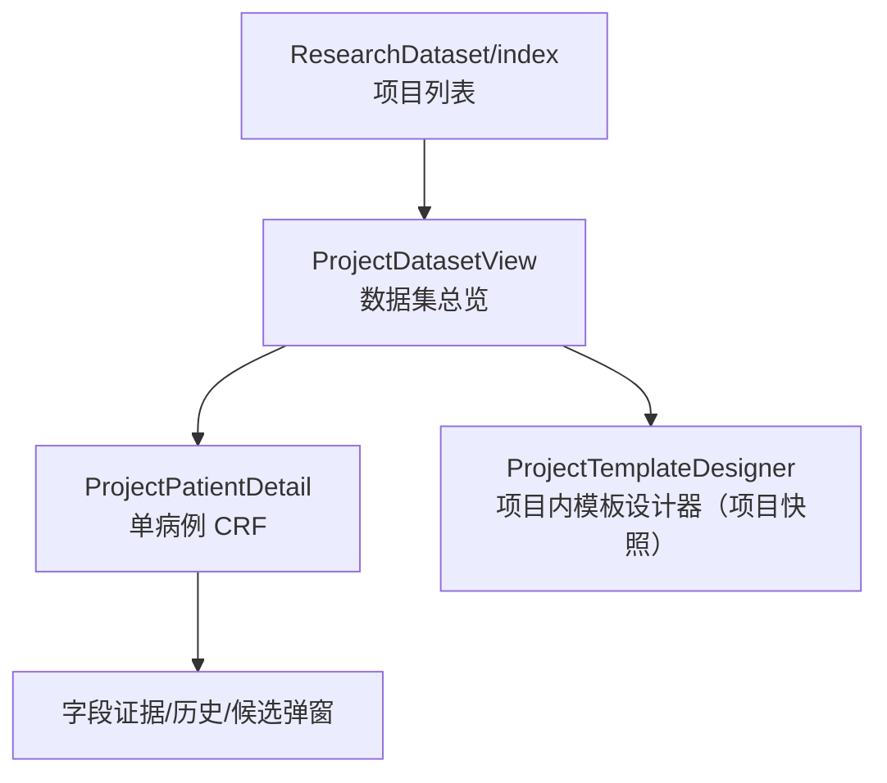
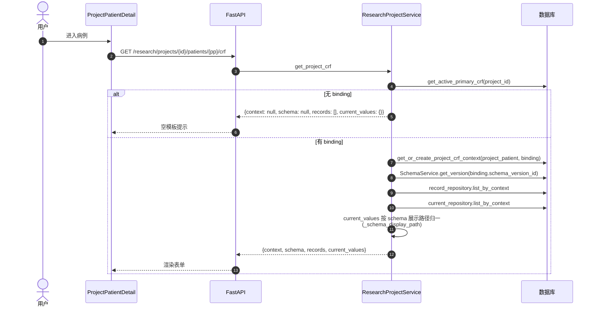
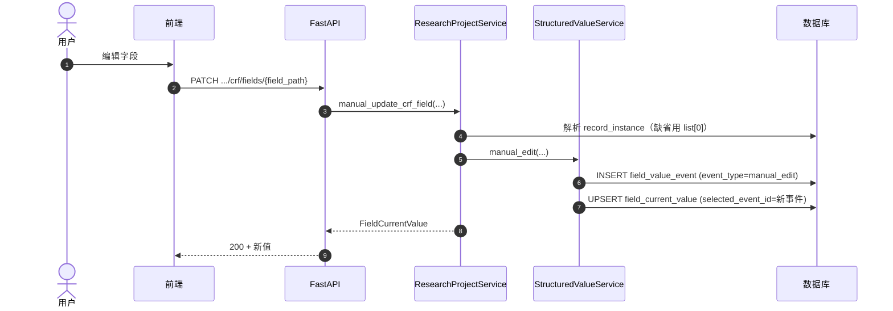

# 业务流程：数据集查看与编辑

> [!info] 一句话说明
> 两个层级的视图：**项目层**（`ProjectDatasetView`）总览所有入组病例+字段矩阵；**单病例层**（`ProjectPatientDetail` + `ProjectSchemaEhrTab`）在**项目上下文**下编辑该病例的 CRF。

## 两层视图

### ProjectDatasetView 的作用

- 顶部统计：入组人数、平均完整度、PI 名（来自 `compute_project_stats`）。
- 字段矩阵：以"字段组 / 字段"为列、以"入组病例"为行的宽表（数据来自 `GET .../patients/{pp}/crf`）。
- 操作入口：纳入/撤回病例、触发"更新电子病历夹"（批量抽取，详见 [[AI抽取]]）、导出（详见 [[业务流程-数据导出]]）。
- 渲染器：默认 V2（`ProjectDatasetV2`），可通过 `?renderer=v1` 切回 V1。

### ProjectPatientDetail / ProjectSchemaEhrTab 的作用

- 路由：`/research/projects/{id}/patients/{project_patient_id}`。
- 在**项目上下文**下打开病例：与 [[病例管理]] 的 PatientDetail 共享渲染组件，但所有读写都打到 `/research/projects/.../crf/...` 这一组接口，写到 `data_context (context_type=project_crf, schema_version_id=项目绑定版本)`。
- 因此：在项目页编辑字段值**不会**影响该病例在 EHR 上下文（`context_type=ehr`）的值，也不会影响其它项目下的字段值。

## 读取主流程（GET CRF）

## 写入主流程（PATCH 字段值）

## 证据/候选/事件相关

- **候选值**（同一字段被多次抽取/编辑得到的所有 event）：`GET .../fields/{field_path}/candidates` 返回所有 event + 当前选中、是否存在冲突。
- **切换证据来源**：`POST .../select-event` 或 `.../select-candidate`（功能等价）会把 `field_current_value.selected_event_id` 改成指定事件，并刷新当前值，但**不会**新建 event。
- **删除字段值**：`DELETE .../fields/{field_path}` 会按解析后的 query_path 同时清空当前值/事件/证据三表。
- **多实例表单**：`POST/DELETE .../crf/records` 用于"用药记录"这类可重复 form 的实例增删。

> [!info] field_path 别名机制
> 同一字段在路径里"有索引"（`drugs.0.name`）与"无索引"（`drugs.name`）两种写法都会被服务接受；查找按 `_field_path_aliases` 顺序尝试，落库走规范化路径。详见 `_canonical_field_path`、`_resolve_existing_field_path`。

## 异常分支

| 场景 | 表现 | 处理 |
|---|---|---|
| project / project_patient 不属主 | 404 | `Project patient not found` |
| 病例已撤回 | 404 | `_get_project_patient_or_404` 排除 status=withdrawn |
| 项目无 binding 调用 PATCH | 404 | `Project CRF context not found` |
| select-event 的 event_id 不属于本上下文/本字段 | 404 | `CRF field event not found` |

## 涉及资源

- **API**：见 frontmatter
- **数据表**：[[表-data_context]] [[表-record_instance]] [[表-field_current_value]] [[表-field_value_event]] [[表-field_value_evidence]]
- **前端**：`ProjectDatasetView.jsx`、`ProjectPatientDetail.jsx`、`ProjectSchemaEhrTab.jsx`、`useProjectPatientData`、`adapters/datasetAdapter`

## 验收要点

- [ ] 项目页编辑字段值，不影响该病例的 EHR Tab（context_type=ehr）显示
- [ ] 删除字段后 candidates 接口仍可拉到历史 event（事件已删？—— 实际三表均删；前端表现为空）
- [ ] 切换 candidate 不新增 event，仅切 selected_event_id
- [ ] 顶层 form 自动初始化的 record_instance 在 GET 时即返回
