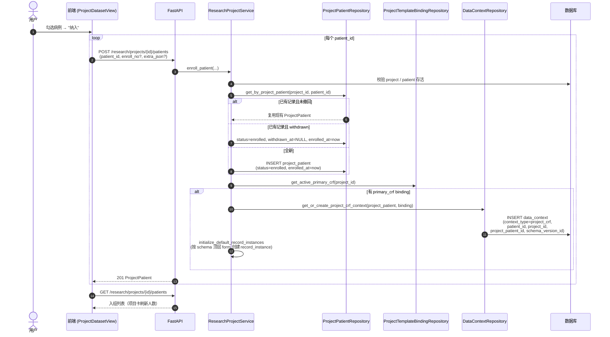
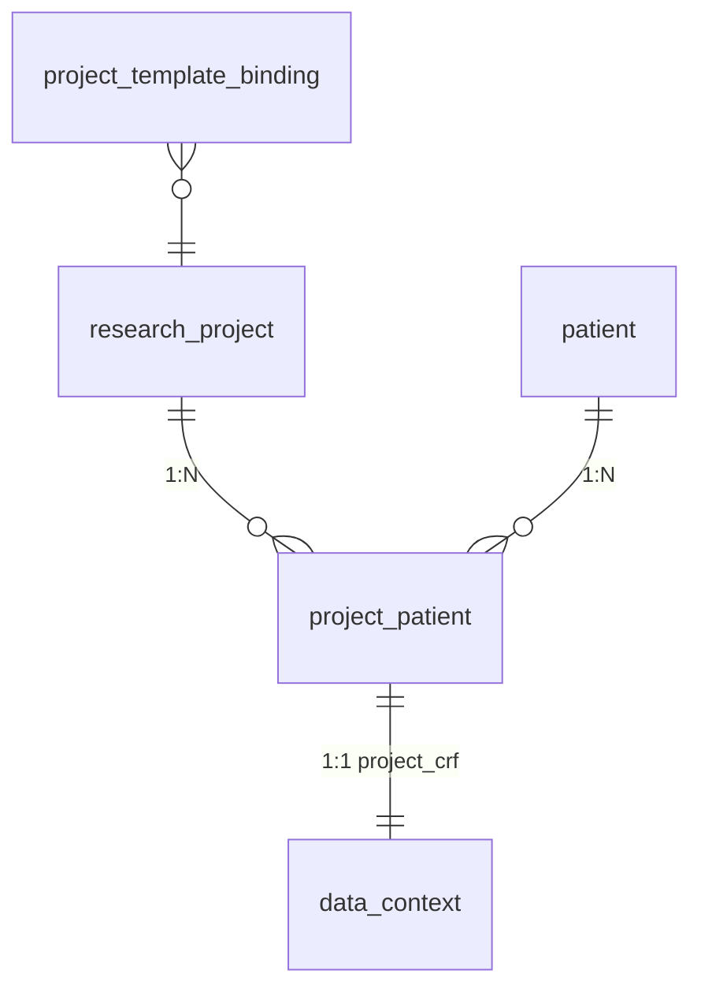

# 业务流程：病例纳入

> [!info] 一句话说明
> 把病例池中的病例"装进"科研项目，形成 **N:M** 入组关系；如项目已绑定 primary_crf 模板，则自动为该入组创建一份 **project_crf 数据上下文**，后续字段值都挂在这个上下文上。

## 触发场景

- 在项目页"添加患者"对话框中勾选若干病例提交；
- 病例从撤回（withdrawn）状态恢复入组（同一 patient 二次 POST 会复用旧记录并改回 `enrolled`）。

## 前置条件

- 项目存在且 `status != archived`；
- 病例存在且 `deleted_at IS NULL`（见 `patient_repository.get_active_by_id`）；
- （可选但常见）项目已有 `primary_crf` binding，否则不会创建 project_crf 上下文。

## 主流程

## 数据模型与多对多关系

- 唯一约束：`uk_project_patient(project_id, patient_id)` —— 同一病例在同一项目内最多一条记录（撤回再入组复用本条）。
- 撤回（DELETE 接口）走"软撤回"：status=withdrawn、withdrawn_at=now，**不删 data_context、不删字段值**，便于审计与恢复。

## 字段值如何与项目关联

> [!info] project_crf 上下文是关键中间层
> 病例的字段值不直接挂到项目，而是挂到该入组的 `data_context (context_type=project_crf, schema_version_id=...)`：
> - 同一病例在不同项目下各有独立的 project_crf 上下文（互不影响）；
> - 同一项目同一病例在不同 schema_version 下也是独立上下文（换版本时不污染旧数据）。

字段读写均通过 [[业务流程-数据集查看与编辑]] 中的接口；存储与变更历史复用 [[AI抽取/证据归因机制]] 的三表（`field_current_value` / `field_value_event` / `field_value_evidence`）。

## 异常分支

| 场景 | 表现 | 处理 |
|---|---|---|
| 病例不存在或已软删 | 入组失败 | 404 `Patient not found` |
| 项目已归档 | 入组失败 | 404 |
| 二次纳入同一病例 | 不报错 | 复用现有记录；若 withdrawn 则恢复 |
| 项目无 primary_crf binding | 入组成功但无上下文 | 后续访问 CRF 接口返回空 schema |
| 撤回后再读 list | 仍包含该记录 | 由前端按 status 过滤展示 |

## 涉及资源

- **API**：见 frontmatter
- **数据表**：[[表-project_patient]] [[表-research_project]] [[表-data_context]] [[表-record_instance]]
- **前端**：`ProjectDatasetView.jsx` 患者选择弹窗、`useProjectDatasetViewModel`

## 验收要点

- [ ] 重复纳入同一病例只返回一条 ProjectPatient
- [ ] 撤回再入组：status 回到 enrolled、withdrawn_at 清空
- [ ] 项目无 binding 时纳入后 GET CRF 返回 `context: null`
- [ ] 切换 binding 后新纳入的病例上下文挂新 schema_version；老入组的上下文不变
- [ ] 列表接口包含 withdrawn 记录（由前端过滤）
