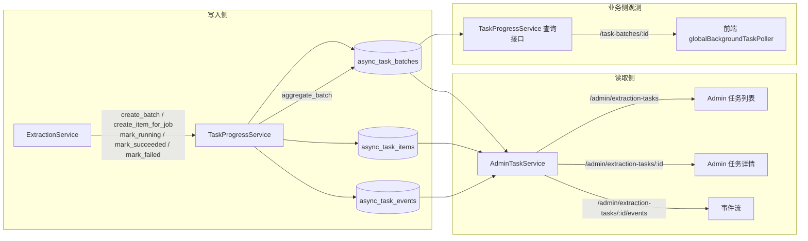
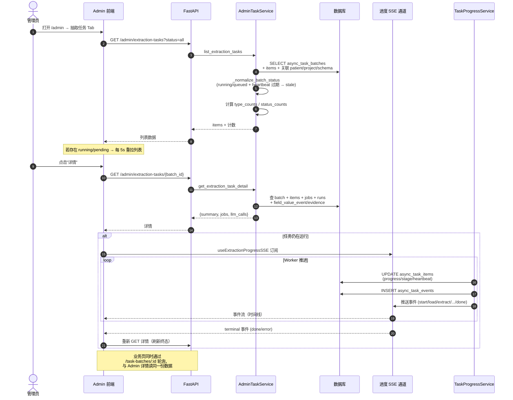

# 业务流程-异步任务监控

> [!info] 一句话说明
> 任意业务侧投递的抽取任务，都会落到 `async_task_batches / items / events` 三张表；管理员在 Admin 页面**任务列表 → 详情**两层视图里观测进度、查看 LLM 调用、定位失败。

## 触发场景

- 业务侧：用户点击"更新电子病历夹" / "更新 CRF" / 单文档靶向抽取 → `ExtractionService` 通过 `TaskProgressService.create_batch + create_item_for_job` 写入观测层
- 管理员侧：进入 `/admin` 页面 → 切到"抽取任务" Tab → 看到所有批次

## 前置条件

- 当前用户具备管理员角色（`is_admin_user` 通过；见 [[用户系统与权限/README]]）
- 至少存在一个由 `TaskProgressService` 创建的 batch（OCR / metadata 当前 **未** 接入观测层，列表里看不到 — TBD）

## 主流程

### 数据流总览



### 列表 → 详情时序



## 三层数据结构

| 表 | 角色 | 一行代表 |
|---|---|---|
| `async_task_batches` | 用户一次操作 | 一次"更新电子病历夹"或一次"更新 CRF" |
| `async_task_items` | 子任务 | 一个 [[表-extraction_job]] 对应一个 item（一文档 / 一表单 / 一组合） |
| `async_task_events` | 事件流 | item 的阶段切换、进度更新、错误、心跳 |

字段详情见 [[表-async_task]]。聚合规则与 `scope_type / task_type` 详见 [[关键设计-任务批次与子任务]]。

## 阶段进度约定

`ExtractionService` 在关键节点调用 `TaskProgressService.update_job_progress`，把 `(status, progress, stage, stage_label)` 同步写入 `async_task_items` 并落一条 event。前端 `NODE_META` 把 `stage` 翻译为中文标签（"任务开始" / "加载 Schema & 文档" / "LLM 抽取" / "物化落库" / "完成" 等）。

具体阶段编号清单见内部规划文档 `eacy/异步任务进度追踪实现方案.md`（不在交付库内）。

## 停滞探测

> [!warning] stale 是 Admin 层"虚拟状态"
> `async_task_batches.status` 永远不会真正变为 `stale`；只有读侧 `AdminTaskService._is_stale` 在响应时把"`running/queued` 且 `heartbeat_at` 超过 15 分钟"的批次显示为 `stale`。所以重启 Admin 进程不影响该判定（条件是无状态的）。

判定逻辑：

```text
status ∈ {running, queued}
AND (heartbeat_at or updated_at) < now() - 15min
→ 前端展示 "stale" 标签
```

## 任务详情查看

详情接口 `GET /admin/extraction-tasks/{task_id}` 返回三段：

1. `summary`：批次级聚合（项目 / 患者 / 模板 / 计数 / 错误摘要）
2. `jobs[]`：每个子任务展开为一行
   - 关联 [[表-extraction_job]] + 最新 [[表-extraction_run]]
   - `extracted_fields`：通过 `field_value_event` LEFT JOIN `field_value_evidence` 拿到字段值与原文证据（见 [[AI抽取/证据归因机制]]）
3. `llm_calls[]`：从 `extraction_run.parsed_output_json.validation_log` 提取的校验日志，作为 LLM 调用证据展示

> [!info] llm_source = "run"
> 当前 LLM 调用日志来自 `extraction_run` 字段；规划中的 `llm_call_logs` 独立表尚未启用，故详情返回固定 `llm_source = "run"`。

## 重试触发

> [!todo] TBD
> 当前 Admin 前端 **没有** 重试按钮调用专门的重试 API；
> 业务侧重试通过用户在业务页面再次点击"更新病历夹 / 更新 CRF"实现，新一次操作会创建新的 batch（不复用原 batch_id）。
> Celery 内部对 HTTP / DB 错误有最多 3 次的自动重试（见 [[AI抽取/README]] 中"重试策略"段），由 Worker 而非管理员触发。

## 异常分支

| 场景 | 表现 | 处理 |
|---|---|---|
| Worker 崩溃 | items 长时间停在 `running`，无 event | 15 分钟后 Admin 标记为 `stale`；运维需检查 Celery & Redis |
| LLM 调用失败 | item.status = `failed`，`error_message` 有内容，event_type=`error` | 用户在业务页重新触发；不影响其它 item |
| heartbeat 未实现的旧任务 | `updated_at` 仍在更新可避免误判 stale | 兜底条件已覆盖 |
| 任务详情 404 | `batch_id` 在 `async_task_batches` 中不存在 | `AdminTaskNotFoundError → 404` |

## 涉及资源

- **API**：`GET /api/v1/admin/extraction-tasks`、`GET /api/v1/admin/extraction-tasks/{task_id}`、`GET /api/v1/admin/extraction-tasks/{task_id}/events`、`GET /api/v1/task-batches/{batch_id}`、`GET /api/v1/task-batches/{batch_id}/events`
- **数据表**：[[表-async_task]]、[[表-extraction_job]]、[[表-extraction_run]]
- **前端页面**：`frontend_new/src/pages/Admin/index.jsx`（`ExtractionTasksTab`、`ExtractionTaskDetailModal`）

## 验收要点

详见 [[验收要点]]。
