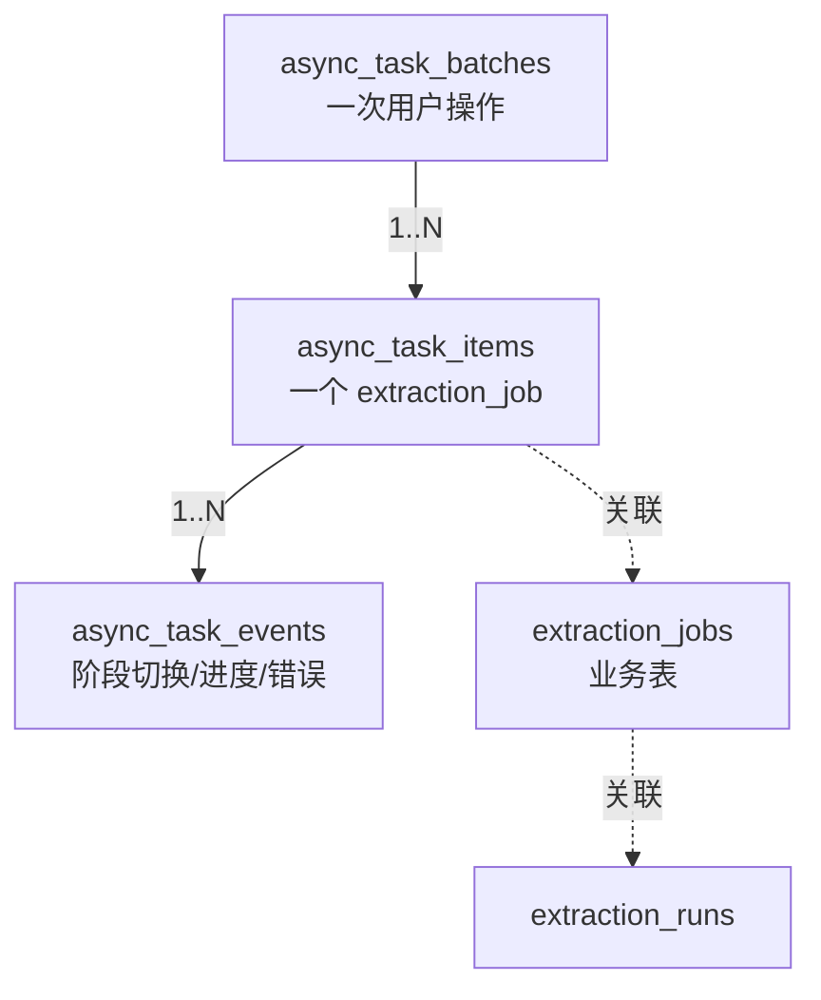

# 关键设计-任务批次与子任务

> [!info] 一句话定位
> `async_task_batches → async_task_items → async_task_events` 是观测层；本文解释 **task_type / scope_type** 的语义、**批次聚合**的规则、**状态归一化**的边界。

## 批次 vs 子任务

| 概念 | 创建时机 | 谁来写 |
|---|---|---|
| Batch | 用户点击"更新电子病历夹 / 更新 CRF / 靶向抽取"时 | `TaskProgressService.create_batch` |
| Item | 抽取规划阶段为每个 form_key / 文档创建一个 ExtractionJob 后 | `TaskProgressService.create_item_for_job`，同时落一条 `state_changed` 事件 |
| Event | Worker 推进每个 stage 时 | `TaskProgressService.update_job_progress` 内部调用 `_create_event` |

字段定义见 [[表-async_task]]。

## task_type

业务侧实际写入 `async_task_batches.task_type` 的字符串包含具体子类型（例如 `patient_ehr_folder_extract`、`project_crf_targeted_extract` 等）；**Admin 列表展示前会做一次归并**：

| Admin 显示类型 | 归并规则（`AdminTaskService._admin_task_type`） |
|---|---|
| `project_crf` | 原始 task_type 包含 `project_crf` |
| `targeted` | 包含 `targeted`，**或** 任一子任务带 `target_form_key` |
| `patient_ehr` | 包含 `patient_ehr` |
| 原值 / `all` | 其它 |

> [!info] 为什么归并
> 业务侧需要区分 folder / targeted 子流程以决定参数；管理员视角只关心"这是 CRF / EHR / 靶向"。两层关注点分离。

## scope_type

`async_task_batches.scope_type` 标识"任务的归属对象类型"，决定哪些 `*_id` 字段需要填写：

| scope_type | 必填字段 | 典型场景 |
|---|---|---|
| `patient` | `patient_id` | 电子病历夹更新 |
| `project_patient` | `project_id` + `project_patient_id` | 科研项目对单个入组患者的 CRF 抽取 |
| `project` | `project_id` | 项目级整体操作（TBD：当前是否启用未确认） |
| `document` | `document_id` | 单文档级任务（OCR / metadata 当前未接入，TBD） |

> [!warning] scope_type 的取值清单未在代码端强约束
> 模型仅声明 `Mapped[str | None]`；业务侧约定见 `eacy/异步任务进度追踪实现方案.md`。如未来扩展（如 `dataset_export`）需统一加常量并同步前端文案。

## 批次进度聚合

`TaskProgressService.aggregate_batch` 在每次 item 状态变化后调用，重新计算并写回 batch 字段。聚合规则（基于 items 的当前态）：

| 字段 | 来源 |
|---|---|
| `total_items` | items 总数 |
| `succeeded_items` / `failed_items` / `cancelled_items` | 同状态 items 计数 |
| `progress` | items 进度的平均或加权（具体公式见服务实现，0-100 单调递增由 update_job_progress 保证） |
| `status` | items 全部 terminal → `succeeded / failed`；存在 running → `running`；否则 `created / queued` |
| `started_at` | 首个 item 进入 running 的时间 |
| `finished_at` | 全部 terminal 后 |
| `heartbeat_at` | 任一 item 心跳更新时 |

> [!example] 举例：一次"更新电子病历夹"
> - 用户点击 → 创建 1 个 batch（task_type=`patient_ehr_folder_extract`, scope_type=`patient`）
> - 规划阶段为该患者 5 个文档 × 命中 3 个表单 → 创建 N 个 ExtractionJob → 对应 N 个 item
> - Worker 推进每个 item → 写 event + 聚合 batch.progress
> - 全部完成后 batch.status = `succeeded`，Admin 显示绿色"已完成"

## 状态归一化（命名差异表）

业务表的状态字与前端展示存在小的命名差异，Admin 层负责映射：

| 业务侧（DB） | 前端展示 | 触发条件 |
|---|---|---|
| `created` | `pending` | 刚 INSERT |
| `queued` | `pending` | 已投递 Celery |
| `running` | `running` | Worker 拿到任务 |
| `succeeded` | `completed` | 业务完成 |
| `failed` | `failed` | 业务失败，`error_message` 有值 |
| `cancelled` | `cancelled` | 用户取消（TBD：当前是否真有取消入口） |
| —— | `stale` | 见 [[业务流程-异步任务监控]] 停滞探测 |

映射代码：`AdminTaskService._normalize_batch_status` / `_normalize_item_status`。

## 重试与多 Run

| 维度 | 体现 |
|---|---|
| Worker 自动重试 | 一个 ExtractionJob 可关联多个 ExtractionRun（`run_no` 递增）；item 本身不复制，只在该 item 上累加 attempts |
| 用户重试 | 当前不复用 batch；用户重新触发会创建新 batch 与新 item（详情可见 [[业务流程-异步任务监控]] 重试触发段） |
| 详情展示 attempt_count | `len(runs_for_job)`，max_attempts 固定为 3（hardcoded） |

## 已知 TBD / 边界

> [!todo] 待补
> - OCR / metadata 任务**尚未**接入 `async_task_*`（仍只依赖 `documents.ocr_status / meta_status`）；导致 Admin 任务列表只覆盖抽取域
> - `scope_type=document / project` 是否真有写入路径，待运行时验证
> - 详情的 `llm_calls` 当前来自 `extraction_run.parsed_output_json.validation_log`；规划中的独立 `llm_call_logs` 表尚未启用（`llm_source = "run"`）
> - 列表上限 1000 条（`select(...).limit(1000)`）；高峰期需要分页化（TBD）

## 相关文档

- [[业务流程-异步任务监控]]
- [[业务概述]]
- [[表-async_task]]
- [[表-extraction_job]]
- [[AI抽取/证据归因机制]]
