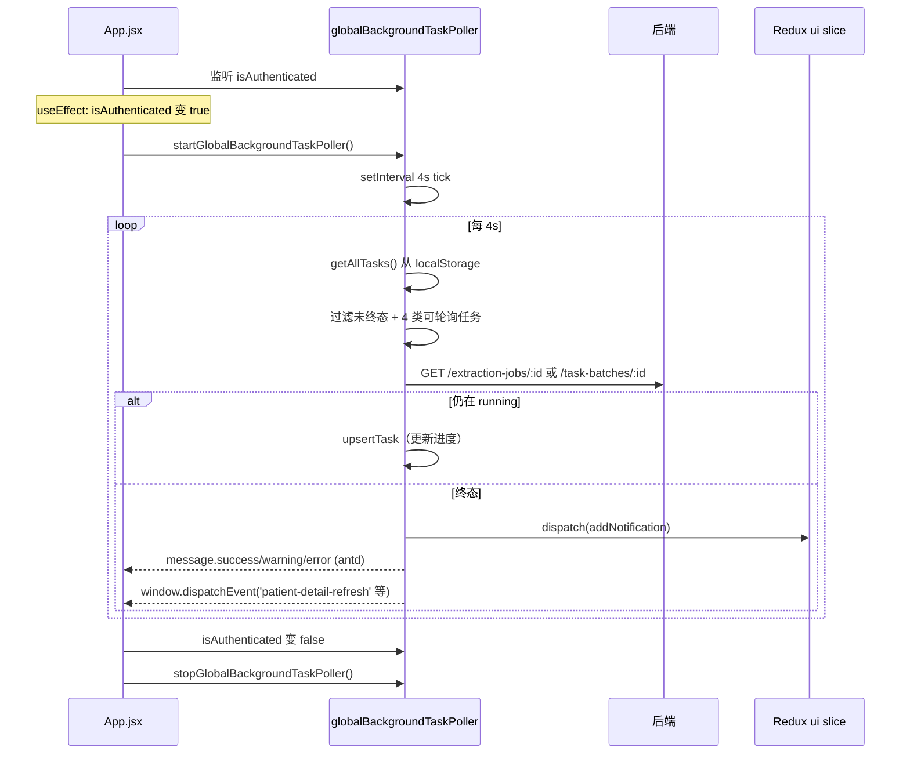

# 关键设计-全局后台任务轮询

> [!info] 一句话说明
> 后端的抽取 / 病历夹批次任务都是异步的；前端用**一个**全局 setInterval 轮询所有进行中的任务，**无论用户在哪个页面**，任务结束都能弹 toast、写进通知中心、并广播刷新事件给当前页面。

## 一、为什么需要

业务上有 4 类长耗时后端任务：

| 任务类型 | 触发场景 | 后端入口 |
|---|---|---|
| `patient_extract` | 患者一键"重新抽取整患者病历" | `POST /extraction-jobs` (`job_type=patient_ehr`) |
| `ehr_targeted_extract` | 病历某个 form 重抽 | `POST /extraction-jobs` (`target_form_key=...`) |
| `project_crf_targeted` | 项目 CRF 某个 form 重抽 | `POST /extraction-jobs` (`job_type=project_crf`) |
| `ehr_folder_batch` | 病历夹批量更新（多任务并行） | `POST /patients/:id/ehr/update-folder` |

用户提交后**立刻可以离开当前页面**——切换患者、关闭浏览器、再回来都要看到"任务已完成"的最终结果。集中式轮询比每个页面各搞一个 useEffect setInterval 更可靠（避免重复轮询、避免漏轮询）。

## 二、启停时机



- **启动**：`App.jsx` 的 useEffect 依赖 `isAuthenticated`，登录态变 true 立即起轮询；登出 / 401 时立即停止
- **轮询间隔**：`POLL_MS = 4000`（4 秒一轮）
- **并发保护**：`tickPromise` 单例锁，若上一轮还没结束就跳过这一轮（不会堆积）

## 三、任务进入轮询的路径

任务**写入**走 `utils/taskStore.js#upsertTask`，由触发方各自负责：

| 触发方 | 何时写入 |
|---|---|
| `PatientDetail/index.jsx` 重抽按钮 | 拿到 `task_id` 后 `upsertTask({type:'patient_extract'/'ehr_targeted_extract', task_id, patient_id, ...})` |
| `SchemaForm` 项目模式靶向抽取 | `upsertTask({type:'project_crf_targeted', task_id, project_id, project_patient_id, target_form_key})` |
| `api/patient.js#updatePatientEhrFolder` | 返回 `batch_id` 后由调用方写 `localStorage["eacy_ehr_folder_batch_<patientId>"] = batchId` |

> [!warning] 入队不是 idempotent
> `task_id` 必须是后端返回的真实 ID，前端不能随便编。`taskStore` 用 `task_id` 去重 upsert，最多保留 50 条。

## 四、终态处理（settleExtractionTask）

终态判定：状态 ∈ `{completed, completed_with_errors, succeeded, failed, cancelled}`。

| 任务类型 | toast | 通知中心 | 页面刷新事件 |
|---|---|---|---|
| `patient_extract` | `成功 N 失败 M` | `task:patient_extract` | `patient-detail-refresh` (含 patientId) |
| `ehr_targeted_extract` | `病历靶向抽取已完成（<form>）` | `task:ehr_targeted_extract` | `patient-detail-refresh` |
| `project_crf_targeted` | `科研项目靶向抽取已完成（<form>）` | `task:project_crf_targeted` | `eacy:project-crf-refresh` (含 projectId + projectPatientId) |
| `ehr_folder_batch` | `电子病历夹更新完成 / 失败 N` | `task:ehr_folder_batch` | `patient-detail-refresh` |

页面只要监听对应的 `window.addEventListener` 即可在收到事件时重新拉数据，不用关心是哪一笔具体任务。

## 五、去重保护

同一个任务可能在"详情页轮询"与"全局轮询"中都看到终态，导致两条 toast。用 `sessionStorage` 单标志位避免：

```javascript
// utils/taskStore.js
export function claimExtractionNotifyOnce(taskId) {
  const k = `eacy_extraction_notified_${taskId}`
  if (sessionStorage.getItem(k)) return false
  sessionStorage.setItem(k, '1')
  return true
}
```

批次任务用类似的 `eacy_ehr_batch_notified_<batchId>` key。

> [!warning] sessionStorage 跨刷新会清
> 这是有意的：刷新页面后视为"全新会话"，重新提醒一次更安全。但跨 tab 不共享。

## 六、与 Antd notification 的集成

文件内 import 的是 `message`（短时 toast），不是 `notification`。两个都是 antd 提供：

- `message.success/warning/error` —— 顶部短暂 toast，**不持久化**
- 同时 `store.dispatch(addNotification(...))` —— 写进 `ui.notifications.list`，由 [[组件复用说明#MainLayout]] 顶部的 `NotificationBell` 展示
- 用户即使离开当前 tab、回来后通过铃铛仍能看到列表

通知列表本身的持久化在 `utils/notificationBridge.js` —— 订阅 store，每次 `ui.notifications` 变更写一次 `localStorage`，启动时 hydrate。

## 七、调试

代码里留了调试开关：

```javascript
window.__eacyDebugTaskPoller = true   // 控制台打开 verbose log
```

排查"任务卡住不通知"时先开它，看 `[task-poller]` 输出的 tick / pollTask / claim 链路。

## 相关文档

- [[状态管理说明]] —— Redux ui.notifications
- [[页面-PatientDetail]] —— 监听 `patient-detail-refresh` 事件的页面
- [[页面-ResearchDataset]] —— 监听 `eacy:project-crf-refresh` 事件的页面
- 后端任务接口：见 `03_接口/AI抽取/` 与 `03_接口/任务批次/`（按业务域）
