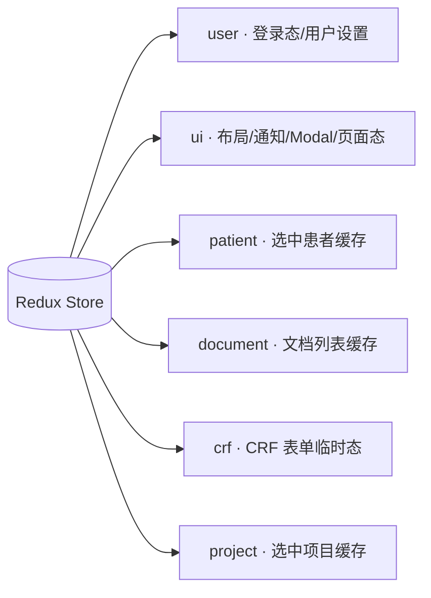
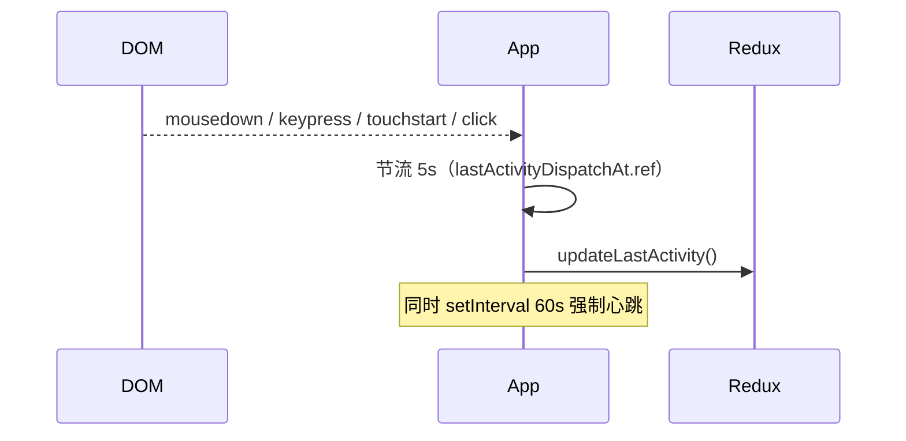

# 状态管理说明

> Redux Toolkit slice 概览、用户会话与活动心跳、后台任务的"双轨持久化"。**不替代** slice 源码的字段表，只说**每个 slice 的意图与边界**。

## 一、Store 组成

`store/index.js` 用 `configureStore` 组装六个 slice。`serializableCheck` 忽略 `persist/*`（项目没引入 redux-persist，关键持久化走 `localStorage` 自管，见后文）。

## 二、各 slice 职责

### userSlice

**单一事实源：登录状态与用户偏好**。

- `isAuthenticated / userInfo / userSettings / loginTime / lastActivity`
- 初始化时从 `localStorage` 还原（`access_token` + `user_info` + `user_settings`），相当于轻量 SSR 一样的"页面刷新不掉登录"。
- 关键 action：
  - `loginSuccess` —— 写 token / userInfo 到 localStorage，标记 `userSettings = null` 等调用方拉取
  - `setUserSettings` —— 硬登录后由调用方 dispatch；写一份到 `localStorage.user_settings`
  - `logout` —— 调 `clearUserSessionStorage` 清掉 token + 业务缓存（任务列表、通知、批次去重标记）
  - `updateLastActivity` —— 心跳，详见下文

> [!info] "硬登录 vs 软登录"
> - **硬登录**：用户在 `/login` 输密码 → 后端 `POST /auth/login` → `loginSuccess` + 拉 `user_settings` 缓存
> - **软登录**：页面刷新时若 `localStorage` 已有 token，`App.jsx` 调用 `softLogin()` 验证 token 是否仍有效（当前实现是空 success，未来对接 `/auth/me`）

### uiSlice

**所有"UI 临时态"**，与业务数据无关。包括：

- `layout`：siderCollapsed / siderWidth
- `navigation`：currentPath / breadcrumbs / activeMenuKey
- `theme`：暗黑模式预留（暂未启用）
- `loading.global` —— 控制 `App.jsx` 的 `<GlobalLoading />`
- `notifications`：通知中心列表 + 未读计数（被 NotificationBell 消费）
- `modals` / `drawers` / `tables` / `search` / `pages`：跨组件 UI 状态的占位槽（实际使用比较克制，多数页面仍用局部 state）

通知相关 action：`addNotification`（前置插入，最多 200 条）、`markNotificationAsRead`、`markAllNotificationsAsRead`、`hydrateNotifications`（启动时从 localStorage 还原）。

### patient / document / crf / project slice

这四个 slice 当前承担"选中项 + 简单列表缓存"的职责，**不是**主数据源——主数据由各页面的 `useXxxData` hook 直接调 API 并保存到组件 state。Redux 缓存更多用于跨页面共享"上次选了哪个项目 / 哪个患者"。

> [!warning] 不要把所有 API 结果都塞进 Redux
> 项目坚持的模式是：列表与详情用页面级 hook（如 `usePatientData`、`useProjectDatasetViewModel`）保存，Redux 只放真正跨页面共享的极简状态。强行集中只会让组件粘连更深。

## 三、用户活动心跳

`App.jsx` 同时挂两套监听：

- 任意用户事件触发，**节流 5s** 写一次 `lastActivity`
- 每 60s 强制写一次（保活）
- `lastActivity` 当前只是状态字段，未来可用于"超时自动登出"逻辑

## 四、通知与后台任务的"双轨持久化"

通知中心与后台任务跨页面 / 跨刷新仍要存活，因此都在 Redux 之外另开了 localStorage 通道：

| 数据 | Redux 字段 | 持久化文件 / key | 桥接器 |
|---|---|---|---|
| 通知列表 | `ui.notifications.list` | `localStorage` | `utils/notificationBridge.js` |
| 后台任务列表 | （无）页面自己读 | `localStorage["eacy_task_store_v1"]` | `utils/taskStore.js` |
| 病历夹批次 ID | （无） | `localStorage["eacy_ehr_folder_batch_<patientId>"]` | `globalBackgroundTaskPoller` |
| "已通知过"去重 | （无） | `sessionStorage["eacy_extraction_notified_<taskId>"]` | `taskStore#claimExtractionNotifyOnce` |

启动时 `main.jsx` 调 `setupNotificationPersistence(store)`：

- 订阅 store，每次 `ui.notifications` 变化写一次 localStorage
- 启动时 dispatch `hydrateNotifications` 把上次的列表灌回来

后台任务则是 [[关键设计-全局后台任务轮询]] 单独的话题。

## 五、调用 API 与 store 的关系

`api/request.js` 在 401 时直接 `clearUserSessionStorage()` + redirect `/login`，不走 Redux dispatch（因为可能在 Provider 外）。这是有意为之，避免 React 渲染期间的 dispatch 死锁。

`loginSuccess` 不是直接由 `api/auth.js` 调用，而是由 `pages/UserSystem/Login.jsx` 在登录接口成功后 dispatch；保留组件层完全控制副作用。
