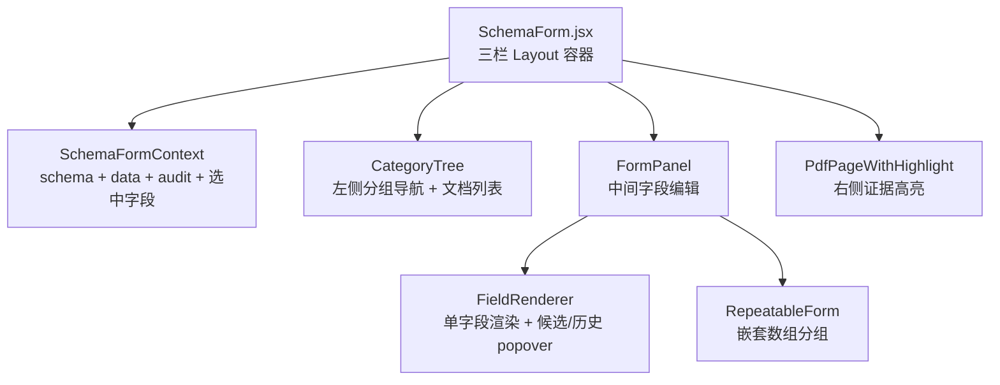

# 组件复用说明

> 列出**跨页面共享**的关键组件，描述各自职责与典型用法。具体 props 与类型见源码，本文只点出"它解决什么问题、被谁用、扩展时要注意什么"。

## 一、SchemaForm 体系

整套位于 `components/SchemaForm/`，是病历夹（EHR）与项目 CRF 两个最复杂表单页面的核心。

### SchemaForm

- 作用：把后端的 `schema_json` + `current_values` + `evidence` 渲染为可编辑的三栏页面（左目录 / 中表单 / 右文档证据）。
- 复用点：[[页面-PatientDetail]] 的 `SchemaEhrTab` 与 `ProjectSchemaEhrTab`；[[页面-ResearchDataset]] 项目患者详情都基于它。
- props 思路：传入 `schemaSource`（schema + data + audit）、`onSave`（字段级更新回调）、`mode`（patient_ehr / project_crf 决定调哪套 API）。不要 copy 完整 props 表，看 `SchemaFormContext.jsx`。

### CategoryTree

- 作用：基于 schema 的顶层 `fieldGroups` 渲染折叠树。叶子节点是表单分组，可重复表单（`type: array`）在叶子节点带"+ 添加实例"按钮。
- 项目模式扩展：在左下区显示挂在该患者的文档列表（`DocumentCard` 来自 `PatientDetail/tabs/DocumentsTab/components`），点击文档可在右侧打开 `DocumentDetailModal`。
- 注意：树的展开 / 收起状态目前在组件本地 state，不进 Redux；切换患者会重置。

### FormPanel + FieldRenderer

- `FormPanel` 负责字段排版（label + 编辑控件 + 证据图标 + 历史按钮）。
- `FieldRenderer` 内部根据 schema 的 `type` / `enum` / `format` 选控件，并挂 popover 显示候选值、抽取历史、字段证据。
- 候选值 / 历史 / 证据三类 API 在 patient 与 project 模式下走两套：`getEhrFieldCandidatesV3` / `getProjectCrfFieldCandidates` 等，调用入口都从 `SchemaFormContext` 注入。

### RepeatableForm

- 作用：渲染"可重复 record"（如多次检查、多次随访），对应 schema 中 `type: array, items: { properties }`。
- 行级别支持"新增 / 删除一条 record_instance"，分别走 `POST .../records` 和 `DELETE .../records/:id`（见 `api/patient.js#createEhrRecordInstanceV3`、`api/project.js#createProjectCrfRecordInstance`）。

## 二、PDF 证据高亮

| 组件 | 路径 | 用途 |
|---|---|---|
| `PdfPageWithHighlight` | `components/PdfPageWithHighlight/index.jsx` | 渲染**单页** PDF 并叠加 polygon 高亮；接受 `pageNo` + `polygons[]` + `pageSize` |
| `DocumentBboxViewer` | `components/DocumentBboxViewer/index.jsx` | 整文档 + 多页 + 缩放工具栏的浏览器（用于 `DocumentDetailModal`） |
| `FieldSourceViewer` | `components/FieldSourceViewer/index.jsx` | `ClickableFieldValue` + `FieldSourceModal`：把字段值变成可点击的链接，点击弹出"该字段来自哪份文档哪个 bbox"的对话框 |

证据坐标的标准化在 `api/patient.js#normalizeEvidenceLocation` 完成，注意 polygon 来源字段在不同 API 里叫 `polygon` / `textin_position` / `position`，前端做了兜底归一。

## 三、Modal 类（按业务）

| 组件 | 路径 | 用途 |
|---|---|---|
| `DocumentDetailModal` | `pages/PatientDetail/tabs/DocumentsTab/components/DocumentDetailModal.jsx` | 文档预览 + 元数据 + OCR 文本 + 操作（重抽 / 删除 / 改归档） |
| `PatientCreateModal` | `components/Patient/PatientCreateModal.jsx` | 新建患者，被 `MainLayout` 与多个页面复用 |
| `TemplateMetaModal` | `components/Research/TemplateMetaModal.jsx` | CRF 模板元数据（名称 / 分类 / 描述）编辑 |
| `FieldSourceModal` | `components/FieldSourceViewer/index.jsx` | 字段证据来源对话框 |

> [!info] Modal 复用约定
> 业务 Modal 各自管理可见性（局部 `useState`）。`uiSlice.modals` 当前没有强约束，未在跨组件场景下被广泛使用——优先用局部 state，需要跨组件再考虑 Redux。

## 四、表格类

项目里没有"通用 Table 封装组件"，所有列表（FileList、PatientPool、ProjectDatasetView）都直接用 Ant Design 的 `<Table />`，列定义和 columns 在各页面里。共用的只有：

- `components/Common/StructuredDataView` —— 把结构化 JSON 渲染成只读层级表（用于项目 CRF 浏览模式）
- `utils/sensitiveUtils.js` —— `maskName / maskPhone / maskIdCard / maskAddress` 等脱敏函数，所有患者列在显示前都过一次

## 五、布局类

### MainLayout (`components/Layout/MainLayout.jsx`)

- 顶部 Header + 左侧 Sider + 右侧 Content (`<Outlet />`)
- 集成 NotificationBell（消息中心）、全局搜索、用户菜单、面包屑
- 左侧 Sider 在科研 / 患者类页面会切换为"二级 rail"模式（项目列表 / 模板列表 / 患者列表 / 文件列表）——见 `layoutShellConfig.js` 与 `researchRailLayout.js`
- 不要在 MainLayout 里加业务逻辑，二级 rail 已经吃掉了相当多的复杂度

### NotificationBell (`components/Layout/NotificationBell.jsx`)

- 读 `ui.notifications`（见 [[状态管理说明]]），由 [[关键设计-全局后台任务轮询]] 推送
- 持久化由 `utils/notificationBridge.js` 负责（写 localStorage，登录后 hydrate）

## 六、表单设计器（CRF Designer）

`components/FormDesigner/` 是另一套独立子系统，被 [[页面-CRFDesigner]] 和 [[页面-ResearchDataset#项目模板编辑]] 共用。详见对应页面文档。
