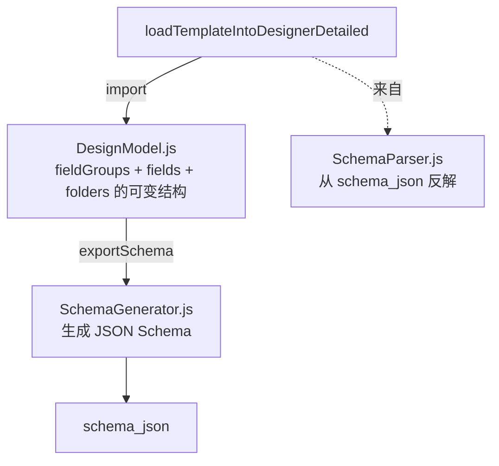
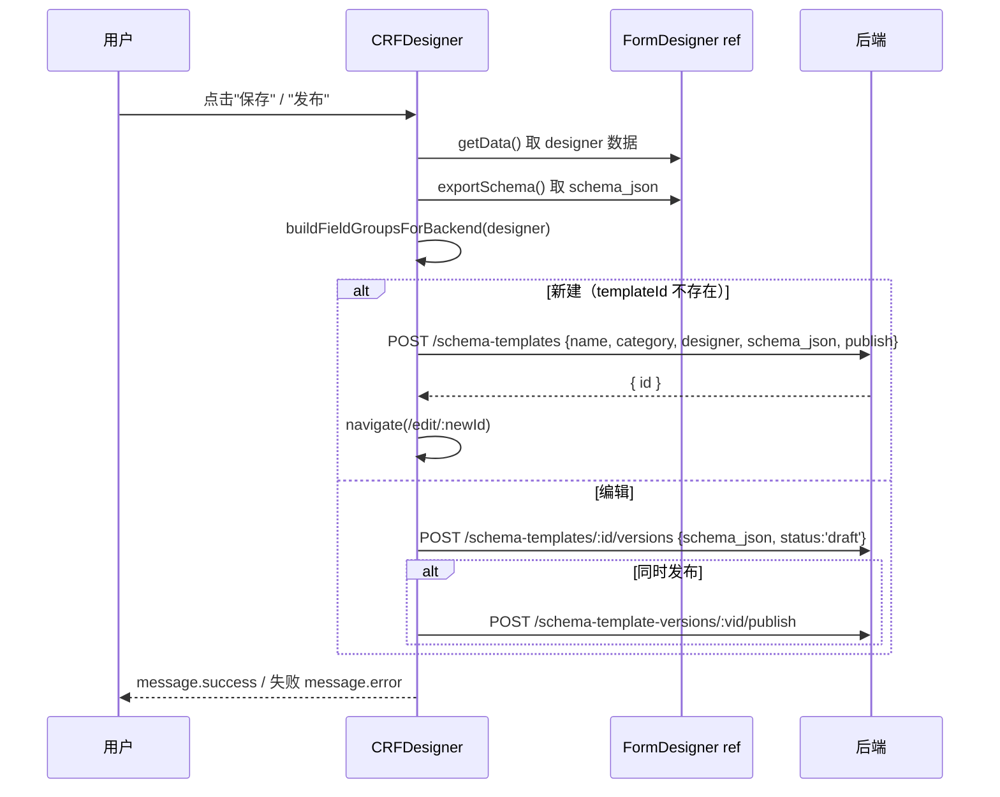

# 页面-CRFDesigner

> [!info] 一句话说明
> CRF / Schema 模板设计器：拖拽组件库 → 在画布上构建分组与字段 → 配置字段属性 → 保存为新版本并发布。承担"全局 CRF 模板"与"项目级 CRF snapshot"两种保存目标。

## 一、入口路由

| 路由 | 模式 | 备注 |
|---|---|---|
| `/research/templates/create` | 新建 | 保存时 `POST /schema-templates` |
| `/research/templates/:templateId/edit` | 编辑 | 保存为新版本 `POST /schema-templates/:id/versions` 然后 publish |
| `/research/templates/:templateId/view` | 只读 | URL 以 `/view` 结尾即触发 `isViewMode` |
| `/research/projects/:projectId/template/edit` | 项目级 | 实际渲染 `ProjectTemplateDesigner.jsx`，复用同一个 `FormDesigner` 组件，但保存 API 不同（写项目绑定的 schema 版本） |

## 二、三栏布局

| 区域 | 路径 | 职责 |
|---|---|---|
| 左 · 组件库 | `LeftPanel/ComponentLibrary.jsx` | 拖拽源：单行文本、多行、数字、日期、单选、多选、表格、嵌套分组 等 |
| 左 · 文件夹树 | `LeftPanel/FolderTree.jsx` | 模板顶层"分组"导航，决定 schema 中 `fieldGroups` 的层级 |
| 中 · 画布 | `CenterPanel/DesignCanvas.jsx` + `GroupCard.jsx` + `FieldCard.jsx` | 真正显示与排序的区域，使用 `@dnd-kit/*` 支持拖拽 |
| 右 · 配置 | `RightPanel/FieldConfigPanel.jsx` / `FormConfigPanel.jsx` | 当前选中字段 / 表单的属性编辑（名称、类型、必填、选项、说明、对接 doc_type 等） |

## 三、内部数据模型

`components/FormDesigner/core/` 维护一套独立于 JSON Schema 的"设计器模型"：

- 设计器内部存的是**"designer 形态"**（嵌套 group + field 列表，带 UI 元数据如位置、宽度、显示提示）
- 保存时同时输出两份：
  - `designer`（含 `fieldGroups`）—— 回放时能 100% 还原 UI 形态
  - `schema_json`（JSON Schema draft 2020-12）—— 后端实际用来校验数据
- 两份都写到模板版本的 `schema_json` 字段下（`schema_json.designer` + `schema_json.layout_config.fieldGroups`）

## 四、嵌套分组与可重复表单

- 顶层分组（folder）：模板的章节，对应 schema `properties` 顶层 key
- 二级分组：folder 内的小节
- 字段类型 `record_group`（在 designer 内）→ schema 输出 `type: array, items: { properties }`，前端 [[组件复用说明#RepeatableForm]] 据此渲染"多条记录"

字段的稳定身份用 **UID** 标识（不依赖 path），方便模板演进时已抽取数据按 UID 迁移到新 path。

## 五、保存 / 发布流程

保存逻辑实际在 `api/crfTemplate.js#saveCrfTemplateDesigner` / `createCrfTemplateDesigner` 里封装。注意：

- 元数据（name / category / description）通过 `TemplateMetaModal` 单独维护，保存时调 `PATCH /schema-templates/:id` (`updateCrfTemplateMeta`)
- 模板编码 `template_code` **不再由用户输入**，后端按 name 生成全局唯一编码
- 导入 / 导出 CSV 是设计器的便捷功能（`CSVConverter`），适合批量从 Excel 模板迁移

## 六、项目模板编辑 (`ProjectTemplateDesigner`) 的差异

- UI 完全一样（同一个 `FormDesigner` 子组件）
- 保存接口走 `api/project.js#saveProjectTemplateDesigner`：
  1. 在原模板下创建新版本 `POST /schema-templates/:tid/versions`
  2. 立即 `publish`
  3. 删除项目现有 `template-binding`，再 `POST /projects/:id/template-bindings` 指向新版本
  4. 这样项目"独立演进"模板而不影响其他项目共用的旧版本
- 详见 [[页面-ResearchDataset#项目模板编辑]]

## 七、跨页面通信

- 保存成功后派发 `research-template-rail-refresh` 事件，让 [[组件复用说明#MainLayout]] 的科研侧 rail 重新拉模板列表
- 接收 `research-template-meta-open` 事件：从其他页面跳过来后自动打开元数据弹窗

## 八、相关

- [[组件复用说明]] —— SchemaForm 是设计器输出的消费者
- [[页面-ResearchDataset]] —— 项目模板编辑入口
- 后端模板版本与 binding：见 `02_业务域/Schema模板与CRF/`
