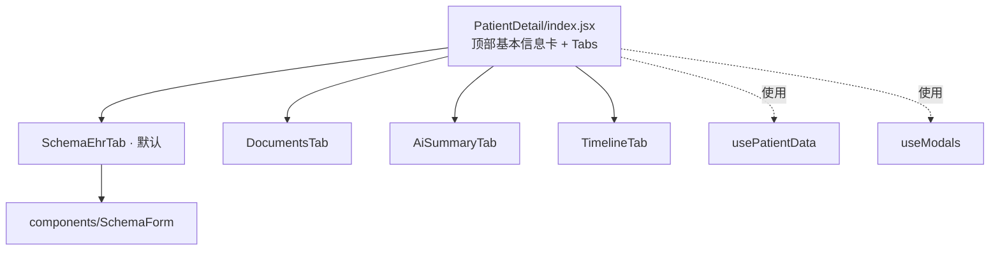
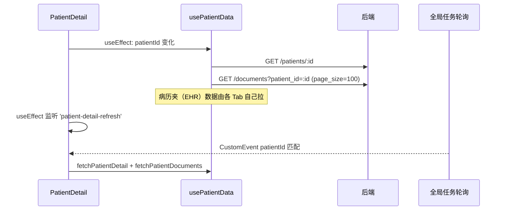
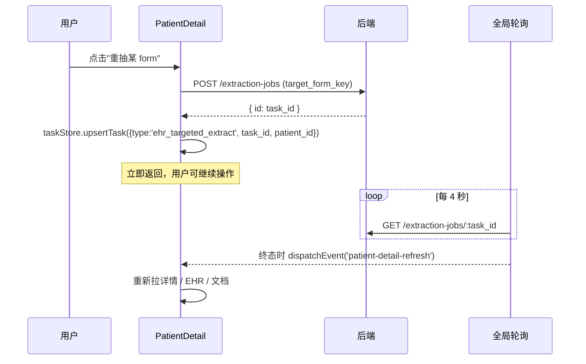

# 页面-PatientDetail

> [!info] 一句话说明
> `/patient/detail/:patientId` 一站式查看与编辑某患者的所有信息：病历夹（Schema 表单）、关联文档、AI 综述、时间线。是全前端最复杂的页面（≈ 2700 行）。

## 一、页面骨架

顶部："姓名 / 性别 / 年龄 / 科室 / 主治医生 / 主要诊断 / 关联项目"汇总卡 + "编辑信息 / 导出数据"按钮。

下方 Tabs（`activeKey` 在组件本地 state，初值 `ehr-schema`）：

| key | 标签 | 组件 | 作用 |
|---|---|---|---|
| `ehr-schema` | 电子病历_V2.0 | `SchemaEhrTab` | 三栏 Schema 表单 |
| `documents` | 文档（N） | `DocumentsTab` | 已归档到该患者的所有文档 |
| `ai-summary` | AI 病情综述 | `AiSummaryTab` | LLM 生成的综述（占位实现） |
| `timeline` | 时间线 | `TimelineTab` | 字段变更历史时间线 |

## 二、数据加载策略

- **基础信息 / 文档列表**：在 `usePatientData` 内，patientId 切换时会先 `AbortController.abort()` 上一次请求，再拉新数据
- **EHR Schema 数据**：由 `SchemaEhrTab` 内部调 `GET /patients/:id/ehr`，返回 `{schema, current_values, records}` 一次性给三栏组件
- **文档证据**：在 `SchemaForm` 中按需懒加载（点击字段 → 查证据 → `GET /patients/:id/ehr/fields/:path/evidence`）
- **后台抽取完成刷新**：监听 `window` 上的 `patient-detail-refresh` 事件（由 [[关键设计-全局后台任务轮询]] 派发），收到后重新拉详情 + 文档 + EHR

## 三、各 Tab 数据职责

### SchemaEhrTab

复用 `components/SchemaForm/SchemaForm.jsx`，传入 `mode='patient_ehr'`。

- 一次性拉 `GET /patients/:id/ehr` 得到 schema + 当前值
- 字段编辑保存：`PATCH /patients/:id/ehr/fields/:fieldPath` —— **逐字段保存**，前后值 diff 由 `usePatientData/collectLeafValues` 算
- 字段历史 / 候选 / 证据：分别走三套 `GET .../events`、`.../candidates`、`.../evidence`
- 候选选定：`POST .../select-candidate` 把多源冲突时选中的那条标记为权威
- record 实例：`POST/DELETE /patients/:id/ehr/records[/:rid]`
- 重抽某 form：`POST /extraction-jobs` (`target_form_key=...`) → 写入 `taskStore` 进入 [[关键设计-全局后台任务轮询]]

### DocumentsTab

- 文档列表来自 `usePatientData` 已拉好的 `patientDocuments`
- 点文档 → 打开 `DocumentDetailModal`（PDF 预览 + 元数据 + OCR 文本）
- 操作：重抽（`extractEhrData`）、删除（`deleteDocument`，含证据影响确认弹窗 `getDocumentEvidenceImpact`）、改归档患者（`archiveDocument` 传新 patient_id）
- 上传文档：内嵌 `UploadPanel`，调 `uploadAndArchiveToPatient`（后端一次完成上传 + 归档 + 触发 OCR/metadata/抽取链路）
- "病历夹更新"按钮：`POST /patients/:id/ehr/update-folder` → 写 `localStorage["eacy_ehr_folder_batch_<patientId>"]` → [[关键设计-全局后台任务轮询]] 接管

### AiSummaryTab

当前 API 是空实现（`generateAiSummary` / `getAiSummary` 返回 emptySuccess）。UI 已经做好编辑 / 重生成 / 字段脚注引用文档来源。等后端 LLM 综述接口接通即可。

### TimelineTab

显示字段变更事件流（目前是 placeholder，等接 `GET /patients/:id/timeline`，TBD）。

## 四、与抽取链路的协作

> [!info] 关键：刷新由事件驱动，不是 Tab 切换驱动
> 即使用户在抽取期间切到 DocumentsTab、再切回 SchemaEhrTab，也不会重复拉 EHR；只有真正收到 `patient-detail-refresh` 事件才会刷新。

## 五、敏感字段脱敏

`patientInfo.phone / idCard / address` 在显示时由 `utils/sensitiveUtils.js` 做掩码。编辑弹窗里：

- 未点击的字段显示掩码字符串，不参与校验、不提交
- 用户点击后状态切到 `sensitiveModified=true`，清空显示让用户重填，提交时才走真正的值
- 由 `sensitiveModified` 这个 ref 控制，避免"用户没改的字段被掩码字符串覆盖到后端"

## 六、相关

- [[组件复用说明]] —— SchemaForm 三栏
- [[关键设计-全局后台任务轮询]] —— 抽取完成的刷新链路
- [[状态管理说明]] —— Redux 在本页几乎不参与（patient 数据全在组件 hook）
- 后端字段抽取语义：见 `02_业务域/AI抽取/` 与 `03_接口/患者/`
