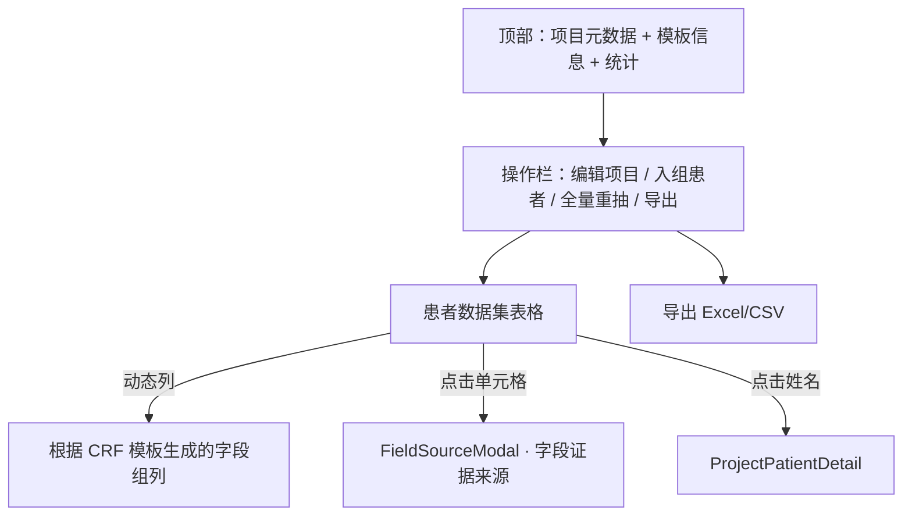
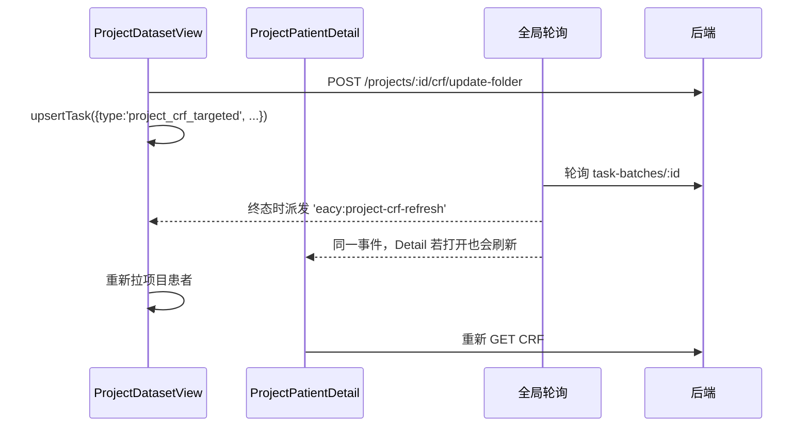

# 页面-ResearchDataset

> [!info] 一句话说明
> 科研项目工作区，三层页面：**项目列表 → 项目详情 / 数据集 → 项目患者详情**。这是后端 `research` 域接口最密集的前端入口。

## 一、三层导航

```mermaid
graph LR
  L1[/research/projects<br>ResearchDataset/index.jsx]
  L2[/research/projects/:projectId<br>ProjectDatasetView.jsx]
  L3[/research/projects/:projectId/patients/:patientId<br>ProjectPatientDetail.jsx]
  TD[/research/projects/:projectId/template/edit<br>ProjectTemplateDesigner.jsx]
  TD2[/research/templates/*<br>CRFDesigner]
  L1 -->|点项目卡片| L2
  L2 -->|点患者行| L3
  L2 -->|编辑模板| TD
  L1 -->|CRF 模板管理 Tab| TD2
```

## 二、第一层 · 项目列表 (`index.jsx`)

- 一个文件 ≈ 2640 行，承担多职责：
  - 项目列表（卡片 / 表格视图切换）
  - 创建项目向导（多步 Steps：基本信息 → 选模板 → 选患者 → 确认）
  - CRF 模板管理 Tab（列表 / 导入 CSV / 克隆 / 转换 / 删除）
  - 模板版本管理对话框
- 主要 API：
  - `GET /projects` + `getProjects` 拉项目（同步聚合统计：`actual_patient_count` / `avg_completeness`）
  - `POST /projects` 新建；新建过程中调 `POST /projects/:id/patients` 批量入组初始患者
  - `GET /schema-templates`、`POST /schema-templates`（用于"创建模板"按钮跳到 [[页面-CRFDesigner]]）

> [!warning] 这个文件需要拆
> ResearchDataset/index.jsx + ProjectDatasetView.jsx + ProjectPatientDetail.jsx 加起来 7900 行，单文件远超 400 行的约定。未来需要按"项目向导 / 模板 Tab / 项目卡片"拆分。本文档不展开 UI 细节。

## 三、第二层 · 项目详情 (`ProjectDatasetView.jsx`)



### 数据加载

1. `GET /projects/:id` —— 项目元数据（含 `template_info` 或 `template_scope_config`）
2. `GET /projects/:id/patients` —— 项目入组患者列表（每人附带 CRF 完成度）
3. `getProjectTemplateDesigner(projectId)` —— 拿到当前绑定的 schema_json，用于生成动态列

### 动态列与"穿透/总览"视图

- `viewMode = 'penetration' | 'overview'`：穿透视图按字段组展开横向列；总览视图聚合统计
- 列定义在运行时由 `templateFieldGroups` + `templateFieldMapping` 推出，模板更新后立即反映在表格

### 数据集导出

`exportProjectCrfFile(projectId, payload)` 直接 fetch (非 `request.js` 包装)，因为返回 Blob 而非 JSON。导出格式由 payload 决定（Excel / CSV）。

### CRF 批量抽取

- 单个患者重抽：`POST /projects/:id/patients/:ppId/crf/update-folder`
- 全量重抽：`POST /projects/:id/crf/update-folder`（可指定 `project_patient_ids` 子集）
- 返回 `batch_id` → 写 `taskStore` → [[关键设计-全局后台任务轮询]] 接管进度
- 进度卡片：监听 `getCrfExtractionProgress(taskId)`，显示 `succeeded_items / failed_items / running`

### 项目模板编辑

点 "模板 · <name>" 按钮 → 跳 `/research/projects/:id/template/edit` → 渲染 `ProjectTemplateDesigner`：

- 复用 [[页面-CRFDesigner]] 的 `FormDesigner` 子组件
- 保存调 `saveProjectTemplateDesigner`：创建新版本 + 发布 + 切换项目 template-binding（详见 `api/project.js`）
- 保存后回到 ProjectDatasetView，触发表头刷新

## 四、第三层 · 项目患者详情 (`ProjectPatientDetail.jsx`)

形态接近 [[页面-PatientDetail]]，但**只显示项目维度**的 CRF（不是全患者 EHR）：

- `GET /projects/:id/patients/:ppId/crf` —— 项目 CRF 数据 + schema 一次拉完
- 三栏：左 CategoryTree（项目模板的分组 + 已挂在该患者的文档）/ 中表单 / 右 PDF 证据
- 字段保存：`PATCH /projects/:id/patients/:ppId/crf/fields/:path`
- record 实例：`POST/DELETE /projects/:id/patients/:ppId/crf/records[/:rid]`
- 靶向重抽：`startCrfExtraction({jobType:'project_crf', target_form_key})` → `taskStore` → `eacy:project-crf-refresh` 事件

## 五、与全局任务轮询的协作



具体事件路由参见 [[关键设计-全局后台任务轮询]]。

## 六、子目录概览

`pages/ResearchDataset/` 还包含：

| 目录 | 作用 |
|---|---|
| `hooks/` | `useProjectDatasetViewModel` 等数据 hook |
| `components/` | 项目专用组件（含 `ProjectDatasetV2` 第二代表格视图） |
| `adapters/` | API → 视图层数据适配器（`adaptProjectPatients`、`adaptTemplateMeta`） |
| `parsers/` `renderers/` | schema → 表格列定义 |
| `config/` `data/` | 字段组渲染配置、状态常量 |

设计意图：把"科研项目"作为一个准业务子前端来组织，逐步从 `index.jsx` 巨型组件中抽取出来。

## 七、相关

- [[页面-CRFDesigner]] —— 模板设计器（被项目模板编辑复用）
- [[页面-PatientDetail]] —— 患者全局 EHR；项目维度 CRF 与之结构相似
- [[组件复用说明]] —— SchemaForm / FieldSourceViewer 都被本页深度使用
- [[关键设计-全局后台任务轮询]] —— 项目 CRF 抽取进度的事件驱动刷新
- 后端项目接口：见 `02_业务域/科研项目与数据集/` 与 `03_接口/科研/`
