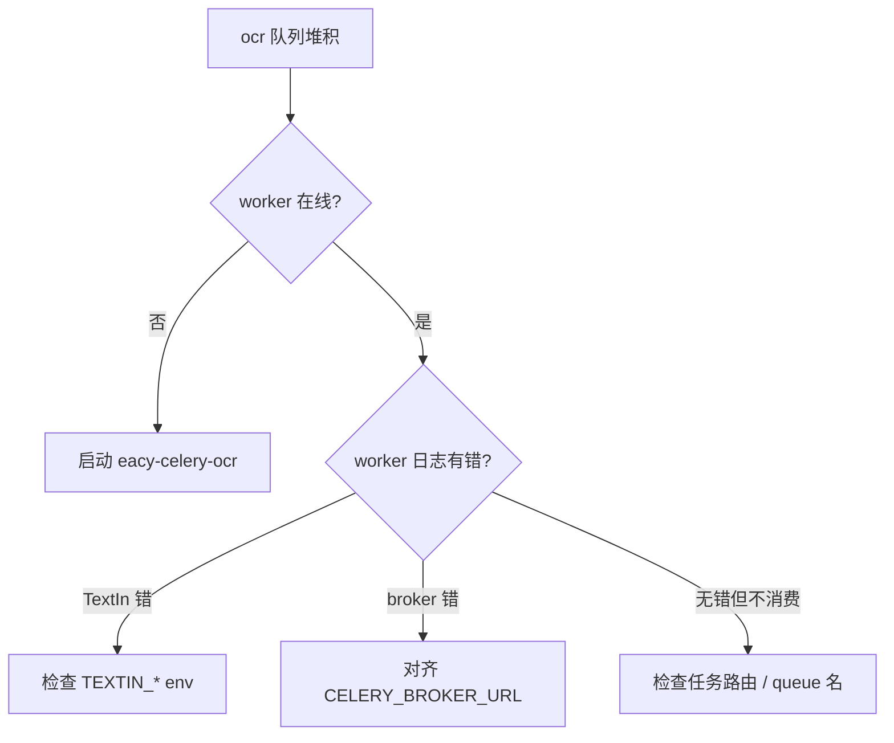
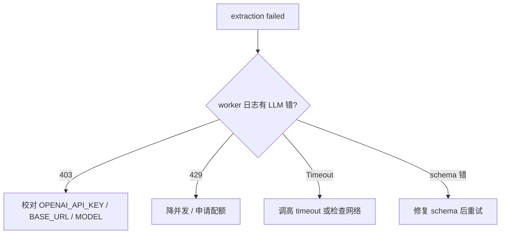
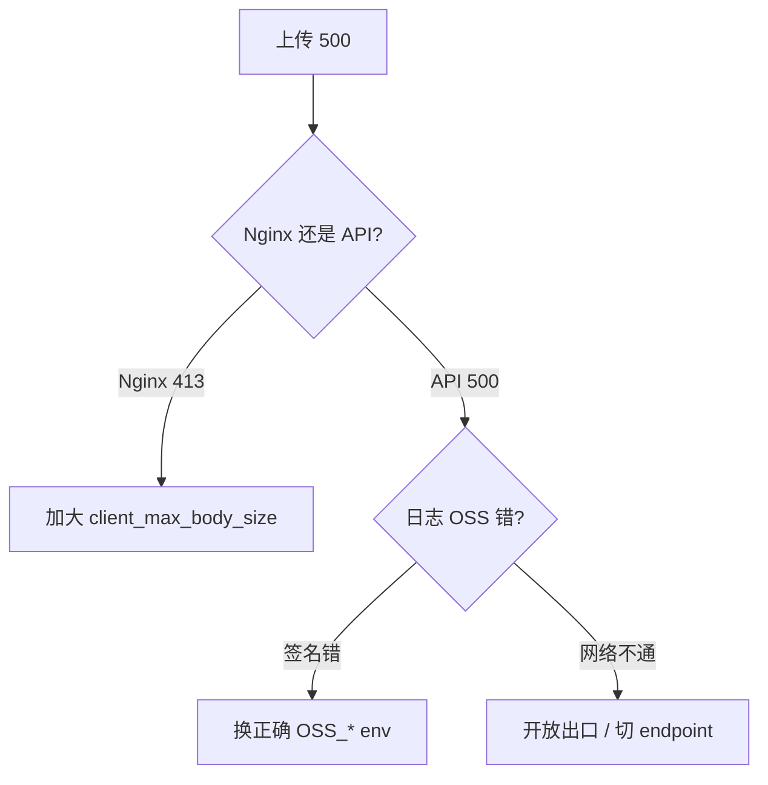
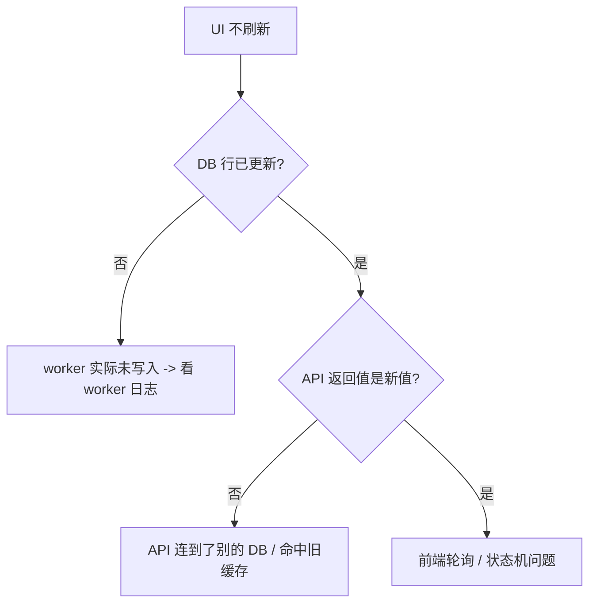
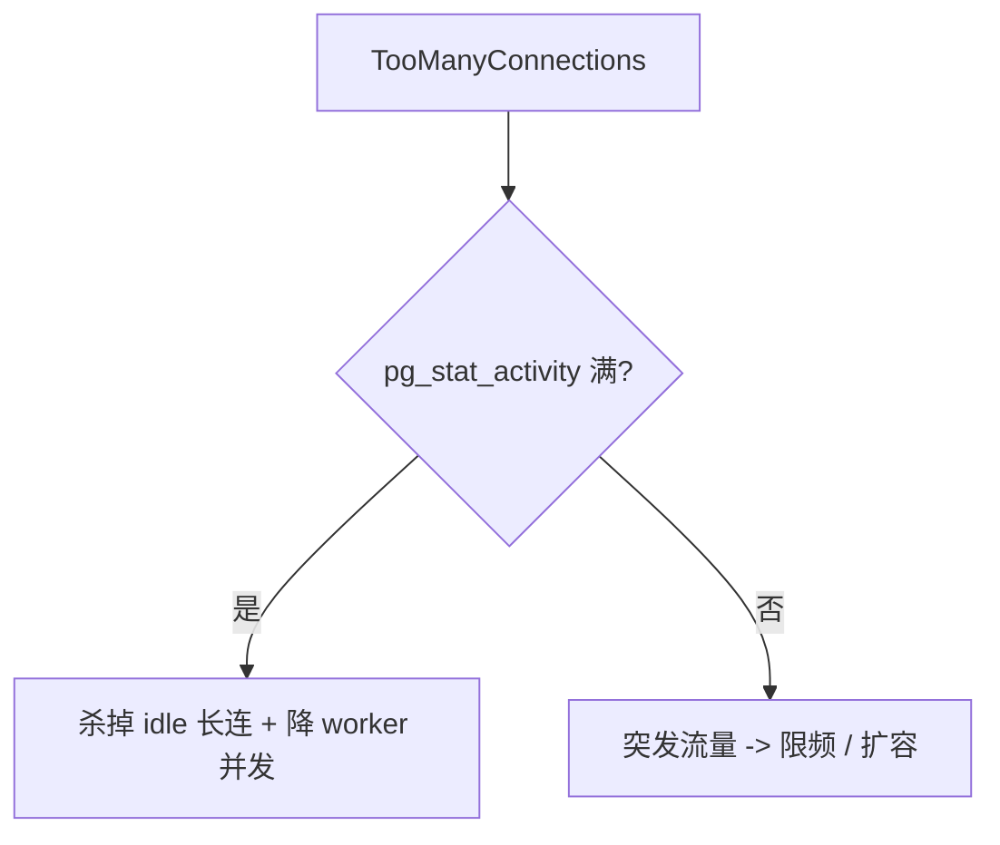
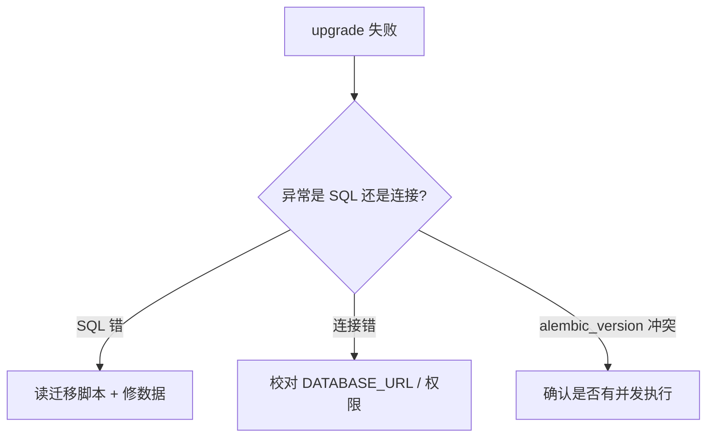

# 常见故障排查（索引）

> 一文一现象。本页是六个具体故障的目录与速查。每个章节都按 [[../_templates/T-故障排查|T-故障排查]] 模板组织：现象 → 根因 → 排查 → 修复 → 预防。

| 故障场景 | 现象关键字 | 锚点 |
|---|---|---|
| OCR 任务卡 queued（Worker 未起） | 上传后状态不变 | [[#一OCR任务卡queued]] |
| 抽取任务一直失败（LLM 配额/网络） | extraction job failed | [[#二抽取任务一直失败]] |
| 文档上传 500（OSS 配置错） | upload 500 | [[#三文档上传500]] |
| Celery 任务返回但前端进度不更新 | UI 不刷新 | [[#四前端进度不更新]] |
| 数据库连接耗尽 | `TooManyConnectionsError` | [[#五数据库连接耗尽]] |
| Migration 失败回滚 | `alembic upgrade` 报错 | [[#六migration失败回滚]] |

---

## 一、OCR任务卡queued

### 现象

用户上传文档后，前端文档列表上的状态长时间停留在"待 OCR" / "解析中"；`/api/v1/documents/v2/tree` 返回 `parse_total > 0` 且不下降。

### 可能根因

| 根因 | 排查命令 / 检查点 |
|---|---|
| OCR worker 未启动 | `systemctl status eacy-celery-ocr` / `inspect ping` |
| `DOCUMENT_OCR_AUTO_ENQUEUE=false` | 查 `.env`，应为 `true` |
| Broker 配置错 | API 与 worker 的 `CELERY_BROKER_URL` 不一致 |
| TextIn 凭证错 / 超时 | worker 日志 `TEXTIN_*` 相关错误 |
| Redis 不可达 | `redis-cli -h $REDIS_HOST ping` |

### 排查路径



### 修复步骤

1. `redis-cli -n 1 llen ocr` 确认堆积
2. `systemctl restart eacy-celery-ocr`，观察日志
3. 若是 TextIn 错：核对 [[环境变量清单#六TextIn OCR]] 中四个变量，重启 OCR worker

### 相关日志

- 路径：`journalctl -u eacy-celery-ocr` / `logs/celery.log`
- 关键字：`TEXTIN`、`process_document_ocr`、`ConnectionRefusedError`

### 预防措施

- [[监控与告警]] 中开启 `ocr` 队列长度告警
- systemd 的 `Restart=always` 保证 worker 崩溃自动拉起

---

## 二、抽取任务一直失败

### 现象

`extraction_job` 表中任务终态多为 `failed`；用户在前端看到"抽取失败"。

### 可能根因

| 根因 | 排查命令 / 检查点 |
|---|---|
| LLM 配额耗尽 | extraction worker 日志 `429` / `quota` |
| LLM 403（key 或 base_url 错） | 日志 `403 Forbidden` |
| LLM 超时 | 日志 `Timeout`；调高 `EXTRACTION_LLM_TIMEOUT_SECONDS` |
| 网络出口受限 | `curl -I $OPENAI_API_BASE_URL` |
| schema 不合法 | 日志 schema 校验异常 |

### 排查路径



### 修复步骤

1. 查 extraction worker 最近 50 条日志
2. 按根因更新 `.env`（[[环境变量清单#七LLM（OpenAI兼容）]]）
3. **重启 metadata + extraction worker**（参考 [[Celery任务运维]]）
4. 在前端或后端 API 重试失败任务

### 相关日志

- `journalctl -u eacy-celery-extraction`
- 关键字：`OPENAI`、`process_extraction_job`、`Retry`

### 预防措施

- [[监控与告警]] 中开启抽取失败率告警
- 大批量任务前先评估 LLM 配额

---

## 三、文档上传500

### 现象

前端上传 PDF 立即报 500；后端日志包含 OSS 相关栈。

### 可能根因

| 根因 | 排查命令 / 检查点 |
|---|---|
| `OSS_ACCESS_KEY_*` 错 | 后端日志 `InvalidAccessKeyId` / `SignatureDoesNotMatch` |
| Bucket 不存在 / 跨区 | `OSS_BUCKET_NAME` / `OSS_ENDPOINT` 是否匹配 |
| 出口不通 OSS | `curl -I https://$OSS_BUCKET_NAME.$OSS_ENDPOINT` |
| `client_max_body_size` 不够 | Nginx 报 413 |
| `DOCUMENT_STORAGE_PROVIDER` 非 `oss` | 检查 env |

### 排查路径



### 修复步骤

1. 看后端日志的 OSS 异常类型
2. 核对 [[环境变量清单#五对象存储（OSS）]] 全部 OSS_* 字段
3. 重启后端 API
4. 上传一个小文件验证

### 相关日志

- `journalctl -u eacy-backend`
- 关键字：`oss2`、`AccessDenied`、`StreamingResponse`

### 预防措施

- 部署前用 `ossutil` 在服务器本地试上传一次同一 key
- Nginx 配置 `client_max_body_size 200m` 见 `DEPLOYMENT_RUNBOOK.md` §9

---

## 四、前端进度不更新

### 现象

后端日志显示 Celery 任务已完成，但前端文档卡片 / 抽取任务进度条始终不更新。

### 可能根因

| 根因 | 排查命令 / 检查点 |
|---|---|
| API 没读到最新 DB 行（事务隔离 / 缓存） | 直接查 DB 行状态 |
| 前端轮询被节流 | 浏览器 Network 看 `/tasks` 请求间隔 |
| API 与 worker 连不同 DB | 两边 `DATABASE_URL` 是否一致 |
| Celery backend 与 broker 错配 | `CELERY_BACKEND_URL` 不一致导致 `AsyncResult` 拿不到 |
| Redis 缓存（archive tree）未失效 | 业务缓存命中旧值 |

### 排查路径



### 修复步骤

1. `psql` 直查相关表（`document.parse_status` / `extraction_job.status`）
2. `curl` API 看返回是否同步
3. 若 API 滞后：检查两端 `DATABASE_URL` 与 Redis 缓存键，必要时清缓存
4. 若 API 同步、UI 不变：前端 hard refresh、查看 polling 是否被暂停（Tab 后台）

### 相关日志

- `journalctl -u eacy-backend`
- 浏览器 DevTools Network

### 预防措施

- API 与所有 worker 共用一份 `.env` 引用方式（`EnvironmentFile`）
- 谨慎给读路径加缓存，必须有失效机制

---

## 五、数据库连接耗尽

### 现象

API 或 worker 日志出现：

```text
asyncpg.exceptions.TooManyConnectionsError: sorry, too many clients already
```

接口大量 5xx，新请求立即失败。

### 可能根因

| 根因 | 排查命令 / 检查点 |
|---|---|
| `DB_POOL_SIZE` × 进程数 > DB `max_connections` | `SELECT count(*) FROM pg_stat_activity;` |
| Celery 并发过高 | 看各 unit `--concurrency` 总和 |
| 长事务未释放 | `SELECT * FROM pg_stat_activity WHERE state='idle in transaction';` |
| 前端轮询过密放大请求 | 浏览器 Network |

### 排查路径



### 修复步骤

1. **临时**：`pg_terminate_backend(pid)` 清理 `idle in transaction` 长连
2. 降 `eacy-celery-extraction` 并发到 1，观察恢复
3. 与 DBA 协商 `max_connections` 与 `DB_POOL_SIZE` 调整
4. 重启 API + 全部 worker 使新池生效

### 相关日志

- `journalctl -u eacy-backend`、`journalctl -u eacy-celery-*`
- 关键字：`TooManyConnectionsError`、`OperationalError`

### 预防措施

- [[监控与告警#3.1 数据库]] 中加连接数告警
- 容量公式："`API workers + ocr.concurrency + metadata.concurrency + extraction.concurrency`" × `DB_POOL_SIZE` 必须 < `max_connections`

---

## 六、Migration失败回滚

### 现象

`alembic upgrade head` 抛异常退出；当前数据库版本号介于新旧之间，业务无法正常工作。

### 可能根因

| 根因 | 排查命令 / 检查点 |
|---|---|
| 迁移脚本 SQL 语法错 | 看异常栈中的 SQL |
| 数据冲突（如非空约束新增但旧数据为 NULL） | 看具体行 |
| 跳版本（数据库远远落后于代码） | `alembic current` vs `alembic heads` |
| 权限不足（无 CREATE / ALTER） | 数据库账号权限 |
| 多机并发跑了 migration | 看 `alembic_version` 表是否被锁 |

### 排查路径



### 修复步骤

> [!warning] 在生产做任何 schema 修复前，先做一次完整备份
> 见 [[备份与恢复]]。

1. `poetry run alembic current` 记录当前位置
2. 读最近一个迁移脚本，定位失败语句
3. 如是数据冲突：先手动 `UPDATE` 让旧数据合法，再 `alembic upgrade head`
4. 如是脚本本身错：暂停升级，回滚代码到上一个稳定版本（`git reset --hard <prev>`），保持 schema 不动
5. **不要盲跑 `alembic downgrade`**：多数 EACY migration forward-only

### 相关日志

- 终端输出
- DB 服务端日志（CREATE / ALTER 失败的详细原因）

### 预防措施

- 升级前先在 staging 库或 [[备份与恢复#3.1 数据库恢复演练|演练库]] 上 dry run 一次 migration
- 大型 migration 拆小步、避免长锁
- CI 中加入 `alembic upgrade head` + `alembic check` (TBD：当前仓库尚未配置)

---

## 相关文档

- [[首次部署手册]]
- [[升级流程]]
- [[Celery任务运维]]
- [[监控与告警]]
- [[环境变量清单]]
- [[备份与恢复]]
