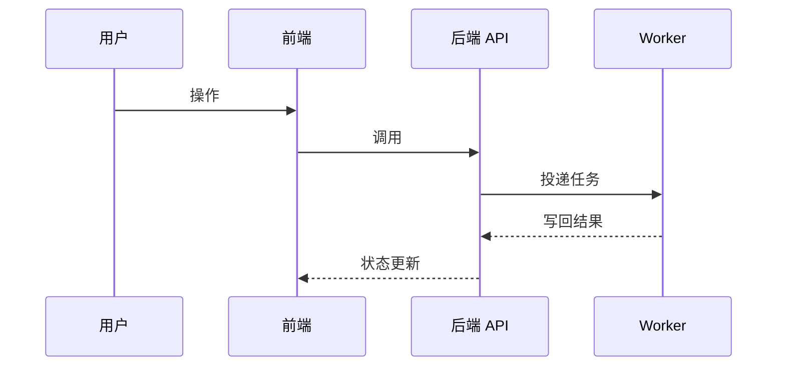

# {{title}}

> [!info] 一句话说明
> 这个流程做什么、什么时候触发、产出什么。

## 触发场景
- 

## 前置条件
- 

## 主流程

## 异常分支
| 场景 | 表现 | 处理 |
|---|---|---|
|  |  |  |

## 涉及资源
- **API**：[[API-xxx]]
- **数据表**：[[表-xxx]]
- **前端页面**：[[页面-xxx]]

## 验收要点
- [ ] 
