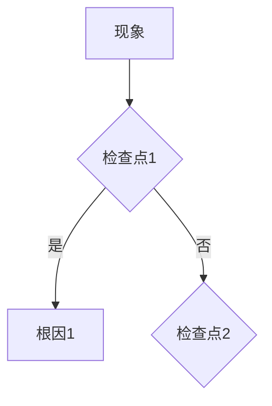

# {{title}}

## 现象
用户观察到的表现 / 监控告警内容。

## 可能根因
| 根因 | 排查命令 / 检查点 |
|---|---|
|  |  |

## 排查路径

```mermaid
flowchart TD
    A[现象] --> B{检查点1}
    B -->|是| C[根因1]
    B -->|否| D{检查点2}
```

## 修复步骤
1. 

## 相关日志
- 路径：
- 关键字：

## 预防措施
怎样避免再次发生。
