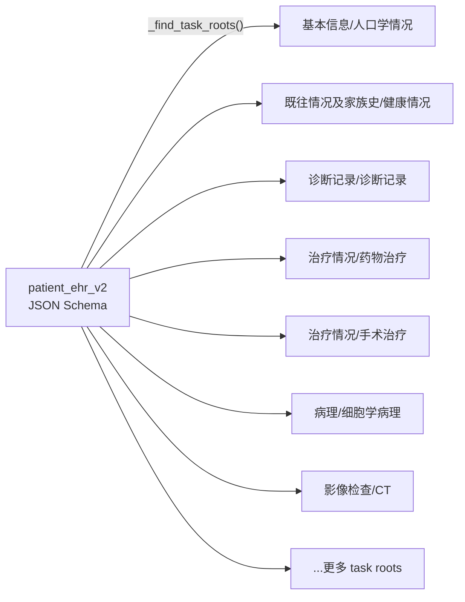
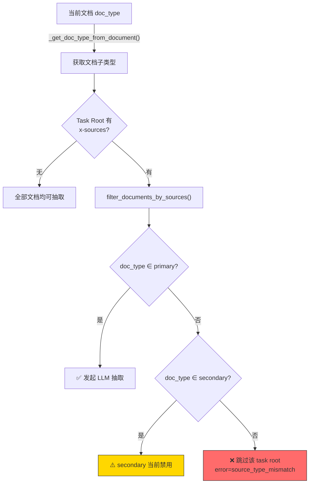
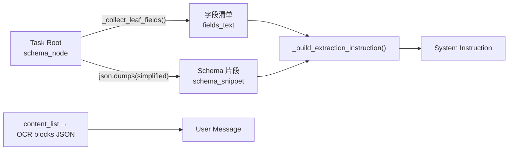
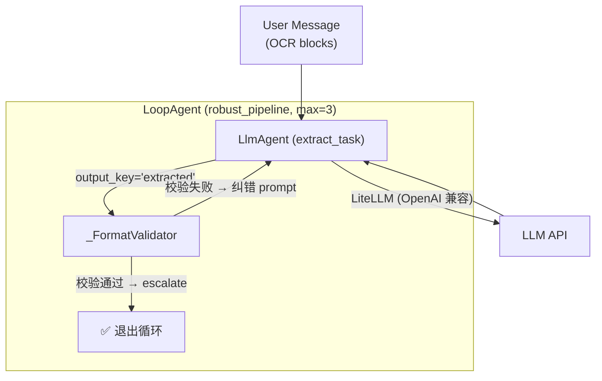
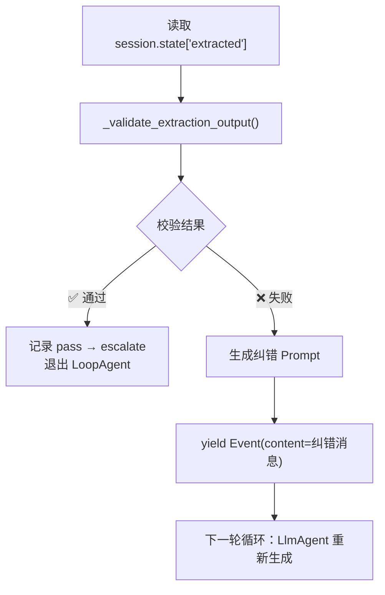
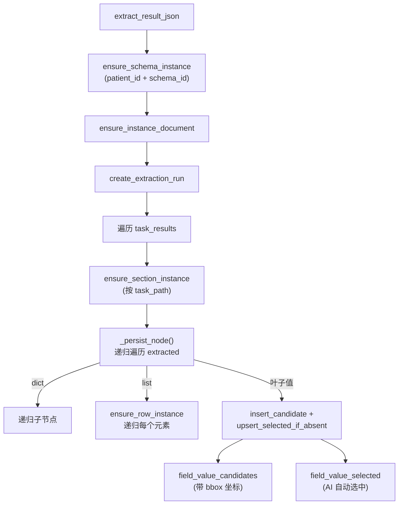
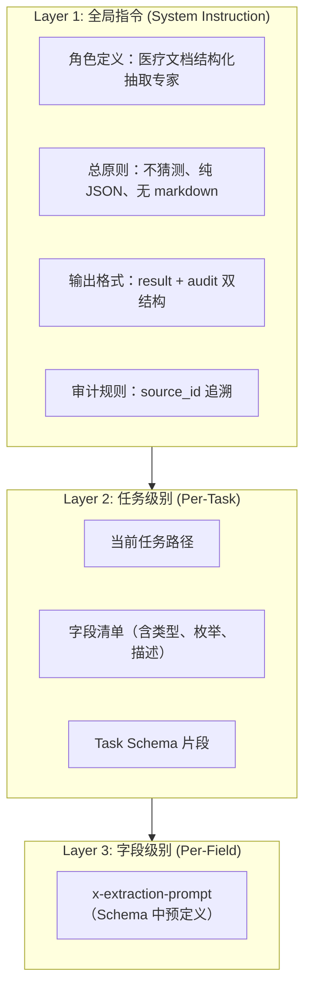

可以，下面是已经把所有流程图代码块都加上 ` ```mermaid ` 包裹后的 md 版本。
# 电子病历夹抽取 Agent 全流程分析

## 一、系统整体架构

```mermaid
graph TD
    A["📄 文档上传"] -->|"status=ocr_pending"| B["🔍 OCR 处理"]
    B -->|"raw_text 写入"| C["📋 Metadata 抽取"]
    C -->|"meta_status=completed"| D["🤖 EHR 结构化抽取"]
    D -->|"extract_result_json 写入"| E{"文档已归档?<br/>patient_id ≠ null"}
    E -->|是| F["💾 EHR 物化"]
    E -->|否| G["等待归档"]
    G -->|"归档事件"| F
    F --> H["✅ 病历夹实例<br/>field_value_candidates<br/>field_value_selected"]

    subgraph daemon["Pipeline Daemon (轮询守护进程)"]
        I["tick() 每 N 秒"] --> J["扫描 documents 表"]
        J --> K["扫描 ehr_extraction_jobs 表"]
        K -->|"线程池派发"| D
        K -->|"线程池派发"| F
    end
````

系统由 **4 个阶段** 组成，通过 [daemon.py](file:///Users/apple/project/first-project/pipeline-daemon/daemon.py) 中的 `PipelineDaemon` 轮询驱动：

| 阶段          | 触发条件                                         | 执行方式                   | 产出                        |
| ----------- | -------------------------------------------- | ---------------------- | ------------------------- |
| 1. OCR      | `status = ocr_pending`                       | Prefect / subprocess   | `raw_text`, `ocr_payload` |
| 2. Metadata | `meta_status = pending`                      | subprocess             | `metadata`（文档类型等）         |
| 3. EHR 抽取   | `ehr_extraction_jobs.status = pending`       | subprocess → LLM Agent | `extract_result_json`     |
| 4. EHR 物化   | `job_type = materialize & patient_id ≠ null` | subprocess             | 实例层表数据                    |

---

## 二、EHR 抽取 Agent 的期望状态完整流程

### Phase 1：调度触发

```mermaid
sequenceDiagram
    participant D as PipelineDaemon
    participant DB as SQLite (eacy.db)
    participant S as subprocess
    participant P as ehr_pipeline.py

    D->>DB: tick() 扫描 documents 表<br/>找无 job 的文档
    D->>DB: INSERT INTO ehr_extraction_jobs<br/>(status=pending)
    D->>DB: SELECT * FROM ehr_extraction_jobs<br/>WHERE status='pending' AND job_type='extract'
    DB-->>D: job_id, document_id
    D->>S: subprocess.Popen([python, ehr_pipeline.py,<br/>--job-id, job_id, --job-type, extract])
    S->>P: main() → svc.run_extract_job(job_id)
```

> [!NOTE]
> Daemon 通过 `_ensure_extract_jobs_for_pending_docs()` 为所有有 OCR 数据但无 extract job 的文档自动补建 pending job，实现了从「轮询 documents 表」到「轮询 job 表」的过渡。

---

### Phase 2：Job Claim 与文档数据准备

在 [ehr_pipeline.py:run_extract_job()](file:///Users/apple/project/first-project/metadata-worker/ehr_pipeline.py#L896-L1006) 中：

1. CAS 抢占: `claim_job(job_id)` → `pending → running`
2. 读文档: `get_document(document_id)` → `ocr_payload`, `raw_text`, `metadata`
3. 加载 Schema: `_get_schema_by_id_or_code(schema_id)` → `patient_ehr_v2` 的 JSON Schema
4. OCR → `content_list`: `_ocr_payload_to_content_list()` 将 Textin 格式的 OCR 数据转为统一的 block 列表

`content_list` 格式示例：

```json
[
  {"id": "p0.0", "bbox": [x1, y1, x2, y2], "text": "姓名：张三", "page_id": 0},
  {"id": "p0.1", "bbox": [x1, y1, x2, y2], "text": "性别：男", "page_id": 0}
]
```

---

### Phase 3：EhrExtractorAgent 初始化 — Schema 驱动的 Task Root 发现



在 [ehr_extractor_agent.py](file:///Users/apple/project/first-project/metadata-worker/ehr_extractor_agent.py#L670-L676) 中：

```python
class EhrExtractorAgent:
    def __init__(self, schema):
        self._schema = schema
        self.task_roots = _find_task_roots(schema)  # 自动发现所有 task root
```

Task Root 发现逻辑（[_find_task_roots](file:///Users/apple/project/first-project/metadata-worker/ehr_extractor_agent.py#L244-L270)）：

Schema 树的 DFS 遍历，在遇到带 `x-sources` 或 `x-merge-binding` 的 object/array 节点时停止，将其标记为一个独立的抽取任务。

```python
# 停止条件：节点含 x-sources 或 x-merge-binding，且类型为 object/array
if (node.get("x-sources") or node.get("x-merge-binding")) and t in ("object", "array"):
    roots.append(TaskRoot(path, name, schema_node, x_sources, x_merge_binding))
    return  # 不再递归子节点
```

每个 Task Root 包含：

* `path`: 如 `["基本信息", "人口学情况"]`
* `x_sources`: 文档类型过滤配置，如 `{"primary": ["病案首页"], "secondary": ["出院小结/记录"]}`
* `schema_node`: 该节点的完整子 schema（用于校验和 prompt 生成）

---

### Phase 4：x-sources 文档类型过滤



> [!IMPORTANT]
> 当前实现中 `secondary sources` 被禁用（`secondary_sources = []`）。只有文档子类型模糊命中 `primary` 列表时，才会对该 task root 发起 LLM 抽取。这减少了无效 API 调用但可能遗漏一些信息。

模糊匹配逻辑：标准化后做子串包含匹配：

```python
def _matches(norm_type, candidates):
    for c in candidates:
        if c in norm_type or norm_type in c:  # 双向子串匹配
            return True
```

---

### Phase 5：Prompt 构建与 LLM 调用

这是核心环节。每个匹配的 Task Root 会构建独立的 Prompt，然后通过 Google ADK 的 Agent 框架发送给 LLM。

#### 5.1 Prompt 构建流程



#### 5.2 Prompt 模板详解

System Instruction 由 [_build_extraction_instruction()](file:///Users/apple/project/first-project/metadata-worker/ehr_extractor_agent.py#L482-L520) 构建，完整模板如下：

```text
你是专业的医疗文档结构化抽取专家。你的任务是基于当前输入文档，为当前 task path 抽取结构化结果，并返回严格符合要求的 JSON。

【当前任务路径】
{task_path_str}

【总原则】
1. 仅依据当前输入文档文本抽取，不使用外部知识，不做常识补全。
2. 宁可缺失，不可猜测；无可靠证据时返回 null。
3. 只处理当前任务定义的字段，不新增字段，不输出任务外结构。
4. 只输出纯 JSON，不要 markdown，不要解释，不要思维链。

【输出格式】
{
  "result": <符合当前 task schema 的 JSON>,
  "audit": {
    "fields": {
      "<字段路径>": {
        "value": <与 result 对应字段相同的值>,
        "raw": <原文证据片段；无证据时为 null>,
        "source_id": <原文块标识，如 p0.3；无证据时为 null>
      }
    }
  }
}

【审计规则】
1. audit.fields 必须覆盖你实际输出的叶子字段。
2. audit.value 必须与 result 中同路径字段值一致。
3. raw 必须是原文片段，不得总结改写。
4. source_id 必须来自输入 OCR blocks 的 block_id。

【字段清单】
{fields_text}

【当前任务 schema 片段】
{schema_snippet}
```

#### 5.3 字段清单（fields_text）的生成

由 [_collect_leaf_fields()](file:///Users/apple/project/first-project/metadata-worker/ehr_extractor_agent.py#L273-L307) 递归遍历，产出格式如下：

```text
- /身份信息/身份ID/N/证件类型 | type=string | enum=['居民身份证', '护照', ...] | 非住院号类，为身份ID | 提示=请从下文中提取患者的【证件类型】...
- /身份信息/身份ID/N/证件号码 | type=string | 身份ID号 | 提示=请从下文中提取与上述证件类型对应的【证件号码】...
- /患者姓名 | type=string | 姓 + 名 | 提示=请从下文中提取患者的【姓名】...
- /性别 | type=string | enum=['男', '女', '不详'] | 患者的生物学性别
```

> [!TIP]
> 每个字段的 `x-extraction-prompt` 在 schema 中预定义，嵌入到字段清单中，作为 per-field 级别的微调指令。这种设计允许领域专家在 schema 层面直接控制 LLM 的抽取行为。

#### 5.4 User Message 的构建

```python
user_message = (
    f"以下是文档「{file_name}」（类型: {doc_type}/{doc_subtype}）的 OCR 文本块：\n\n"
    + json.dumps(blocks_for_llm, ensure_ascii=False)
)
```

其中 `blocks_for_llm` 的格式：

```json
[
  {"block_id": "p0.0", "text": "姓名：张三", "page_id": 0},
  {"block_id": "p0.1", "text": "性别：男 年龄：45岁", "page_id": 0}
]
```

> [!NOTE]
> `block_id` 的格式为 `p{page_id}.{序号}`，LLM 在 `audit.fields.*.source_id` 中需要引用这些 ID，后续物化时用于定位原文的 `bbox` 坐标。

---

### Phase 6：Google ADK Agent 执行架构



核心执行逻辑在 [_extract_single_task_adk()](file:///Users/apple/project/first-project/metadata-worker/ehr_extractor_agent.py#L558-L634)：

```python
# 1. 创建抽取 Agent
extract_agent = LlmAgent(
    name="extract_task",
    model=_get_llm_model(),        # LiteLLM → OpenAI 兼容
    instruction=instruction,        # 上面构建的 system prompt
    output_key="extracted",         # 输出存入 session state
)

# 2. 创建格式校验器
validator = _FormatValidator(name="format_validator")

# 3. 包装为循环 Agent（自修复）
pipeline = LoopAgent(
    name="robust_pipeline",
    sub_agents=[extract_agent, validator],
    max_iterations=3,               # 最多 3 轮修复
)
```

#### 6.1 `_FormatValidator` 的自修复机制



[_validate_extraction_output](file:///Users/apple/project/first-project/metadata-worker/ehr_extractor_agent.py#L377-L436) 校验内容：

1. JSON 解析 — 处理 markdown 包裹的 JSON
2. 顶层结构 — 必须有 `result` 键
3. `result` 类型 — 必须是 `dict` 或 `list`
4. 空值清理 — 去除空字符串和 `null`
5. `audit` 结构 — `audit.fields` 必须是 `dict`
6. JSON Schema 校验 — 使用 `Draft202012Validator` 校验 `result` 是否符合 task schema

纠错 Prompt 示例：

```text
[校验轮次 1] 抽取结果校验失败：result 不符合当前 task schema: '男' is not one of ['居民身份证', ...]

请严格重新输出纯 JSON，禁止解释、禁止 markdown、禁止思维链。
输出格式必须为：
{"result": <当前任务结果>, "audit": {"fields": {...}}}

要求：
1. result 必须符合当前 task schema
2. 顶层必须有 result 和 audit
3. audit.fields 键必须为 JSON Pointer 风格路径
4. 无证据时请返回 null，不要猜测
```

#### 6.2 重试与容错

外层有 tenacity 的指数退避重试，处理 API 级别的错误：

```python
@retry(
    stop=stop_after_attempt(10),
    wait=wait_exponential(multiplier=2, min=5, max=120),
    reraise=True
)
async def _extract_single_task_adk(...)
```

---

### Phase 7：结果聚合

所有 Task Root 的抽取结果在 [extract_single_document()](file:///Users/apple/project/first-project/metadata-worker/ehr_extractor_agent.py#L678-L851) 中聚合：

```python
DocumentCRFExtractionResult(
    crf_data={
        "基本信息": {"人口学情况": {...}},
        "诊断记录": {"诊断记录": [...]},
        ...
    },
    task_results=[ExtractionTaskResult(...)],
    total_fields=120,
    filled_fields=85,
    coverage=0.708,
    duration_ms=15000,
    errors=["Task XX: source_type_mismatch", ...],
)
```

---

### Phase 8：物化（Materialization）

抽取结果写入 `documents.extract_result_json` 后，若文档已归档到患者，通过 [_materialize_from_staged_extraction()](file:///Users/apple/project/first-project/metadata-worker/ehr_pipeline.py#L1096-L1201) 将扁平结果投影到实例层：



> [!IMPORTANT]
> Audit → BBox 链路：物化时从 `audit.fields.*.source_id` 获取 `block_id`（如 `p0.3`），再从 `content_list` 中查找对应的 `bbox` 坐标，写入 `field_value_candidates.source_bbox_json`。这是前端文档查看器中「红框高亮」功能的数据来源。

---

## 三、Prompt 封装设计总结

### 三层 Prompt 架构



| 层级   | 来源                                    | 示例                         |
| ---- | ------------------------------------- | -------------------------- |
| 全局指令 | `_build_extraction_instruction()` 硬编码 | “宁可缺失，不可猜测”                |
| 任务级别 | Schema 中的 `path / x-sources / 结构`     | “当前任务路径：基本信息 / 人口学情况”      |
| 字段级别 | Schema 节点的 `x-extraction-prompt`      | “请从下文中提取患者的【姓名】，仅输出2–5个汉字” |

### 关键设计决策

1. **Schema-Driven**：所有任务拆分、字段定义、枚举约束、抽取提示都来自 JSON Schema，无硬编码业务逻辑
2. **Task Decomposition**：大 Schema 按 `x-sources` 边界拆分为独立 task root，每个 task 独立调用 LLM（可串行/并发）
3. **Self-Healing Loop**：`LoopAgent` 最多 3 轮 LLM 调用，配合 JSON Schema 校验实现格式自修复
4. **Audit Trail**：`result + audit.fields` 双输出，强制 LLM 提供原文证据和 `block_id` 溯源
5. **Progressive Materialization**：先抽取跟随文档存储，归档后再物化到病历夹实例，解耦了两个关注点

